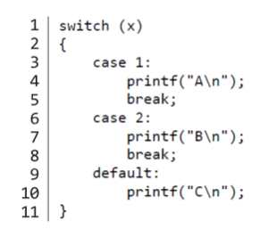

# C 기초


`#include stdio.h`는 "stdio.h"라는 파일을 찾아서 "printf"함수에 접근할 수 있도록 한다.


`int main(void)`는 스크래치의 `초록색 깃발을 클릭했을 때`와 같다. 즉, 시작하다의 의미이다.


`printf`는 python의 `print`와 같지만 좀더 포멧화된 형식이다.

그리고 파이썬과 다르게 들여쓰기가 `printf` 다음에 되지 않으므로 "\n"을 작성하여 들여쓰기를 할 수 있다.

그리고 꼭 문장을 끝낼 때 `;`을 붙여야 한다.


c의 확장자는 `.c`이다! word처럼 자동적으로 붙여주지는 않아서 C의 경우엔 직접 .c를 붙여줘야한다.


## 컴파일러


우리가 직접 작성한 코드는 __소스코드__라고 부른다. 이를 2진수로 작성된 __머신코드__로 변환해야 컴퓨터가 이해가 가능하다. 이것을 컴파일러라는 프로그램이 대신 수행해준다. 번역기라고 보면 된다.


터미널창의 명령어 프롬프트에서 `$`기호 옆에 우리가 원하는 명령어를 입력하면 된다. (ls, mkdir, rm, ... ls는 list mkdir은 make directory, rm은 remove였다는 것을 오늘 깨달았다....)

`clang hello.c`를 입력하면 clang이라는 컴파일러로 "hello.c" 코드를 컴파일하라는 의미이다. 그 결과 a.out이 생성된다. 

`./a.out` 을 입력하면 현재 디렉토리에 있는 a.out이라는 프로그램을 실행하게 해준다.


# 문자열


사람의 이름을 입력받고, hello, "이름"을 출력하는 프로그램을 만든다고 해보자.

CS50 Sandbox에서 스크래치의 ask 함수와 가장 비슷한 것은 `get_string`함수이다.


사용자의 이름을 받아서 저장할 변수를 `answer`이라고 지정하였다. 변수 이름은 상관이 없으나 변수명 앞에 변수가 저장하는 데이터의 종류를 아주 정확히 명시해주어야한다.(C는 오래된 언어이다. python에서는 필요없다.)


일반적으로 수학에서 `=`는 같다를 의미한다. 하지만 프로그래밍언어에서는 오른쪽에서 왼쪽으로 가는 화살표와 비슷하다. 쉽게 말하면 오른쪽에 있는 것을 왼쪽에 지정한다. 이를 __할당 연산자__라고 한다.


이를 출력하기 위해서 printf함수를 이용해보겠다.

우리는 answer이라는 변수 안에 있는 이름을 출력해야되기 때문에 `%`를 사용해야한다. 이때, 어떤 종류의 인자를 받는 지도 명시해줘야한다. string이기 때문에 `%s`를 사용해준다. 


근데 `get_string`함수가 어딨는거지...? `stdin.h`에는 없는데.. 아하! `cs.h`파일 안에 있구나. 그럼 컴퓨터가 찾을 수 있게 파일 맨 위에 지정해줘야한다. `#include<cs50.h>`

이제 터미널을 켜보자.

`$ clang -o string string.c -lcs50`

`-o`는 output의 이름을 지정하는 명령어, `-l`은 link로 컴파일시 cs50파일을 연결하게 한다. 근데 이거 너무 길고 복잡하지 않나?

`$make string` Walla! make 명령어를 통해 작성한 코드를 컴파일 하고 실행하면, 사용자에게 입력값을 받고 문장 내에 포함하여 출력하는 프로그램이 된다.


# 조건문과 루프


`[변수의 종류] [변수명] = [값];` : 여기서 =는 할당 연산자!

C에서 counter 값을 증가시키려면 `counter = counter + 1` => `counter += 1` => `counter++`


## 조건문

### if


음... `==`..? 

=을 할당 연산자로 정했으니까 ==는 같다고 표현하자...!

### switch

조건식의 결과값에 따라서 매칭되는 case의 코드를 실행.



###  3항 연산자

`int y = (x>3) ? 2 : 1;`

x가 3보다 크면 y의 값은 2, 아니면 1이다.


## 루프

### while


while문은 반복문, while문의 조건문이 true면 평생 반복, 이렇게 지정해주면 50번만 반복!

```
i는 0으로 설정 -> i는 50보다 작은가? -> 작다 -> hello world를 출력한다 -> i를 1증가시킨다 -> i가 50보다 작은가? -> (반복) -> i가 50보다 작은가? -> 작지 않다 -> 종료
```

### for

 **for** 를 사용하면 for ( ) 안에 각각 (변수 초기화; 변수 조건; 변수 증가) 에 해당하는 코드를 넣어서 간단하게 표현 가능


# 자료형, 형식 지정자, 연산자

## 자료형

```
bool: 불리언 표현, (예) True, False, 1, 0, yes, no
char: 문자 하나 (예) 'a', 'Z', '?'
string: 문자열
int: 특정 크기 또는 특정 비트까지의 정수 (예) 5, 28, -3, 0
long: 더 큰 크기의 정수
float: 부동소수점을 갖는 실수 (예) 3.14, 0.0, -28.56
double: 부동소수점을 포함한 더 큰 실수
```


## CS50 라이브러리 함수

```
get_char
get_double
get_float
get_int
get_long
get_string
```


## 형식 지정자

```
%c : char
%f : float, double
%i : int
%li : long
%s : string
```

## 기타 연산자 및 주석

```
+:  더하기
-: 빼기
*: 곱하기
/: 나누기
%: 나머지
&&: 그리고
||: 또는
//: 주석
```


## 좋은 코드 생각해보기

나이를 Day로 환산해보는 프로그램을 짜보겠다.

```c
# include <cs50.h>
# include <stdio.h>

int main(void)
{
    int age = get_int("what's your age?\n");
    int days = age * 365;
    printf("Your are at least %i days old.\n", days);
}
```

흠... days라는 변수를 없애보겠다.

```c
# include <cs50.h>
# include <stdio.h>

int main(void)
{
    int age = get_int("what's your age?\n");
    printf("Your are at least %i days old.\n", age * 365);
}
```

age 굳이 만들어야되나?

```c
# include <cs50.h>
# include <stdio.h>

int main(void)
{
    printf("Your are at least %i days old.\n", get_int("what's your age?\n") * 365);
}
```

음... 이 코드가 과연 옳은걸까? 줄어들긴 했지만 가독성이 좋은 코드는 아니다.

보통 읽기 편하고 이해하기 쉬운 코드가 더 선호되어진다.


## 실수 출력

```c
# include <cs50.h>
# include <stdio.h>

int main(void)
{
    float price = get_float("What's the price?\n");
    printf("Your total is %f\n", price*1.0625);
}
```

이 코드는 가격을 입력받아 세금을 포함한 금액을 출력해주는 코드이다. 실제로 출력해보면... 소수점자리가 6번째까지 나온다..!

```bash
what's the price
100
Your total is 106.250000
```

이는 이 자료형이 비트를 이용해 어떤 자리 수 까지 나올 수 있는지 나타내줘서 그렇다. 그럼 포맷을 한번 서보장

```c
printf("Your total is %.2f \n", price*1.0625);
```

```bash
what's the price
100
Your total is 106.25
```


# 사용자 정의 함수, 중첩 루프

## 사용자 정의 함수

기침을 3번 하는 프로그램을 만들어보자.

```c
#include <stdio.h>

int main(void)
{
    printf("cough\n");
    printf("cough\n");
    printf("cough\n");
}
```

음...중복작업이 너무 많다. for문 적용해보자

```c
#include <stdio.h>

int main(void)
{
    for (int i = 0; i < 3; i++)
    {
        printf("cough\n")
    }
}
```

이걸 함수로 만들어볼까?

```c
#include <stdio.h>

void cough(void)
{
    printf("cough\n")
}

int main(void)
{
    for (int i = 0; i < 3; i++)
    {
        cough();
    }
}
```

`void 함수명(void)` : {출력 ? 자료형 : void }/ 함수이름 적어 / {입력 ? 자료형 : void}

함수를 main 밑으로 내릴 수 있을까? 안타깝게도 C는 위에서 아래로 읽기 때문에 오류가 나게된다.

그럼 방법이 전혀 없을까? 아니다

```c
#include <stdio.h>

void cough(void);

int main(void)
{
    for (int i = 0; i < 3; i++)
    {
        cough();
    }
}

void cough(void)
{
    printf("cough\n");
}
```

요렇게 cough 봤었지???라고 C를 속여주는 것이다. 

이제 for 루프를 안쓰고 함수에 반복할 횟수를 넣어주면 반복하는 함수를 만들어보자

```c
#include <stdio.h>

void cough(int n);

int main(void)
{
    cough(3);
}

void cough(int n)
{
    for (int i = 0; i < n; i++)
    {
        printf("cough\n");
    }
}
```


## 중첩 루프

```c
#include <cs50.h>
#include <stdio.h>

int main(void)
{
    int n;

    do
    {
        n = get_int("Size: ");
    }
    while (n < 1);

    for (int i = 0; i < n; i++)
    {
        for (int j = 0; j < n; j++)
        {
            printf("#");
        }
        printf("\n");
    }
}
```


# 하드웨어의 한계

컴퓨터는 RAM(Random Access Memory)이라는 물리적 저장장치를 포함하고 있다. 우리가 작성한 프로그램은 구동 중에 RAM에 저장되는데, RAM은 __유한한 크기__의 비트만 저장할 수 있어 부정확한 결과를 나타낼 때도 있다.


## 부동 소수점 부정확성

```c
#include <cs50.h>
#include <stdio.h>

int main(void)
{
    // 사용자에게 x 값 받기
    float x = get_float("x: ");

    // 사용자에게 y 값 받기
    float y = get_float("y: ");

    // 나눗셈 후 출력
    printf("x / y = %.50f\n", x / y);
}
```

```bash
x: 1
y: 10
x / y = 0.10000000149011611938476562500000000000000000000000
```

...? 0.1000...이 나와야하는데 9번째 소수점부터 이상한 숫자가 나온다 무슨 일일까?

float에서 저장가능한 비트 수가 유한하기 때문에 9번째부터 부정확한 결과가 나온다.


## 정수 오버플로우

```c
#include <stdio.h>
#include <unistd.h>

int main(void)
{
    for (int i = 1; ; i *= 2)
    {
        printf("%i\n", i);
        sleep(1);
    }
}
```

```bash
1
2
4
...
1073741824
overflow.c:6:25: runtime error: signed integer overflow: 1073741824 * 2 cannot be represented in type 'int'
-2147483648
0
0
...
```

10억을 넘기자 앞으로 넘어갈 1의 자리가 없어졌다...!(비트가 유한하기 때문에)

int의 비트는 32개다.. 그래서 그 이상의 숫자는 저장할 수 없다.


실제로 보잉 787에서 248일이 지나면 모든 전력을 잃는 문제가 일어났다. 왜냐면 보잉 787안의 소프트웨어의 변수가 248일이 지난 후 오버플로우가 되었기 때문이다. 248일을 1/100초로 계산하면 2의 32승이 되는데, 보잉을 설계할 때 사용한 변수의 비트가 32개였기 때문에 결국 248일마다 전원을 다시끄는 불상사가 생겼던 것이다.

=> 교훈 ; 설계할 때 데이터 값의 범위를 유의하자!

