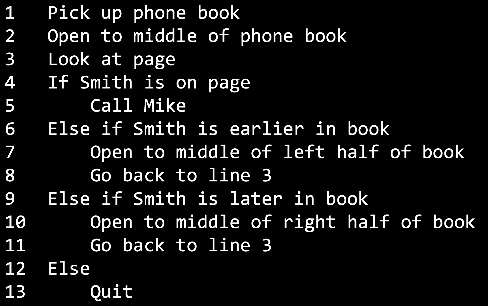
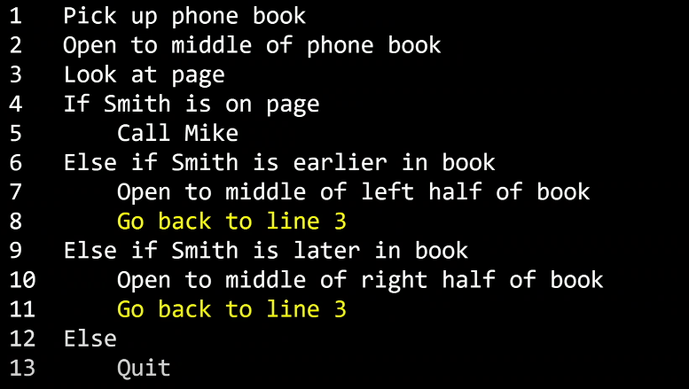

컴퓨터 과학은 **문제 해결에 대한 학문**

문제 해결은 입력을 전달받아 출력을 만들어내는 과정

그 중간에 있는 과정이 바로 CS!


이런 입출력을 표현하기 위해서는 우리 모두가 동의할 약속(표준)이 필요하다. 

따라서 컴퓨터 과학의 가장 첫 번째 개념은 어떻게 표현하는지에 대한 __표현방법__이다.


# 2진법

컴퓨터는 오직 0과 1을 가지고 있기 때문에 2의 거듭제곱을 이용해 계산한다.

 2진법은 전기를 통해 연산하는, 즉 __전기를 켜고 끄는 방식__으로 작동하는 컴퓨터에게 아주 적합한 방법!

트랜지스터는 컴퓨터 속의 아주 작은 스위치. 컴퓨터는 수백만개의 스위치(트랜지스터)들을 가지고 있고, 이들을 물리적으로 이용해 (on/off 상태를 통해)정보를 표현하고 값을 저장.


## 비트

정보를 저장하고 연산을 수행하기 위해서 컴퓨터는 __비트(bit)__라는 측정 단위를 쓴다.

## 비트열

하나의 비트는 0과 1, 2가지 값만 저장할 수 있다. 컴퓨터 내부에서 물리적 표현이 될 때는 켜고 끌 수 있는 스위치라고 생각할 수 있다.

하나의 비트로 많은 양의 데이터를 나타내기에는 부족하다. 여러 숫자 조합을 컴퓨터에 나타내기 위해서는 비트열을 사용한다. __바이트(byte)__는 8개의 비트가 모여서 만들어졌다. 그래서 2^8, 즉 256개의 서로 다른 바이트가 존재할 수 있다.


# 정보의 표현

숫자를 저렇게 표현한다면, 문자는 어떻게 표현할까?

문자를 숫자로 표현할 수 있도록 정해진 약속(표준)이 물론 있다.

ASCII코드 : 128개의 부호, 10진수 기준 A는 65(1000001), B는 66

유니코드 : ASCII보다 상위버전, ASCII코드의 한계로 만들어짐. 이모티콘도 가능!


## 그림, 영상, 음악의 표현

그림 또한 숫자로 나타낸다 : RGB : Red, Green, Blue! 이 세가지 색들의 비율을 조합해 특정한 색을 나타낸다.

영상 또한 수많은 그림을 이어 붙여놓은 것이기 때문에 숫자로 표현이 가능하다.

음악 또한 음 높이, 음 길이, 소리 크기를 숫자로 표현할 수 있다.


# 알고리즘

이 위에서 나타낸 것은 컴퓨터에 __입력__해주는 것이다.

그럼 출력은 어떻게 얻지..?


컴퓨팅은 입력을 받아 그 입력을 처리한 후 출력하는 __과정__

__알고리즘__은 입력에서 받은 자료를 출력형태로 만드는 __처리과정__

즉, 알고리즘이란 입력값을 출력값의 형태로 바꾸기 위해 어떤 명령들이 수행되어야 하는지에 대한 __규칙들의 순서적 나열__

문제 해결의 관점에서 보면 알고리즘은 그저 문제를 해결하는 단계적인 방법일 뿐이다.


이러한 일련의 순서적 규칙들을 어떻게 나열하는지에 따라서 알고리즘의 종류가 달라진다.같은 출력값이라도 알고리즘에 따라서 출력까지의 시간이 다를 수 있다. 


우리가 원하는 문제를 풀기위해선 어떤 알고리즘을 사용해야할까?


## 정확한 알고리즘

```
예를 들어, 전화번호부에서 Mike Smith를 찾는 일을 한다고 합시다.
전화번호부를 집어 들고 첫 페이지를 펼친 후 Mike Smith가 그 페이지에 있는지 찾습니다.
없으면 그 다음 페이지에서 찾습니다.
Mike Smith 를 찾을 때까지 혹은 전화번호부가 끝날 때까지 이것을 반복합니다.
하지만 언젠가는 Mike Smith 가 전화번호부에 있다면 이 알고리즘을 통해 Mike Smith 를 찾을 수 있을 것입니다.
```

알고리즘을 평가할 때 __정확성__도 중요하지만 __효율성__도 중요하다.


## 정확하고 효율적인 알고리즘

```
이번에는 더 직관적이고 효율적인 알고리즘을 적용하여 Mike Smith를 찾아봅시다.
먼저, 전화번호부 가운데를 폅니다. 만약 Mike Smith가 그 페이지에 있다면 우리 알고리즘은 끝납니다.
없다면, 전화번호부가 이름순으로 정렬되어 있으므로 우리는 Mike Smith가 지금 페이지보다 앞부분에 있는지 뒷부분에 있는지 알고 있습니다.
그러므로 책의 절반을 버릴 수 있게 되고 나머지 절반에 대해 똑같은 알고리즘을 수행합니다.
한 페이지가 남을 때까지 계속 수행합니다.
마지막에 남은 한 페이지에는 Mike Smith의 이름이 있거나 없거나 둘 중 하나일 겁니다.
```

기존 알고리즘보다 더 __효율적__으로 변했다. 

첫번째 알고리즘에서는 100번의 페이지를 넘겨야했지만 이 알고리즘은 1번의 절차만 더 수행하면 된다.

첫 번째 알고리즘은 한 장을 넘긴 다음 또 한 장 넘기는 규칙들의 순서적 나열이었고,
두 번째 알고리즘은 반을 줄이고, 다음 또 반을 줄이는 규칙들의 순서적 나열이었다.


## 의사코드



의사코드는 필요한 행동이나 조건을 잘 설정하여 컴퓨터가 수행해야 하는 일을 절차적으로 파악할 수 있게 도와준다.

중간중간 들여쓴 부분은 종속 관계를 나타낸다.


노란색 부분은 __함수__를 나타낸다. 함수는 컴퓨터에게 이 경우에는 어떤것을 할지 알려주는 동사와 같다


노란색 부분은 __조건__이다. 여러 선택지 중 하나를 고르는 것이다.


앞서 말한 결정을 내리기 위한 질문이다. 이것을 불리언이라고 한다. 0과 1(False, True)로 나타낸다



마지막으로, 루프이다. 계속해서 반복하는 순환이다.


[이미지와 전문 출처 : CS50](https://www.boostcourse.org/cs112/lecture/118997)