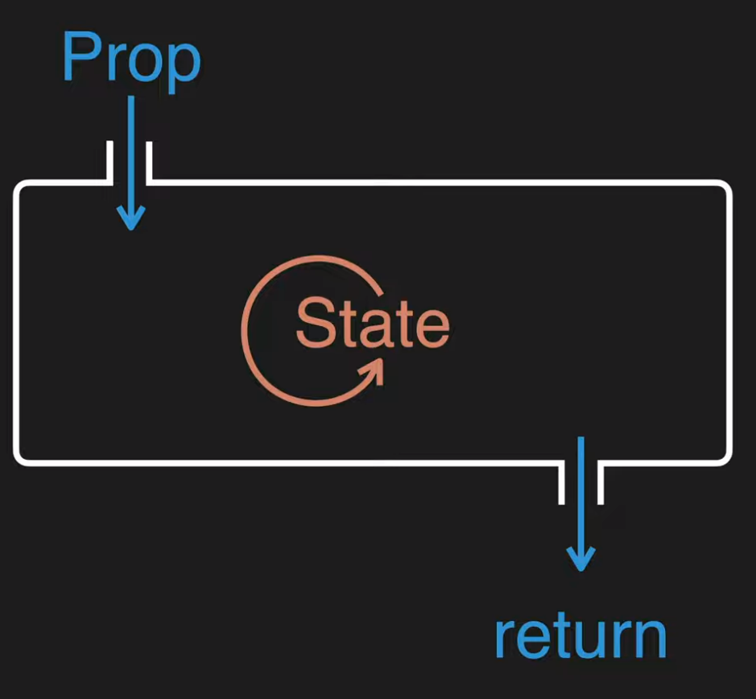

React는 component는 입력과 출력이 있는데 입력이 Prop 출력은 return

prop과 함께 컴포넌트 함수를 다시 실행해서 새로운 return값을 만들어주는 데이터가 __state__!


# State vs Prop

prop : component 사용하는 외부자를 위한 데이터

state : component를 만드는 내부자를 위한 데이터


### A태그를 누르면 창의 내용이 변하게 만들기

```js
//App.js
...
function App() {
  const mode = 'WELCOME'
  let content = null;
  if(mode == 'WELCOME'){
    content =  <Article title="Welcome" body="Hello, WEB"></Article>
  }else if(mode == 'READ'){
    content =  <Article title="READ" body="Hello, React"></Article>
  }
  return (
    <div className="App">
      <Header title="REACT" onChangeMode={() => {
        mode='WELCOME'
      }}></Header>
      <Nav topics={topics} onChangeMode={(id) => {
        mode='READ'
      }}></Nav>
      {content}
    </div>
  );
}

```

이렇게 하고 다른 A태그들은 바뀌지 않는다

=> 왜? mode 값이 바뀌었을지라도, App함수는 다시 실행되지 않았기 때문에 return값이 변화가 없다!

=> mode의 값이 바뀌면 component 함수가 다시 실행되어 새로운 return값이 만들어지게되고, 그 return 값이 UI에 반영되었으면 좋겠다! 


#### 이때 State를 사용한다!

React에서 제공하는 useState 훅을 이용한다.

mode, 즉 지역변수를 State(상태)로 업그레이드 시킬거야!

`const _mode = useState('WELCOME')` : 상태를 만들어 return 된 결과를 _mode로 만들었다.

당연히 error가 떠서 console.log를 찍어봤더니

```js
(2) ['WELCOME', ƒ]
0: "WELCOME"
1: ƒ ()
length: 1
name: "bound dispatchSetState"
arguments: (...)
caller: (...)
[[Prototype]]: ƒ ()
[[TargetFunction]]: ƒ dispatchSetState(fiber, queue, action)
[[BoundThis]]: null
[[BoundArgs]]: Array(2)
length: 2
[[Prototype]]: Array(0)
```

그렇다, useState는 __배열__이었던 것이다!

0번째 데이터는 상태의 값을 읽을 때 쓰는 데이터이고

1번째 데이터는 상태의 값을 변경할 때 쓰는 함수이다.


state의 값은 0번째 index 값으로 읽는다 ` const mode = _mode[0]`

state를 바꿀 때는 1번째 index 함수로 바꾼다 `const setMode = _mode[1]`

축약형으로 ` const [mode,setMode] = useState('WELCOME');`이렇게 쓴다!

```js
return (
    <div className="App">
      <Header title="REACT" onChangeMode={() => {
        setMode('WELCOME')
      }}></Header>
      <Nav topics={topics} onChangeMode={(id) => {
        setMode('READ')
      }}></Nav>
      {content}
    </div>
  );
```

이제 바뀐다!

mode의 상태가 setMode에 의해서 'READ'로 바뀌면 App component가 다시 실행된다.

그러면 useState가 mode의 값을 'READ'로 설정해준다. 그렇게 밑으로 쭉쭉 렌더링되면 되는거임!


# 1, 2, 3을 눌렀을 때 바뀌게하고 싶은데...

` const [id,setId] = useState(null);`

```js
... 
<Nav topics={topics} onChangeMode={(_id) => {
        setMode('READ')
        setId(_id);
      }}></Nav>
...
```

```js
...
let content = null;
  if(mode === 'WELCOME'){
    content =  <Article title="Welcome" body="Hello, WEB"></Article>
  }else if(mode === 'READ'){
    let title, body = null;
    for(let i = 0; i < topics.length; i++){
      if(topics[i].id === id) {
        title = topics[i].title;
        body = topics[i].body;
      }
    }
    content =  <Article title={title} body={body}></Article>
  }
...
```

이제 바뀌겠지? 아니네!

console.log로 찍어보니 topics[i].id는 숫자, state의 id는 문자네? 거슬러 올라가보자!

state의 id는 어디서? > setId > 어디서 썼어? Nav안의 _id > Nav의 event.target.id > a id={t.id}구나!

본디 t.id는 숫자였으나, 태그의 속성으로 넘겨서 문자로 변해버렸습니다 ;^:

Number함수를 써서 숫자형으로 바꿔줍시다

```js
...
function Nav(props) {
    ...
        props.onChangeMode(Number(event.target.id));
   ...
  }
 ...
}
```


이제 원하는대로 출력이 된다!