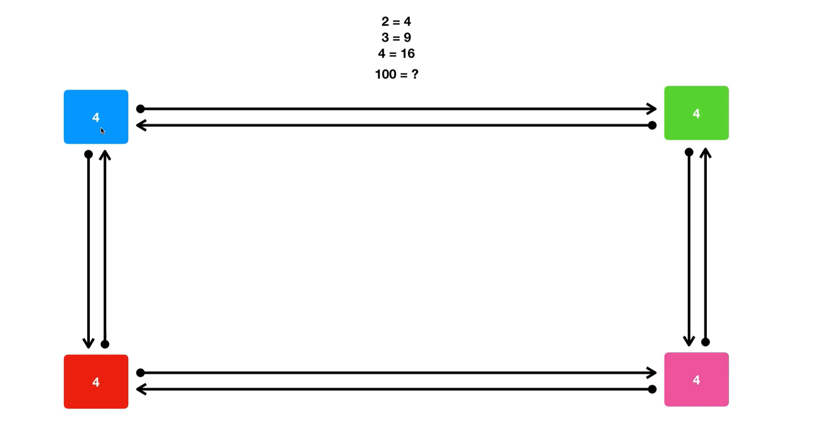
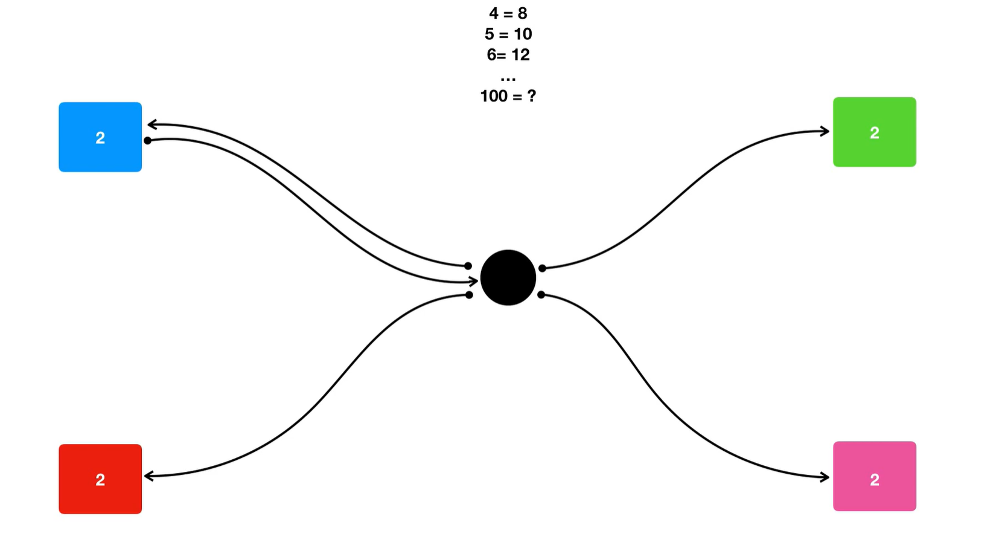
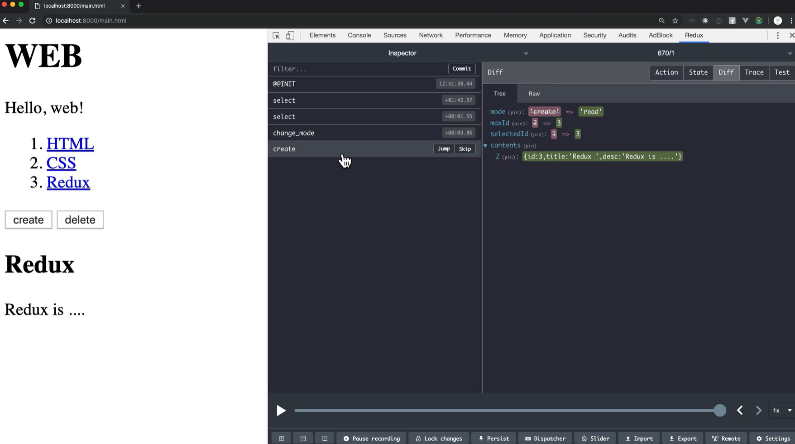

redux같은 시스템을 쓰는 이유?

상호작용하는 부품들은 서로 상호작용하기위해 상호작용하는 부품들이 늘어날 것이고, 어느 하나를 지우면 그와 상호작용하는 부품도 없애야되기 때문에 관리하기 어렵다. => 소프트웨어가 유연하지 않다.

redux로 관리하게 되면, 2개의 로직만 필요하다. 훨씬 간편!

그리고 redux의 devTool이 상태가 바뀌는 것을 알 수 있다. 상태 관리가 쉬워진다. 시간여행을 할 수 있다. 