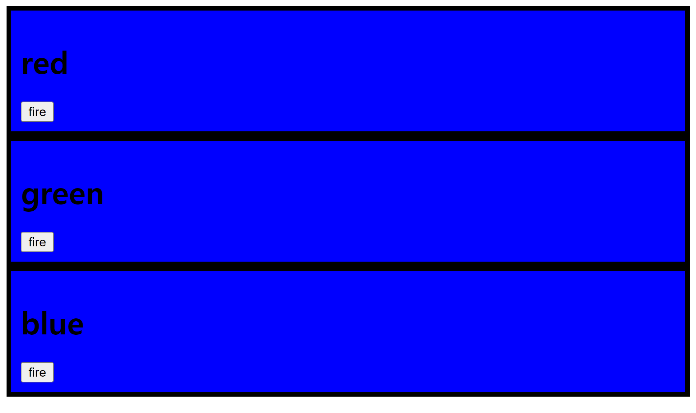

# With out redux

```html
<html>
  <body>
    <style>
      .container {
        border: 5px solid black;
        padding: 10px;
      }
    </style>
    <div id="red"></div>
    <div id="green"></div>
    <div id="blue"></div>

    <script>
      function red() {
        document.querySelector("#red").innerHTML = `
        <div class="container" id="component_red">
            <h1>red</h1>
            <input type="button" value="fire" onclick="
            document.querySelector('#component_red').style.backgroundColor = 'red';
            document.querySelector('#component_green').style.backgroundColor = 'red';
            document.querySelector('#component_blue').style.backgroundColor = 'green';
            ">
        </div>
    `;
      }
      red();
      function green() {
        document.querySelector("#green").innerHTML = `
        <div class="container" id="component_green">
            <h1>green</h1>
            <input type="button" value="fire" onclick="
            document.querySelector('#component_red').style.backgroundColor = 'green';
            document.querySelector('#component_green').style.backgroundColor = 'green';
            document.querySelector('#component_blue').style.backgroundColor = 'green';
            ">
        </div>
    `;
      }
      green();
      function blue() {
        document.querySelector("#blue").innerHTML = `
        <div class="container" id="component_blue">
            <h1>blue</h1>
            <input type="button" value="fire" onclick="
            document.querySelector('#component_red').style.backgroundColor = 'blue';
            document.querySelector('#component_green').style.backgroundColor = 'blue';
            document.querySelector('#component_blue').style.backgroundColor = 'blue';
            ">
        </div>
    `;
      }
      blue();
    </script>
  </body>
</html>

```



ㅠㅠ..

이렇게 새로운 박스를 계속 만들 때 마다 많은 줄의 코드를 새로 적어야하고,...

원래 있던 코드들에도 새로 생긴 박스의 변화값을 넣어줘야하는 귀찮음이 생긴다.... 물론 실수도 발생할 것이다...


# With Redux

