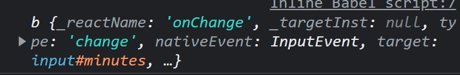

## Understanding State

```js
<!DOCTYPE html>
<html>
  <body>
    <div id="root"></div>
  </body>
  <script src="https://unpkg.com/react@17.0.2/umd/react.production.min.js"></script>
  <script src="https://unpkg.com/react-dom@17.0.2/umd/react-dom.production.min.js"></script>
  <script src="https://unpkg.com/@babel/standalone/babel.min.js"></script>
  <script type="text/babel">
    const root = document.getElementById("root");
    let counter = 0;
    function countUp() {
      counter++;
    }
    const Container = () => (
      <div>
        <h3>Total clicks : {counter}</h3>
        <button onClick={countUp}>Click me</button>
      </div>
    );
    ReactDOM.render(<Container />, root);
  </script>
</html>

```

button을 눌러도 counter가 안바뀐다...? => __아니!__ console에 찍어보면 값이 증가되고 있음을 알 수있다

근데 왜...? : __Rendering을 한 번밖에 안하지 않는가?__

countUp, Container 모두 funtion이라 바로 실행되지 않고, ReactDOM.render이 페이지를 로드했을 때 랜더링 되는데 Container이 실행되었을 때는 counter은 0이다! 물론 EventListener에 의해 counter의 값이 증가되지만 __어느 곳에서도 UI를 새로고침을 하고있지 않다!__

```js
...
    function render() {
      ReactDOM.render(<Container />, root);
    }
    function countUp() {
      counter++;
      render();
    }
...
```

그래서 countUp을 호출할 때 다시 render되게 만들어주면 우리가 원하는 기능을 만들 수 있다.

vanilla JS에서는 h3, button, body가 계속 업데이트 된다. 하지만 React에선 __UI에서 바뀐 부분만__ 업데이트해준다. => 인터엑티브한 앱을 만들 수 있어...! 오직 바뀐 것만 생성된다구!!

#### 이거 값 바꿀 때마다 render 해줘야 하는데요 ㅠㅠ.... => 그래서 요렇게 안써요~


## setState part One

```js
const root = document.getElementById("root");
function App() {
    const data = React.useState(0);
    const [counter, setCounter] = data;
    console.log(data);
    return (
        <div>
        <h3>Total clicks : {counter}</h3>
<button>Click me</button>
</div>
);
}
ReactDOM.render(<App />, root);
</script>
```

위 내용들은 생활코딩에서 배웠으니 합쳐서 블로그에 올리도록 하겠다.


## setState part Two

React.useState 함수는 counter 같은 데이터를 숫자형 데이터로 건네줄거고, 데이터 값을 바꿀 함수도 줄 것이다. 그 함수를 이용해서 데이터 값을 변경할 때 컴포넌트도 동시에 리렌더링된다! 

위 강의와 결과는 같다. 변수를 컴포넌트에 연결해 변수에 데이터를 담은 다음 해당 변수에 담긴 값을 바꾸는 것.


```js
<!DOCTYPE html>
<html>
  <body>
    <div id="root"></div>
  </body>
  <script src="https://unpkg.com/react@17.0.2/umd/react.production.min.js"></script>
  <script src="https://unpkg.com/react-dom@17.0.2/umd/react-dom.production.min.js"></script>
  <script src="https://unpkg.com/@babel/standalone/babel.min.js"></script>
  <script type="text/babel">
    const root = document.getElementById("root");
    function App() {
      const data = React.useState(0);
      const [counter, setCounter] = data;
      const onClick = () => {
        setCounter(counter + 1);
      };
      return (
        <div>
          <h3>Total clicks : {counter}</h3>
          <button onClick={onClick}>Click me</button>
        </div>
      );
    }
    ReactDOM.render(<App />, root);
  </script>
</html>
```


## Recap

데이터가 바뀔때마다 커포넌트를 리렌더링하고 UI를 업데이트한다! __UI만__

modifier 함수를 사용해 state를 바꿀 때 컴포넌트 전체가 재생성되고 새로운 값을 가지고 재생성 될 것이다. 


## State Funtions

위 예시와 같은 코드를 사용하면, 즉 이전 단계의 state를 이용해 현재 state를 바꾸려고 하면 결과가 예상과 다르게 나오는 버그가 일어날 수 있다. 

state를 바꾸는 방법은 두가지!

- 직접 값 입력하기 : 이전 state를 이용해서 현재 state를 바꿔주는 것
  - `setCounter(counter + 1); `
- 함수를 전달하기 : 함수형태 : 함수가 뭘 return하던지 이것이 새 state를 반환한다!
  - `setCounter((current) => current+1)`
  - React가 확실히 현재 값이라는 것을 보장하고 있어!
  - 예상치 못한 업데이트가 어디선가 일어났어도 혼동을 주는 것을 방지


## Inputs and State

### It's HTML Way!

```html
 <div>
    <h1>Super COnverter</h1>
	<label for="minutes">Minutes</label>
	<input placeholder="Minutes" type="number" id="minutes" />
    <label for="hours">Hours</label>
	<input placeholder="Hours" type="number" id="hours" />
 </div>
```

React를 production가 아닌 development를 사용하면 for를 못쓴다고 나오는데, 이유는 JS가 선점한 용어이기 때문이다.

JSX를 쓰고있으니까 `class`, `for`를 쓰면 안됑.... `className`, `htmlFor`이라고 써야해


React JS에서는 input은 우리가 value를 통제할 수 없다. 근데 사용자가 input에 값을 입력할 때마다 값을 바꾸고 싶어

```js
const onChange = (e) => {
    console.log(e);
};
```

이벤트를 출력하니까 뭔가 이상하다...?



왜냐면 React JS가 가짜 event를 발생시킨다. 왜냐면 얘네는 event를 최적화시키거덩! 찐 event는 native event에서 확인 가능하다. target에서 value를 확인 가능! `console.log(e.target.value)`를 하면 입력한 값을 확인 가능하다.

```js
<!DOCTYPE html>
<html>
  <body>
    <div id="root"></div>
  </body>
  <script src="https://unpkg.com/react@17.0.2/umd/react.production.min.js"></script>
  <script src="https://unpkg.com/react-dom@17.0.2/umd/react-dom.production.min.js"></script>
  <script src="https://unpkg.com/@babel/standalone/babel.min.js"></script>
  <script type="text/babel">
    const root = document.getElementById("root");
    function App() {
      const [minutes, setMinutes] = React.useState(0);
      const onChange = (e) => {
        setMinutes(e.target.value);
      };
      return (
        <div>
          <h1>Super COnverter</h1>
          <label htmlFor="minutes">Minutes</label>
          <input
            value={minutes}
            placeholder="Minutes"
            type="number"
            id="minutes"
            onChange={onChange}
          />
          <h4>You want to convert {minutes}</h4>
          <label htmlFor="hours">Hours</label>
          <input placeholder="Hours" type="number" id="hours" />
        </div>
      );
    }
    ReactDOM.render(<App />, root);
  </script>
</html>
```

input의 value에 연결시켜주는 이유는 input값을 외부에서도 바꿔주기 위해서다.


## State Practice Part 1

```js
<!DOCTYPE html>
<html>
  <body>
    <div id="root"></div>
  </body>
  <script src="https://unpkg.com/react@17.0.2/umd/react.production.min.js"></script>
  <script src="https://unpkg.com/react-dom@17.0.2/umd/react-dom.production.min.js"></script>
  <script src="https://unpkg.com/@babel/standalone/babel.min.js"></script>
  <script type="text/babel">
    const root = document.getElementById("root");
    function App() {
      const [minutes, setMinutes] = React.useState(0);
      const onChange = (e) => {
        setMinutes(e.target.value);
      };
      function reset() {
        setMinutes(0);
      }
      return (
        <div>
          <h1>Super COnverter</h1>
          <label htmlFor="minutes">Minutes</label>
          <input
            value={minutes}
            placeholder="Minutes"
            type="number"
            id="minutes"
            onChange={onChange}
          />
          <h4>You want to convert {minutes}</h4>
          <label htmlFor="hours">Hours</label>
          <input
            value={Math.round(minutes / 60)}
            placeholder="Hours"
            type="number"
            id="hours"
            disabled
          />
          <button onClick={reset}>RESET</button>
        </div>
      );
    }
    ReactDOM.render(<App />, root);
  </script>
</html>
```

