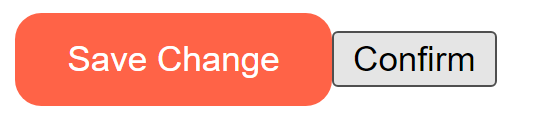
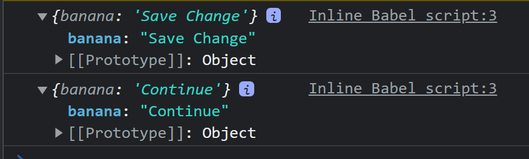

# Props

부모 컴포넌트로부터 자식 컴포넌트로 데이터를 보낼 때 사용 : Props


```react
<!DOCTYPE html>
<html>
  <body>
    <div id="root"></div>
  </body>
  <script src="https://unpkg.com/react@17.0.2/umd/react.production.min.js"></script>
  <script src="https://unpkg.com/react-dom@17.0.2/umd/react-dom.production.min.js"></script>
  <script src="https://unpkg.com/@babel/standalone/babel.min.js"></script>
  <script type="text/babel">
    function SaveBtn() {
      return (
        <button
          style={{
            backgroundColor: "tomato",
            color: "white",
            padding: "10px 20px",
            border: "0",
            borderRadius: "10px",
          }}
        >
          Save Change
        </button>
      );
    }
    function ConfirmBtn() {
      return <button>Confirm</button>;
    }
    function App() {
      return (
        <div>
          <SaveBtn />
          <ConfirmBtn />
        </div>
      );
    }
    const root = document.getElementById("root");
    ReactDOM.render(<App />, root);
  </script>
</html>

```



요런 두 버튼이 있다. Confirm 버튼도 이와 같은 속성을 가지게 하고싶으면 어떻게 해야할까? 물론 복붙하면 되지만 딱히 좋은 방법이 아닌 것 같다. 

```react
...
function Btn(props) {
...
    function App() {
      return (
        <div>
          <Btn banana="Save Change"/>
          <Btn banana="Continue"/>
        </div>
      );
    }
```

모든 컴포넌트들은 `()`로 인자들을 받는다. 리액트가 넣어준다!  아무거나 넣어도 되는데, 보통 props라고 부른다. 

한번 props를 찍어볼까??



오.. props는 Object구나. Object 타입의 banana 값들이 나온다! 우리가 지정해준 값이다. 

이렇게 Btn 태그 옆에 있는 모든 것들을 객체 형태로 넣어서 첫번째 인자로 넘겨준다. 

그래서 `props.banana`를 사용하면 되는구나. 근데 더 예쁘게 쓰고싶다 ? `function *Btn*({ banana, big })`

결과적으론 이렇게 나온다.

```react
<!DOCTYPE html>
<html>
  <body>
    <div id="root"></div>
  </body>
  <script src="https://unpkg.com/react@17.0.2/umd/react.production.min.js"></script>
  <script src="https://unpkg.com/react-dom@17.0.2/umd/react-dom.production.min.js"></script>
  <script src="https://unpkg.com/@babel/standalone/babel.min.js"></script>
  <script type="text/babel">
    function Btn({ banana, big }) {
      return (
        <button
          style={{
            backgroundColor: "tomato",
            color: "white",
            padding: "10px 20px",
            border: "0",
            borderRadius: "10px",
            fontSize: big ? 18 : 16,
          }}
        >
          {banana}
        </button>
      );
    }
    function ConfirmBtn() {
      return <button>Confirm</button>;
    }
    function App() {
      return (
        <div>
          <Btn banana="Save Change" big={true} />
          <Btn banana="Continue" />
        </div>
      );
    }
    const root = document.getElementById("root");
    ReactDOM.render(<App />, root);
  </script>
</html>
```


# Memo

props에 또 뭐를 넣을 수 있을까? string, boolean, funtion 모두 가능!

```react
...
      const changeValue = () => setValue("Revert Changes");
...
          <Btn text={value} changeValue={changeValue} />
          <Btn text="Continue" />
...
```

내가 만든 커스텀 컴포넌트의 onClick은 __이벤트 리스너가 아니다__ 그냥 prop이다! 태그 안에 달아야지 이벤트 리스너지~

```react
...
function Btn({ text, changeValue }) {
      return (
        <button
          onClick={changeValue}
          style={{
            backgroundColor: "tomato",
            color: "white",
            padding: "10px 20px",
            border: "0",
            borderRadius: "10px",
          }}
        >
...
```

자 이제 button안에 onClick이 이벤트 리스너고, 클릭을 하면 changeValue함수를 실행한다!

그니깐, props에 넣는다고 바로 컴포넌트의 return으로 들어가진 않지만, 이런 기능을 구현할 수 있다. 내가 props를 가지고 return 안에 작성하므로서!