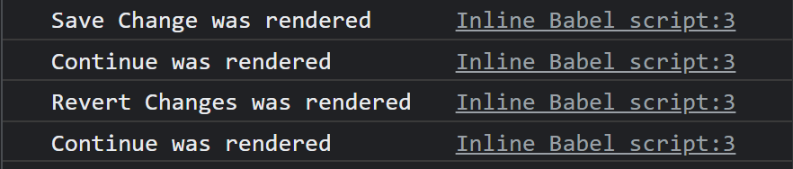

# Props

부모 컴포넌트로부터 자식 컴포넌트로 데이터를 보낼 때 사용 : Props


```react
<!DOCTYPE html>
<html>
  <body>
    <div id="root"></div>
  </body>
  <script src="https://unpkg.com/react@17.0.2/umd/react.production.min.js"></script>
  <script src="https://unpkg.com/react-dom@17.0.2/umd/react-dom.production.min.js"></script>
  <script src="https://unpkg.com/@babel/standalone/babel.min.js"></script>
  <script type="text/babel">
    function SaveBtn() {
      return (
        <button
          style={{
            backgroundColor: "tomato",
            color: "white",
            padding: "10px 20px",
            border: "0",
            borderRadius: "10px",
          }}
        >
          Save Change
        </button>
      );
    }
    function ConfirmBtn() {
      return <button>Confirm</button>;
    }
    function App() {
      return (
        <div>
          <SaveBtn />
          <ConfirmBtn />
        </div>
      );
    }
    const root = document.getElementById("root");
    ReactDOM.render(<App />, root);
  </script>
</html>

```


요런 두 버튼이 있다. Confirm 버튼도 이와 같은 속성을 가지게 하고싶으면 어떻게 해야할까? 물론 복붙하면 되지만 딱히 좋은 방법이 아닌 것 같다. 

```react
...
function Btn(props) {
...
    function App() {
      return (
        <div>
          <Btn banana="Save Change"/>
          <Btn banana="Continue"/>
        </div>
      );
    }
```

모든 컴포넌트들은 `()`로 인자들을 받는다. 리액트가 넣어준다!  아무거나 넣어도 되는데, 보통 props라고 부른다. 

한번 props를 찍어볼까??


오.. props는 Object구나. Object 타입의 banana 값들이 나온다! 우리가 지정해준 값이다. 

이렇게 Btn 태그 옆에 있는 모든 것들을 객체 형태로 넣어서 첫번째 인자로 넘겨준다. 

그래서 `props.banana`를 사용하면 되는구나. 근데 더 예쁘게 쓰고싶다 ? `function *Btn*({ banana, big })`

결과적으론 이렇게 나온다.

```react
<!DOCTYPE html>
<html>
  <body>
    <div id="root"></div>
  </body>
  <script src="https://unpkg.com/react@17.0.2/umd/react.production.min.js"></script>
  <script src="https://unpkg.com/react-dom@17.0.2/umd/react-dom.production.min.js"></script>
  <script src="https://unpkg.com/@babel/standalone/babel.min.js"></script>
  <script type="text/babel">
    function Btn({ banana, big }) {
      return (
        <button
          style={{
            backgroundColor: "tomato",
            color: "white",
            padding: "10px 20px",
            border: "0",
            borderRadius: "10px",
            fontSize: big ? 18 : 16,
          }}
        >
          {banana}
        </button>
      );
    }
    function ConfirmBtn() {
      return <button>Confirm</button>;
    }
    function App() {
      return (
        <div>
          <Btn banana="Save Change" big={true} />
          <Btn banana="Continue" />
        </div>
      );
    }
    const root = document.getElementById("root");
    ReactDOM.render(<App />, root);
  </script>
</html>
```


# Memo

props에 또 뭐를 넣을 수 있을까? string, boolean, funtion 모두 가능!

```react
...
      const changeValue = () => setValue("Revert Changes");
...
          <Btn text={value} changeValue={changeValue} />
          <Btn text="Continue" />
...
```

내가 만든 커스텀 컴포넌트의 onClick은 __이벤트 리스너가 아니다__ 그냥 prop이다! 태그 안에 달아야지 이벤트 리스너지~

```react
...
function Btn({ text, changeValue }) {
      return (
        <button
          onClick={changeValue}
          style={{
            backgroundColor: "tomato",
            color: "white",
            padding: "10px 20px",
            border: "0",
            borderRadius: "10px",
          }}
        >
...
```

자 이제 button안에 onClick이 이벤트 리스너고, 클릭을 하면 changeValue함수를 실행한다!

그니깐, props에 넣는다고 __자동으로 컴포넌트의 return으로 들어가진 않지만__, 이런 기능을 구현할 수 있다. 내가 props를 가지고 return 안에 작성하므로서!

```react
<!DOCTYPE html>
<html>
  <body>
    <div id="root"></div>
  </body>
  <script src="https://unpkg.com/react@17.0.2/umd/react.production.min.js"></script>
  <script src="https://unpkg.com/react-dom@17.0.2/umd/react-dom.production.min.js"></script>
  <script src="https://unpkg.com/@babel/standalone/babel.min.js"></script>
  <script type="text/babel">
    function Btn({ text, changeValue }) {
      console.log(text, "was rendered");
      return (
        <button
          onClick={changeValue}
          style={{
            backgroundColor: "tomato",
            color: "white",
            padding: "10px 20px",
            border: "0",
            borderRadius: "10px",
          }}
        >
          {text}
        </button>
      );
    }
    function ConfirmBtn() {
      return <button>Confirm</button>;
    }
    function App() {
      const [value, setValue] = React.useState("Save Change");
      const changeValue = () => setValue("Revert Changes");
      return (
        <div>
          <Btn text={value} changeValue={changeValue} />
          <Btn text="Continue" />
        </div>
      );
    }
    const root = document.getElementById("root");
    ReactDOM.render(<App />, root);
  </script>
</html>
```

이 예시를 보자. 버튼을 누르면 text값이 변화하고 log창에 우리가 적어준 값이 나올 것이다. 음.. Continue도 나올까?



나온다! 왤까?

맨처음 App이 render된다. 그러면서 Btn을 불러오고, 그때 console.log에 `Save Change was rendered `와 `Continue was rendered`가 출력되는 것은 이해가 간다. 그리고 버튼을 눌렀을 때 `Revert Changes was rendered`까진 이해가 가는데 그 밑에는 왜 출력될까?

우리가 Save Btn을 눌렀고, 그럼 이벤트 리스너가 changeValue 함수를 작동시키는데, 이 함수는 부모 컴포넌트에 있다. 부모컴포넌트에 있는 value의 값이, 즉 state가 변했고 그렇기때문에 App이 rerender되어서 그런 것이다!

_나는 근데 Continue가 rerender 되는걸 원치 않는뎁쇼...._ __그래서 React Memo가 있다!__

__props가 변경되지 않는 선에서 render 되지 않을지 결정할 수 있다!__

```react
...
const MemorizedBtn = React.memo(Btn);
...

    function App() {
      const [value, setValue] = React.useState("Save Change");
      const changeValue = () => setValue("Revert Changes");
      return (
        <div>
          <MemorizedBtn text={value} changeValue={changeValue} />
          <MemorizedBtn text="Continue" />
        </div>
      );
    }
```


# Prop Types

prop의 type을 지정해주지 않으면 협업할 때 틀리는 경우도 있을 수 있다. 근데 React는 경고창이나 에러창을 띄어주지 않는다, 왜냐? 유효한 코드니까! 인간들이 원하는 형식이 있는지 없는지 어떻게 알아. 그냥 오류는 안나 ~ 

그래서 porpTypes를 써볼 것이다.

`  <script src="https://unpkg.com/react@17.0.2/umd/react.development.js"></script>`을 붙여넣어주고 이제 propTypes에 접근이 가능하다!

```react
Btn.propTypes = {
    text: PropTypes.string,
    fontSize: PropTypes.number,
};
```

이렇게 props의 type을 정해주면 내가 저 props만 쓸 것이고, prop에 다른 타입의 데이터를 입력했을 때 console창에 관련 에러가 뜨게된다. __실수 발견 가능__

근데 이경우에는 저 prop들을 안써줘도 상관없다. 만약 꼭 필요하다고 명시해주려면

`fontSize: PropTypes.number.isRequired`라고 써주면 된다! 그럼 안써주면 console창에 경고창을 띄어준다.

그리고, prop에게 default값을 줄 수 있다. 어떻게? ` function *Btn*({ text, changeValue, fontSize = 10 })` 요렇게! 근데 이거는 React 문법이 아닌, JS 문법이다.