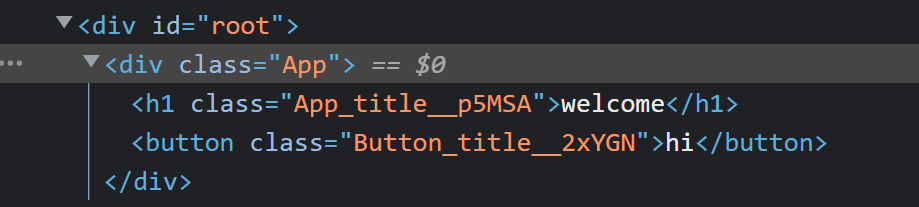

# Introduction

`create-react-app`은 리액트를 만드는데 최고의 방식!

방금은 우리가 script를 다 가져다가 했지만 creat-react-app은 많은 사전설정과 스크립트를 가져다준다.

`npx create-react-app [App name]`

자, 이제 `package.json`을 보자. scripts를 보면 우리가 사용할 수 있는 스크립트들이 있다. start 스크립트를 실행해보겠다

`npm start`

# Tour of CRA

`create-react-app`으로 작업할 때 중요한 것은 __분할과 정복__ => css를 사용할 때 css module을 사용한다.

`[name].module.css`로 이름을 지어 사용할 것이다! 이렇게하면 태그 안에 스타일을 지정해주는 방식보다 훨씬 편리하다. 근데 이렇게 쓰는데 좋은 것이 뭘까...? __클래스 이름을 React가 랜덤으로 지정해준다!__ 그래서 다른 module.css 파일에 동일한 클래스 이름이 있더라도 걱정 할 필요가 없다. DOM에 렌더링 될 때는 

요렇게..! 클래스 이름 뒤에 랜덤으로 붙어서 괜찮다~! 얼마나 멋진가 :)
