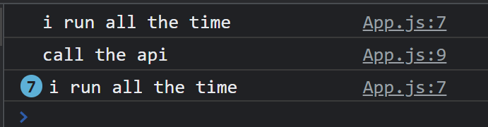

# Introduction

우리가 프로그램을 만들 때, state를 변경하면 그 state만 변경하고 나머지 컴포넌트들은 한번만 render하고 싶을 때가 있다. 예를 들어 API를 가져온다든지... 그럴 때 쓰는 것을 이제 배워볼 것이다!


# useEffect

argument를 2개받는 function이다! __useEffect__는 코드가 1번만 실행되게 해준다. 

```react
  console.log("i run all the time");
  useEffect(() => {
    console.log("call the api");
  }, []);
```



클릭을 누를 때마다 counter의 state가 바뀌어 rerender되는데 call the api는 한번만 실행된 것을 확인할 수 있다.


# Deps

_내가 찾던 기능...! 검색 api를 이용할 때 rerender되지 않는 기능을 찾았다._

예를들어, keyword가 바뀔 때만 그 코드를 실행하고 싶다면 useEffect의 두번째 인자에 keyword를 써 주는 것이다...!

```react
  useEffect(() => {
    console.log("search for ", keyword);
  }, [keyword]);
```

__이 keyword가 변화할 때만 이 코드를 실행해줘, React야 이 state를 보고있으렴~__

근데,.. 처음 렌더링 될 때는 실행이 되니까....! 더 완벽하게 코드를 써주자.

```react
useEffect(() => {
    if (keyword !== "" && keyword.length > 5) {
      console.log("search for ", keyword);
    }
  }, [keyword]);
```

[] 안에 아무것도 없으면 React가 지켜보고 있는 것이 없으니까, 처음 render 될 때 한번만 실행된다! []안에는 여러 개를 넣어도 된다.


# Recap

React의 가장 큰 장점은 우리가 refresh를 하지 않아도 state가 변경되면 알아서 rerender을 해주는 것이다! 하지만 가끔은 component 안에서 한 번만 실행되게 하고 싶을 수도 있다. 그래서 __useEffect__를 사용한다. argument는  우리가 실행시키고 싶은 코드였고, 두번째 는 Dependency는 react가 변화하는지 지켜보는 것이다.


## Memo vs Effect

`useMemo`는 __생성__함수에 관련된 기능. 생성자 함수가 고비용(처리 시간이 오래걸림)인 경우 렌더링마다 계산하는 것은 처리 시간이 오래 걸리므로 값을 기억해놓고 의존성이 변경되었을 경우에만 다시 계산.

`useEffect`는 api 호출, 타이머 등 렌더링 과정에서 한 번만 호출해도 될 기능이 렌더링마다 실행되거나, 호출 과정에서 렌더링에 영향을 미칠 수 있는 것을 따로 모아서 처리하기 위한 기능이다.

`useEffect`는 해당 컴포넌트의 렌더링이 완료된 후에 실행되지만 `useMemo`는 렌더링 중에 실행되는 차이가 있다.


# CleanUp

잘 안쓰이긴 한다... 그래도 해볼궤

```react
import "./style.css";
import { useEffect, useState } from "react";

function Hello() {
  useEffect(() => {
    console.log("I'm here");
    return console.log("bye :(") 
  }, []);
  return <h1>Hello</h1>;
}

function App() {
  const [showing, setShowing] = useState(false);
  const onClick = () => setShowing((prev) => !prev);
  return (
    <div>
      {showing ? <Hello /> : null}
      <button onClick={onClick}>{showing ? "hide" : "show"}</button>
    </div>
  );
}

export default App;
```

버튼을 누르면 Hello component가 보이고, 다시 누르면 없어지는 이 코드가 있다. 버튼을 누를 때마다 저 component를 없애고(destroy) 생성하고(create)있다. 숨기는게 아니고, 아예 없애버리고있다.

근데 destroy할 때도 코드를 실행할 수 있다고...?! 이거를 __cleanup function__이라고 한다.

component가 없어 질 때 분석을 보내고 싶거나(분석 api), console에 출력을 하고 싶을 때나...


위 코드를 이렇게 바꿔 쓸 수 있다.

```react
function Hello() {
  function destroyedFn() {
    console.log("bye :(");
  }
  function effectFn() {
    console.log("created :)");
    return destroyedFn
  }
  useEffect(effectFn, []);
  return <h1>Hello</h1>;
}
```


```react
useEffect(() => {
    console.log("hi :)");
    return () => console.log("bye :(");
}, []);

useEffect(function () {
    console.log("hi :)");
    return function () {
        console.log("bye :(");
    };
}, []);
```

위 두 코드는 같은데...! 그냥 취향의 차이이다. 보통 위 코드를 많이 쓴다. 더 간편하니깐 :)


