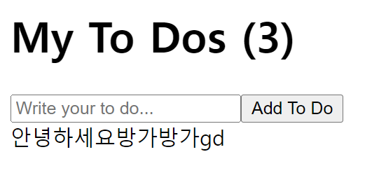

# Todo List 1

array를 수정하는 법은 `setTodos()`



```react
import { useState } from "react";

function App() {
  const [toDo, setToDo] = useState("");
  const [toDos, setToDos] = useState([]);
  const onChange = (e) => setToDo(e.target.value);
  const onSubmit = (e) => {
    e.preventDefault();
    if (toDo === "") {
      return;
    }
    setToDos((currentArray) => [toDo, ...currentArray]);
    setToDo("");
  };
  return (
    <div>
      <h1>My To Dos ({toDos.length})</h1>
      <form onSubmit={onSubmit}>
        <input
          value={toDo}
          onChange={onChange}
          type="text"
          placeholder="Write your to do..."
        />
        <button>Add To Do</button>
      </form>
      {toDos}
    </div>
  );
}

export default App;

```

여기서 __비구조화 할당(구조분해)__를 이용해 Todos를 늘려주었다.


# Todo List 2

`map`함수는 JavaScript 함수로, array에 있는 item을 내가 원하는 것으로 바꿔주고 new array를 뱉어준다.

```react
import { useState } from "react";

function App() {
  const [toDo, setToDo] = useState("");
  const [toDos, setToDos] = useState([]);
  const onChange = (e) => setToDo(e.target.value);
  const onSubmit = (e) => {
    e.preventDefault();
    if (toDo === "") {
      return;
    }
    setToDos((currentArray) => [toDo, ...currentArray]);
    setToDo("");
  };
  console.log(toDos);
  return (
    <div>
      <h1>My To Dos ({toDos.length})</h1>
      <form onSubmit={onSubmit}>
        <input
          value={toDo}
          onChange={onChange}
          type="text"
          placeholder="Write your to do..."
        />
        <button>Add To Do</button>
      </form>
      <hr />
      {toDos.map((item, idx) => (
        <li key={idx}>{item}</li>
      ))}
    </div>
  );
}

export default App;
```

스아실... key값을 적어주지 않으면 이런 경고창이 뜬다! list는 유니크한 key 값을 가지고 있어야 하기 때문이다. map의 두번째 parameter은 index기 때문에 idx를 추가해주면 이 경고창은 뜨지 않는다.

```
react_devtools_backend.js:4026 Warning: Each child in a list should have a unique "key" prop.

Check the render method of `App`. See https://reactjs.org/link/warning-keys for more information.
    at li
    at App (http://localhost:3000/main.31adf43088873f5aaf0f.hot-update.js:29:74)
```

