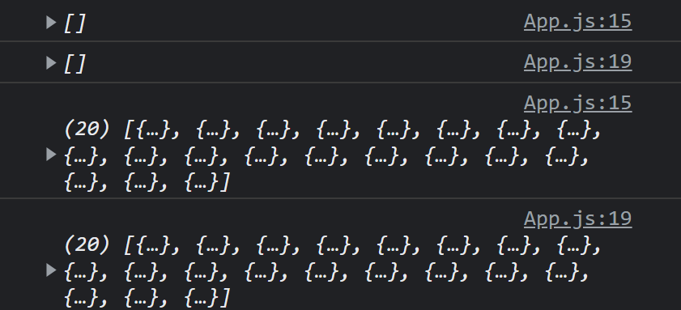
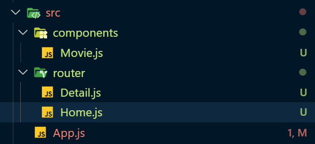

# part One

[movie api link](https://yts.mx/api/v2/list_movies.json?minimum_rating=8.5&sort_by=year)를 이용해서 영화들의 정보를 가져올 것이다.

```react
 useEffect(() => {
    fetch(
      "https://yts.mx/api/v2/list_movies.json?minimum_rating=8.5&sort_by=year"
    )
      .then((res) => res.json())
      .then((json) => {
        setMovies(json.data.movies);
        setLoading(false);
      });
  }, []);
```

지난 시간에 배웠던 것처럼, `useEffect`를 사용하고 지켜볼 것에 아무것도 넣지 않으면 처음 페이지가 render할 때만 안에 코드가 실행된다. 일단 api에서 영화들을 가져와 movies에 저장해주었다.

요즘은 then보다 async-await을 사용한다. 위 코드를 그렇게 변환해보자면

```react
const getMovies = async () => {
    const res = await fetch(
      "https://yts.mx/api/v2/list_movies.json?minimum_rating=8.5&sort_by=year"
    );
    const json = await res.json();
    setMovies(json.data.movies);
    setLoading(false);
  };
  useEffect(() => {
    getMovies();
  }, []);
```

흠... 요것보다 간단하게 쓰고싶으면

```react
const getMovies = async () => {
    const json = await (
      await fetch(
        "https://yts.mx/api/v2/list_movies.json?minimum_rating=8.5&sort_by=year"
      )
    ).json();
    setMovies(json.data.movies);
    setLoading(false);
  };
  useEffect(() => {
    getMovies();
  }, []);
  console.log(movies);
```

await으로 두번 감싸서 json으로 받아주면 된다!



근데... 콘솔엔 왜... 2번 찍히지...? 아하 setMovies를 해주고, setLoading을 해주니까, state가 두번이나 바뀌니까!


이제 가져온 data들을 화면에 뿌려주자. 전에 배웠던 `map`함수를 이용해서! 

_주의 : 각 item은 key 값을 가지고 있어야 한다_

```react
return (
    <div>
      {loading ? (
        <h1>Loading..</h1>
      ) : (
        <div>
          {movies.map((movie) => (
            <div key={movie.id}>
              
              <h2>{movie.title}</h2>
              <p>{movie.summary}</p>
              <ul>
                {movie.genres.map((g) => (
                  <li key={g}>{g}</li>
                ))}
              </ul>
            </div>
          ))}
        </div>
      )}
    </div>
  );
```


# Part Two

사실,,, Movie 내용을 App에 다 넣어줄 필요가 없다. React의 장점인 Movie 컴포넌트를 만들어 Movie를 분리해보겠다

```react
//App.js
import { useEffect, useState } from "react";
import Movie from "../components/Movie";
function Home() {
  const [loading, setLoading] = useState(true);
  const [movies, setMovies] = useState([]);
  const getMovies = async () => {
    const json = await (
      await fetch(
        "https://yts.mx/api/v2/list_movies.json?minimum_rating=9&sort_by=year"
      )
    ).json();
    setMovies(json.data.movies);
    setLoading(false);
  };
  console.log(movies);
  useEffect(() => {
    getMovies();
  }, []);
  return (
    <div>
      {loading ? (
        <h1>Loading..</h1>
      ) : (
        <div>
          {movies.map((movie) => (
            <Movie
              key={movie.id}
              coverImg={movie.medium_cover_image}
              title={movie.title}
              summary={movie.summary}
              genres={movie.genres}
            />
          ))}
        </div>
      )}
    </div>
  );
}
export default Home;
```


```react
//Movie.js
import propTypes from "prop-types";

function Movie({ coverImg, title, summary, genres }) {
  console.log(genres);
  return (
    <div>
      
      <h2>{title}</h2>
      <p>{summary}</p>
      <ul>{genres && genres.map((g) => <li key={g}>{g}</li>)}</ul>
    </div>
  );
}

Movie.propTypes = {
  coverImg: propTypes.string.isRequired,
  title: propTypes.string.isRequired,
  summary: propTypes.string.isRequired,
  genre: propTypes.arrayOf(propTypes.string),
};

export default Movie;
```

prop types로 prop의 type을 지정해주고, movie의 요소들을 prop으로 받아 보내줬다.

흠... 이제 router을 쓰고싶은데? 폴더 구조를 바꿔줘야겠다.




보자보자 ~ component들은 `components`폴더 안에 넣어 관리를 해 줄것이고, `router`에 URL에 따른 것들을 넣어줘야 겠다. App.js는 새로운 component를 render 할 것인데, 이 component는 URL을 보고있고, URL에 따라서 Home을 보여주거나 Detail을 보여 줄 것이다.


# React Router

```
🚨🚨🚨
npm i react-router-dom@5.3.0
🚨🚨🚨
```

버전 명시...!

```react
import { BrowserRouter as Router, Switch, Route } from "react-router-dom";
import Home from "./router/Home";
import Detail from "./router/Detail";

function App() {
  return (
    <Router>
      <Switch>
        <Route path="/movie">
          <Detail />
        </Route>
        <Route path="/">
          <Home />
        </Route>
      </Switch>
    </Router>
  );
}

export default App;
```

```react
import { Link } from "react-router-dom";

function Movie({ coverImg, title, summary, genres }) {
  return (
    <div>
      
      <h2>
        <Link to="/movie">{title}</Link>
      </h2>
      <p>{summary}</p>
      <ul>{genres && genres.map((g) => <li key={g}>{g}</li>)}</ul>
    </div>
  );
}
```

요렇게 구현하면 Home router을 render해줘서 Home이 보이게 된다! URL뒤에 "movie"를 입력하면 Detail route로 넘어간다.

Switch를 사용한 이유는 한 번에 하나의 Route만 렌더링 해준다.

참고로 6버전 이후 router는 더이상 Switch를 필요로 하지않는다. 이때는 Switch 대신 `Routes` import 해주어사용하면 된다.

```react
// react-router-dom 6버전 이상 사용시 코드
// Route 태그의 exact 속성도 더이상 쓰이지 않으며 Routes가 알아서 최적의 경로배정을 해주기 때문에 Switch를 썼을 때의 고민을 말끔히 해결해 준다
<Router>
    <Routes>
        <Route path="/" element={<Home />} />
    </Routes>
</Router>
```


## 왜 <a href="URL">를 안써 ㅠㅠ..?

React의 장점은 무엇이다...? 새로고침을 안하고 다른 페이지로 이동해준다! a태그를 쓰면 새로고침을 해줘서 DOM을 rerender해주기 때문에 react의 장점을 살리지 못한다~! SPA를 만들고있잔아 우리 ~~! 그래서 Link를 사용할 것이다. __Link__는 브라우저의 새로고침 없이 유저를 다른 페이지로 이동시켜주는 컴포넌트다


## HashRouter과 BrowserRouter

HashRouter은 뒤에 `http://localhost:3000/#/` hash가 붙는다.

BrowserRouter은 `http://localhost:3000/` 그냥 요렇게 생겼다. 보통 BrowserRouter를 쓴다.


# Parameters

React Router은 다이나믹(동적) URL을 지원해준다. 그래서 path로 `movie/:id`로 보내서 Detail로 보내줄 것이다.

그래서 Home의 movie id를 prop으로 받아, Movie에서 Link에 id를 넘겨준다.

`<Link to={`/movie/${id}`}>{title}</Link>`

Router에서 어떤 data를 넘겨주는지 궁금할 때 쓰는 함수 __useParams__

```react
import { useParams } from "react-router-dom";
function Detail() {
  const {id} = useParams();
  console.log(id);
  return <h1>Detail</h1>;
}
export default Detail;
```

```
43059
```

이렇게 우리가 route에 지정해준 변수명대로 변수명을 가지고 값을 보여준다. 

그럼 이제 api URL에 id값을 넣어 movie detail DATA를 가져와 꾸며주면 된다.

```react
import { useEffect } from "react";
import { useParams } from "react-router-dom";
function Detail() {
  const { id } = useParams();
  const getMovie = async () => {
    const json = await (
      await fetch(`https://yts.mx/api/v2/movie_details.json?movie_id=${id}`)
    ).json();
  };
  useEffect(() => {
    getMovie();
  }, []);
  return <h1>Detail</h1>;
}
export default Detail;
```

