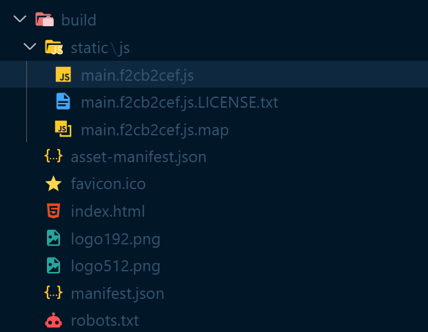

## install gh-pages

```bash
$ npm i gh-pages
$ npm run build
```

gh-pages는 결과물을  github page를 올릴 수 있게 해주는 패키지이다.

자, 이제 package.json에 들어가 "scripts"를 확인해보면 "build"가 있을 것이다. bulid를 실행하면 우리 웹 사이트에 production ready code(코드 압축, 최적화)를 생성하게 된다.



그럼 이런 build 폴더가 생기는데, 여기서 js파일에 들어가보면 우리가 작성한 코드들이 최적화되어 작성되어있는 것을 볼 수 있다. 밑 사진을 보자. 외계어 같지만 우리가 썼었던 코드들이다.


## package.json setting

```react
...
"scripts": {
    ...
    // gh-pages가 build폴더를 저 밑에 homepage에 올린다.
    "deploy" : "gh-pages -d build",
    // build를 한 다음 deploy를 하는 것을 잊지 않기위해 predeploy를 적어준다.
    // node.js가 predeploy를 실행해 bulid후 deploy를 해준다.
    "predeploy" : "npm run build"
}
...
	},
        //내 프로그램 파일이 있는 레포지토리의 github 페이지의 주소
    "homepage" : "https://[username].github.io/[repository name]"
}
```

이제 실행을 해주면...

```bash
$ npm run deploy
npm WARN config global `--global`, `--local` are deprecated. Use `--location=global` instead.

> m-app@0.1.0 predeploy
> npm run build

npm WARN config global `--global`, `--local` are deprecated. Use `--location=global` instead.

> m-app@0.1.0 build
> react-scripts build

Creating an optimized production build...
Compiled with warnings.

[eslint] 
src\router\Detail.js
  Line 13:6:  React Hook useEffect has a missing dependency: 'getMovie'. Either include it or remove the dependency array  react-hooks/exhaustive-deps

Search for the keywords to learn more about each warning.
To ignore, add // eslint-disable-next-line to the line before.

File sizes after gzip:

  56.85 kB  build\static\js\main.f2cb2cef.js

The project was built assuming it is hosted at /temp/.
You can control this with the homepage field in your package.json.

The build folder is ready to be deployed.

Find out more about deployment here:

  https://cra.link/deployment


> m-app@0.1.0 deploy
> gh-pages -d build

Published
```


배포완료!