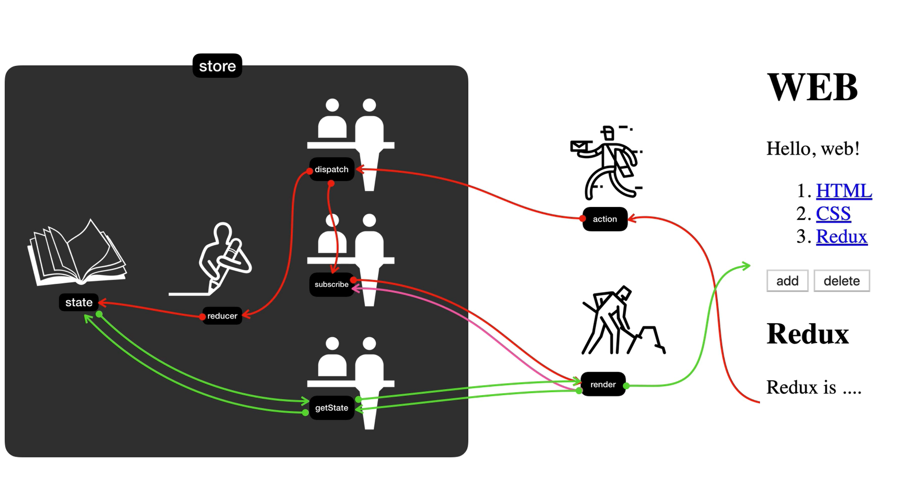

# Redux?

JS로 만든 App들을 위한 예측 가능한 상태의 저장소!

어플리케이션을 만들 때 조심해야하는 것은 __복잡성__이다. redux는 App의 복잡성을 예측가능하게 낮춰줘서 우리의 목표를 달성하는 것을 도와준다.

redux는 하나의 상태를 만든다. state는 한 곳에 데이터를 중앙집중식으로 관리한다.

단 하나의 상태를 유지하고, 수정하는 것을 차단시킨다. => 인가된 담당자(함수)를 이용해서 바꿀 수 있다. __직접 state값을 바꿀 수 없다.__ 가져갈 때도 함부로 가져갈 수 없다. state가 바뀌었을 때도 값이 바뀌었으니까 각자 바꿔! 라고 연락을 해서 각자 값을 바꾼다.

각각의 상태변화가 서로 복제본에게 영향을 미치고 있지 않다. 그리고 Redux를 사용하면 과거의 어플리케이션 상태도 알 수 있다. __Module Reloading__을 할 수 있다. 앱은 refresh가 되는데, 데이터는 남아있게 개발환경을 세팅할 수 있다.

# Redux 소개

보통 React와 Vue.js 를 이용해서 같이 쓰긴 하기만, 단독으로 써도 괜찮다.

그림. redux 지도

store(비유 : 은행) : 정보가 저장됨

state : 실제 정보 : 절대로 state에 직접 접속하는 것이 금지되어있고 불가능하다. 

reducer : store를 만들며 reducer라는 함수를 제일 먼저 내가 만들어야 한다. redux에서 이걸 이해하는게 제일 어렵다.

render : store 밖, redux와 상관없이 나의 코드. state를 반영한 UI를 만든다. 

state(은행)의 정보를 직접 만지면 안되니까, 창구원같은 dispatch, subscribe, getState가 맞아준다.

state 값이 바뀔 때마다 render가 자동으로 불러와서 UI가 바뀌었으면 좋겠는데? => _subscribe_

subscribe : state가 바뀔 때마다 render가 불러와 UI 갱신, 구독

dispatch : onsubmit하면 action이라는 객체를 dispatch로 보내준다. dispatch는 두가지 일을 한다. dispatch가 reducer를 호출해 state 값을 바꾸고 subscribe를 호출해 구독자들을 다 호출해 render 함수를 호출해 화면을 갱신한다. 새로운 state에 맞게 UI가 바뀌게 된다.

dispatch는 reducer에게 2개의 값을 준다. 현재 state 값과 action data 값. action의 type에 따라 코드를 가공해서 return 해준다. 이는 state의 새로운 값, 값이 변경되었다.=> reducer는 state를 __가공하는 가공자__