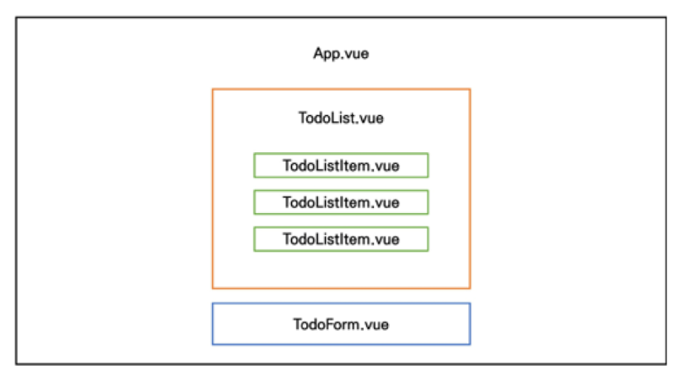
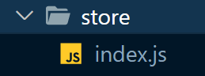
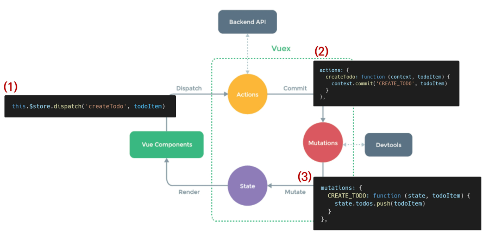

# TODO APP 실습

## 컴포넌트 구성



## Vue 시작 할 때 중요한 것

1. Modeling: __M(data)__V VM : DB를 어떻게 보여줄 것인가 : 언제나 그렇듯이 Data가 중요
2. 컴포넌트 구성 :  M V __VM(컴포넌트 트리)__ : 누가 가지고있을까 : Vuex는 중앙집중구조라서 괜찮아요

### import 경로 설정시 .과 @  : 상대경로와 절대경로

- Vue에서만 @는 src를 상징함 : 절대경로
- .는 파일 위치를 옮겼을 때 못알아챔 : 상대경로
- CLI : 홈폴더 N 루틉폴더 /

#### create pjt

```bash
$ vue create todo-vuex-app
? Please pick a preset: Default ([Vue 2] babel, eslint

$ vue add vuex
 WARN  There are uncommitted changes in the current repository, it's recommended to commit or stash them first.
? Still proceed? Yes
```

vuex plugin을 Vue CLI에 추가해준다 

commit 여부도 YES해준다.


=> Vuex를 추가한 경우 



store 디렉토리와 index.js 파일이 생겼다 : 대표파일 : Vuex core concepts가 작성 되는 곳이다.

```js
// index.js

import Vue from 'vue'
import Vuex from 'vuex'

Vue.use(Vuex)

// Business Logic
export default new Vuex.Store({
  state: { //data
  },
  getters: { //computed
  },
  mutations: { // change!
  },
  actions: { //methods
  },
  modules: {
  }
})
```

기존에 작성하던 스타일은 template/script/style 중 script의 비중이 컸지만 이제 script가 얇아질 것


### 참고 : vue와 vuex의 차이점

```js
//vue way
data: {
  msg: 'hello'
}

//vuex way
state: {
  msg: 'hello'
}

// use
<p>{{msg}}</p>
<p>{{this.$store.state.msg}}</p>

// getters == computed
state {
  myNum: 10
},
getters{
  getNum(state){
    return state.myNum
  },
}

// use
<p>{{this.$state.getter.getNum}}</p>
```


# 기본 구조 잡기

### App.vue

```vue
<template>
  <div id="app">
    <todo-list></todo-list>
    <todo-form></todo-form>
  </div>
</template>

<script>
import TodoList from './components/TodoList.vue'
import TodoForm from './components/TodoForm.vue'
export default {
  name: 'App',
  components: {
    TodoList,
    TodoForm,
  },
}
</script>

```

### TodoList.vue

```vue
<template>
  <div>
    <todo-list-item></todo-list-item>
  </div>
</template>

<script>
import TodoListItem from './TodoListItem.vue'
export default {
  name: 'TodoList',
  components: {
    TodoListItem,
  }
}
</script>
```

### TodoListItem.vue

```vue
<template>
  <div>Todo</div>
</template>

<script>
export default {
  name: 'TodoListItem',
}
</script>
```

### TodoForm.vue

```vue
<template>
  <div>Todo Form
    <input type="text">
  </div>
  
</template>

<script>
export default {
  name: 'TodoForm',
}
</script>
```


## index.js state 작성

_[주의] : Vuex를 사용한다고 해서 Vuex Store에 모든 State를 넣어야 하는 것은 아니다!_

```js
import Vue from 'vue'
import Vuex from 'vuex'

Vue.use(Vuex)

export default new Vuex.Store({
  state: { //data : 마치 DB Table 같네
    todos: [
            {
              title : '점심먹기',
              isCompleted: false,
              data: new Date().getTime(), // date는 절대 중복될 수 없어서 key 값으로 활용!
            },
            {
              title : '저녁먹기',
              isCompleted: false,
              data: new Date().getTime() + 1,
            }
          ]
  },
  getters: { //computed
  },
  mutations: { // methods => change
  },
  actions: { //methods => !change
  },
  modules: {
  }
})
```


### TodoList 데이터 가져오기

컴포넌트에서 Vuex Store의 state에 접근 `$store.state.`

```vue
// TodoList.vue
<template>
  <div>
    <todo-list-item v-for="todo in $store.state.todos"
    :key="todo.date"></todo-list-item> // date는 절대 중복될 수 없어서 key 값으로 활용!
  </div>
</template>
...
```

현재 state의 todo는 값이 변화하는게 아닌데 위 방식은 store에 저장된 todo 목록을 매번 새로 호출하기에 비효율적

=> 대신 todo의 변경 사항이 있을 때만 새로 계산한 값을 반환하는 방향으로 만들자! : computed : this(Vue Instance)로 접근하자

```vue
<template>
  <div>
    <todo-list-item
      v-for="todo in todos"
      :key="todo.date"
      :todo="todo"
    >
    </todo-list-item>
  </div>
</template>
...
<script>
...
    computed: {
        todos(){
          return this.$store.state.todos
        }
      },
...
```


### Pass Props (ToDoList => Todo)

```vue
// TodoListItem.vue
...
<div>
    {{todo.title}}
  </div>
...
  props: {
    todo: {
      type: Object,
    }
```


### Actions & Mutations

```js
// index.js
// mutations가 유일하게 state를 건드릴 수 있는 애니까 함수 Warning차원에서 상수(Vue 권장)
//   linter와 같은 tool에서 디버깅하기 편하고 전체 app에서 어떤게 mutation인지 알기 쉽당
// mutations의 함수는 인자를 state로 받음 : 당연함, state를 건드리는 애니까
// actions는 state를 건드리진 않지만 mutations의 충격방지용(?)으로  
  mutations: { // methods => change
    CREATE_TODO(state, newTodo){
      state.todos.push(newTodo)
    }
  },
  actions: { //methods => !change
    createTodo({commit}, newTodo){
      // context => 만능 맥가이버 칼
      // context안에 mutations에 접근 가능한 commit이 들어있음
      // const commit = context.commit
      // const {commit} = context
      commit('CREATE_TODO', newTodo)
    }
  },
```

`context.state`와 `context.getters`에 접근이 가능하지만 __actions에서 state 조작하지 마라__

### TodoForm.vue 

createTodo 메서드를 통해서 createTodo Action 함수를 호출해온다(dispatch())

```vue
//TodoForm.vue

  <div>Todo Form
    <input type="text"
    v-model="todoTitle"
    @keyup.enter="createTodo">
    <!-- @keyup.enter="$store.dispatch('createTodo')"> -->
  </div>
...
  data: () =>{
    return {
      todoTitle: '',
    }
  },
  methods: {
    createTodo() {
      const newTodo = {
        title: this.todoTitle,
        isCompleated: false,
        data: new Date().getTime(),
      }
      this.$store.dispatch('createTodo', newTodo) //action을 호출하는 이름 dispatch
    },
  }

```


## Vuex 상태 관리 흐름




## Delete Todo & Update Todo

### TodoListItem.vue

```vue
<template>
  <div class="todo-item">
    <span 
    @click="updateTodoStatus(todo)"
    :class="{'is-completed': todo.isCompleted}">
      {{todo.title}}
      </span> -<!--update 밑줄치고, todo의 상태 바꾸기-->
    <!-- 특수 문법 -->
    <!-- <button @click="deleteTodo 걸어두고, 
    실행할 때 인자로 todo 넘겨주세요 같이 메모한 느낌">X</button> -->
    <!-- 지금 실행하자는게 아니야~ -->
    <button @click="deleteTodo(todo)">X</button>
  </div>
</template>

<script>
import {mapActions} from 'vuex'

// {deleteTodo : function() {}, cretaeTodo: function() {}}
export default {
  name: 'TodoListItem',
  props: {
    todo: {
      type: Object,
    }
  },
  methods: {
    // deleteTodo() {
    //   // store에 삭제 요청
    //   this.$store.dispatch('deleteTodo', this.Todo)
    // },
    // 이렇게 쓰는거 너무 길지않냐?  
    // actions의 'deleteTodo' 함수 바로 쓰고싶어 : map
    ...mapActions(['deleteTodo','updateTodoStatus']), //spread operator
    // 구조부할당은? key:value에선 안된다. 밖에서는 가능~
    // mapActions(['deleteTodo'])
  }
}
</script>

<style scoped>
.is-completed {
  text-decoration: line-through;
}
 div{
  border: 2px solid black;
  margin: 2px;
  padding: 2px;
}
span{
  cursor: pointer;
}
</style>
```

### index.js

```js
mutations: { // methods => change
    ...
    DELETE_TODO(state, todoItem){
      //slice를 쓰기위해서 index 값을 구해줌
        const index = state.todos.indexOf(todoItem)
        // 지울 위치에서 1개만큼 지워준다.
        state.todos.splice(index,1)
    },
    UPDATE_TODO_STATUS(state, todoItem){
        // map을 이용해 받아온 todoItem과 todo가 같다면 isComplete 상태를 바꿔준다
      state.todos = state.todos.map(todo => {
        if (todo === todoItem){
          todo.isCompleted = !todo.isCompleted
        }
        return todo
      })
    },

    },
  actions: { //methods => !change
     ...
    deleteTodo({commit}, todoItem){
       // 지우기전에 물어봐주는게 UX를 향상 시킬 수 있지 않을까?
      if (confirm('Are you sure you want to delete')){
      commit('DELETE_TODO',todoItem)
    }
    },
    updateTodoStatus({commit}, todoItem){
      commit('UPDATE_TODO_STATUS', todoItem)
    }
  },
  
```


## 완료한 갯수, 미완료 갯수, 총 목록 갯수!

```js
// index.js
...
  getters: { //computed
    //현재 끝난 일의 갯수
    allTodosCount(state){
      return state.todos.length
    },
    completedTodosCount(state){
      return state.todos.filter(todo => {
        return todo.isCompleted
      }).length
    },
    uncompletedTodosCount(state){
      return state.todos.filter(todo => {
        return !todo.isCompleted
      }).length
    },
...
```


## [참고] Local Storage

Session Storage : 램이 켜져있음

Local Storage : 영구 저장

```js
JSON.stringify(todos)
localStorage.setItem('todos', data)
```

Application 들어가서 확인하면 문자열로 저장된다!

```js
const prevData =localStorage.getItem('todos')
JSON.parse('prevData')
```

확인하려면 파싱해서 확인~


### vuex-persistedstate

설치 : `npm i vuex-persistedstate`

사용

```js
// index.js

import createPersistedState from 'vuex-persistedstate'

export default new Vuex.Store({
    plugins: [
        createPersistedState(),
    ],
})
```