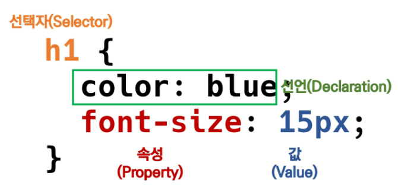
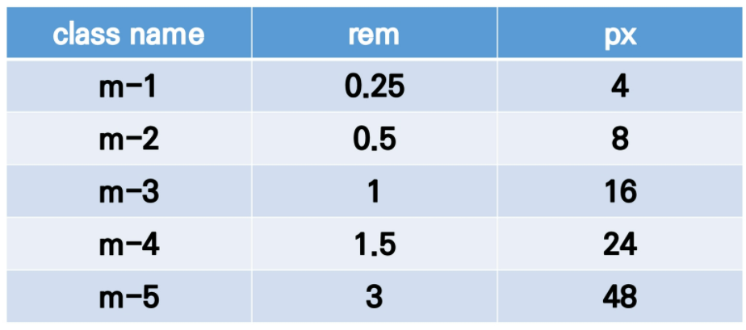
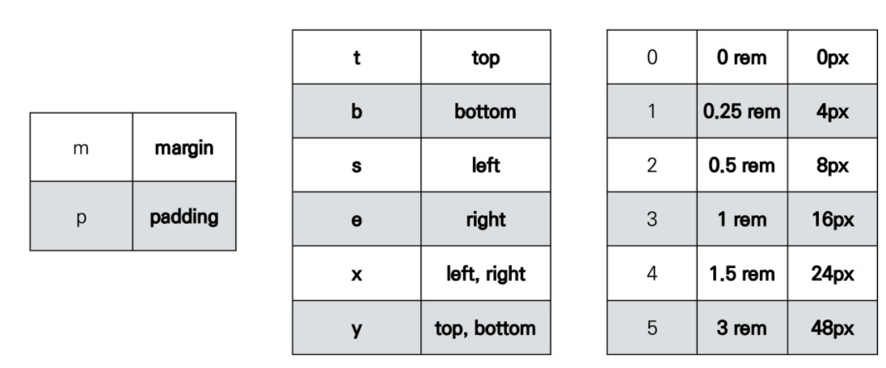

# HTML

### 현재의 웹 표준 : WHATWG

- HTML : Hyper Text Markup Language
  - Hyper Text : 참조를 통해 사용자가 한 문서에서 다른 문서로 즉시 접근할 수 있는 텍스트
  - Markup Language : 태그 등을 이용해 문서나 데이터의 구조를 명시하는 언어
- 그래서 HTML이란? : 웹 페이지를 작성(구조화)하기 위한 언어!


## HTML 기본 구조

```html
<!DOCTYPE html>
<html lang="ko">
<head>
  <meta charset="UTF-8">
  <link href="style.css" rel = "stylesheet">
</head>
<body>
  
</body>
</html>
```

- html : 문서의 최상위(root)요소
- head : 문서 메타데이터 요소
  - 문서 제목, 인코딩, 스타일, 외부 파일 로딩 등
  - 일반적으로 브라우저에 나타나지 않는 내용
  - `<title>` : 브라우저 상단 타이틀
  - `<meta>` : 문서 레벨 메타데이터 요소
  - `<link>` : 외부 리소스 연결 요소 (CSS 파일 등)
  - `<script>` : 스크립트 요소(JS 파일/코드)
  - `<style>` : css 직접 작성
- body : 문서 본문 요소
  - 실제 화면 구성과 관련된 내용

### DOM 트리

- Document Object Model
- 텍스트 파일인 HTML 문서를 브라우저에 렌더링 하기 위한 구조
  - HTML 문서에 대한 모델을 구성
  - HTML 문서 내의 각 요소에 접근 / 수정에 필요한 프로퍼티와 메서드를 제공

### 요소(element)

- `<여는/시작>contents<닫는/종료>` : HTML의 요소는 태그와 내용(contents)로 구성!
  - 태그(element., 요소)는 컨텐츠(내용)를 감싸고, 그 정보의 성격과 의미 정의
- 내용이 없는 태그들 : br(줄바꿈), hr, img, input, link, meta
- 요소는 중첩(nested)될 수 있음
  - 요소의 중첩을 통해 하나의 문서를 구조화
  - 여는 태그와 닫는 태그의 쌍을 잘 확인하기!

### 속성(attribute)

- `<a href(속성명)="https://google.com"></a>(속성값)` : 태그별로 사용할 수 있는 속성 값이 다르다!
-  속성을 통해 태그의 부가적인 정보 설정
- 요소는 속성을 가질 수 있으며, 경로나 크기와 같은 추가적 정보 제공
- 요소의 시작 태그에 작성하며 보통 이름과 값이 하나의 쌍으로 존재
- 태그와 상관없이 사용가능한 속성(HTML Global Attribute)들도 있다
  - id : 문서 전체에서 유일한 고유 식별자 지정
  - class : 공백으로 구분된 해당 요소의 클래스의 목록(CSS, JS에서 요소를 선택하거나 접근)
  - data-* : 페이지에 개인 사용자 정의 데이터를 저장하기 위해 사용
  - style : inline 스타일
  - title : 요소에 대한 추가 정보 지정
  - tabindex : 요소의 탭 순서

### 시맨틱 태그

- HTML5에서 의미론적 요소를 담은 태그 등장
  - 기존 영역을 의미하는 div 태그를 대체해 사용
- 태그 목록
  - header : 문서 전체나 섹션의 헤더
  - nav :내비게이션
  - aside : 사이드 공간, 메인 콘텐츠와 관련성 적은 콘텐츠
  - section : 문서의 일반적인 구분, 컨텐츠 그룹 표현
  - article : 문서, 페이지, 사이트 안에서 독립적으로 구분되는 영역
  - footer : 문서 전체나 섹션의 푸터(마지막 부분)
  - h1, table 등
- Non semantic : div(의미없는 블록 레벨 컨테이너), span(의미없는 인라인 컨테이너) 등
- 검색엔진 등에 의미 있는 정보의 그룹을 태그로 표현
- 단순히 구역을 나누는 것 뿐만 아니라 __의미__를 가지는 태그들 활용하기 위한 노력
- 요소의 의미가 명확해짐 : 가독성 높이고 유지보수 쉽게 함
- 검색엔진최적화 위해 메타태그, 시맨틱 태그 등을 통한 마크업을 효과적으로 활용 해야함

### table

- `<thead>` (tr>th)`<tbody>`(tr>td) `<tfoot>`(tr>td) 
- `<tr>` 가로줄 / `<th> <td>`로 셀 구성
- `colspan, rowspan` 속성을 활용해 셀 병합
- `<caption>` 표 설명 또는 제목

### form

- 정보(데이터)를 서버에 제출하기 위한 영역
  - action : form을 처리할 서버의 URL
  - method : form을 제출할 때 사용할 HTTP 메서드(GET or POST)
  - enctype : method가 post인 경우 데이터의 유형

### input

- name : form control에 적용되는 이름
- value : form control에 적용되는 값 
- required, ~
- label 클릭해 input 자체의 초점을 맞추거나 활성화 가능
  - 사용자는 선택할 수 있는 영역 늘어나 웹/모바일 환경에서 편하게 사용 가능
  - label과 input 입력의 관계가 시각적 뿐만 아니라 화면리더기에서도 label을 읽어 쉽게 내용 확인 가능하게 함
  - input에 id 속성, label에는 for 속성 활용해 상호 연관
- input 유형 : text, password, email(이메일 아니면 form 제출 불가), number(범위 설정 가능), cheakbox, radio, Sidden


# CsS



- 속성 : 어떤 스타일 기능을 변경할지 결정
- 값 : 어떻게 스타일 기능을 변경할지 결정


### CSS 정의 방법

- 인라인 / 내부참조`<style>` / 외부참조 - 분리된 CSS 파일


#### 개발자 도구

- style : 해당 요소에 선언된 모든 CSS
- computed : 해당 요소에 최종 계산된 CSS


## CSS Selector

- 기본 선택자
  - 전체 선택자(*), 요소 선택자(h2, ~)
  - 클래스 선택자(.classname), 아이디 선택자(#idname, 단일 id 사용 권장), 속성 선택자
- 결합자
  - 자손 결합자(.box p), 자식 결합자(.box > p)
  - 일반 형제 결합자, 인접 형제 결합자
- 의사 클래스/요소 (Pseudo Class)
  - 링크, 동적 의사 클래스
  - 구조적 의사 클래스, 기타 의사 클래스, 의사 엘리먼트, 속성 선택

### CSS 적용 우선순위(cascading order)

1. 중요도 : `!important`
2. 우선순위 : 인라인 > id > class, 속성, pseudo-class > 요소, pseudo-element
3. CSS 파일 로딩 순서

### CSS 상속

- 상속을 통해 부모 요소의 속성을 자식에게 상속
  - 속성(property) 중에는 상속이 되는 것과 되지 않는 것들이 있다.
  - 상속O : text관련 요소, opacity, visibility 등
  - 상속X : Box model 관련 요소 / position 관련 요소

### 크기 단위

- px
- %
- em : (바로 위, 부모 요소에 대한) 상속의 영향 받음 / 배수 단위, 요소에 지정된 사이즈에 상대적인 사이즈
- rem : (바로  위, 부모 요소에 대한) 상속의 영향 안받음 / 최상위 요소(html)의 사이즈 기준으로 배수 단위
- viewport : vw,vh,vmin,vmax

### 색상 단위

- 색상 키워드 : 대소문자 구별X
- RGB `# + 16진수 표기` or `rgb(0,0,0)`/ HSL `hsl(0,0%,0) / a는 투명도


## Selectors 심화

### 결합자

- 자손 : selectorA 하위 모든 selectorB 요소
- 자식 : selectorA 바로 아래 selectorB 요소
- 일반 형제 : `A~B` : selectorA의 형제 요소 중 뒤에 위치하는 selectorB 요소 모두 선택 
- 인접 형제 : `A+B` : selectorA의 형제 요소 중 바로 뒤에 위치하는 selectorB 요소 선택


## Box model

- ___모든 요소는 네모(박스모델)이고, 위에서부터 아래로, 왼쪽에서 오른쪽으로 쌓인다.___ : __Normal flow__
- 하나의 박스는 네 부분(영역) : content, paddig, border, margin
- box-sizing
  - 기본적으로 모든 요소의 box-sizing은 content-box : padding 제외 순수 contents 영역만
  - 다만 우리가 일반적으로 영역 볼 때 border까지 너비를 100px 보는걸 원해 box-sizing border-box로 설정


## CCS Display

- ___모든 요소는 네모이고, 좌측상단에 배치 / display에 따라 크기와 배치가 달라진다___
- `display : block` : 줄바꿈 일어나는 요소, 화면 크기 전체의 가로 폭 차지, 블렉 레벨 요소 안에 인라인 레벨 요소 들어갈 수 있다
- display : inline : 줄바꿈 X 행의 일부 요소, content 너비만큼 가로 폭 차지, width, height, 등등 지정 X, 상하여백 line-height로 지정
  - __구분__
  - 대표 블록 레벨 요소 : div / ul, ol, li / p / hr / form 등
  - 대표 인라인 레벨 요소 : span / a / img / input, label / b, em, i, strong 등
- `display : inline-block` : 두 특징 모두 가짐 / 한 줄에 표시 가능(인라인) / width, margin,height 속성지정 가능(블록)
- `display : none` : 해당 요소 화면에 표시X  공간X (비슷 : visibility:hidden)


## CSS Position

- 문서상 요소 위치 지정
- `static` : 모든 태그의 기준 값
  - 부모요소 내에서 배치될 때는 부모 요소의 위치를 기준으로 배치
- 좌표 프로퍼티 사용해 이동 가능
  - relative : 상대 위치
    - 자기 자신 static 위치 기준 이동 (normal flow 유지)
    - 레이아웃에서 요소가 차지하는 공간은 static일 때와 같음(normal position 대비 offset)
  - absolute : 절대 위치
    - 요소를 일반적인 문서 흐름에서 제거 후 레이아웃에 공간 안차지함 (normal flow에서 벗어남)
    - static이 아닌 가장 가까이 있는 부모/조상 요소 기준으로 이동(없으면 body)
  - fixed : 고정 위치
    - 요소를 일반적인 문서 흐름에서 제거 후 레이아웃에 공간 안차지(normal flow에서 벗어남)
    - 부모 요소와 관계없이 viewport를 기준으로 이동
      - 스크롤해도 같은 위치
- ___CSS 원칙 3 : position으로 위치의 기준을 변경___
  - relative : 본인 원래 위치
  - absolute : 특정 부모의 위치
  - fixed : 화면의 위치


# CSS Layout

- techniques : Display, Position, Float, Flexbox, Grid

## Flexbox

- 축
  - main axis(메인 축)
  - cross axis(교차 축)
- 구성요소
  - Flex Container(부모 요소)
    - flexbox 레이아웃을 형성하는 가장 기본적인 모델
    - flex item들이 놓여있는 영역
    - display 속성을 flex 혹은 inline-flex로 지정
    - .flex-container{ display : flex }
  - Flex ltem(자식 요소)
    - 컨테이너에 속해 있는 컨텐츠(박스)

- 축 : flex-direction : row


### Flex 속성

- 배치 설정
  - flex-direction : main axis의 방향 설정
    - row / row-reverse / colume / column-reverse
  - flex-wrap
    - 아이템이 컨테이너 벗어나면 해당 영역 내에 배치되도록 설정
    - nowrap : 한줄 / wrap : 넘치면 그 다음줄
  - flex-flow : direc+wrap
    - flex-flow : row nowrap;
- 공간 나누기
  - justify-content (main axis)
    - main axis 기준 배분 : flex-start, flex-end, center, space-between(아이템 사이 간격), space-around(아이템 둘러싼 영역), space-evenly(전체 영역에서 아이템 간 간격)
  - align-content (cross axis)
    - cross axis 기준 배분 (아이템 한 줄 배치시 확인X) : flex-start, flex-end, center , space-between, space-around, space-evenly
- 정렬
  - align-items (모든 아이템을 cross axis 기준으로) : stretch, flex-start, flex-end, center, baseline
  - align-self (개별 아이템) : 콘테이너 X __개별아이템 적용__ : stretch, flex-start, flex-end, center
- flex-grow : 남은 영역 아이템에 분배 
- order : 배치 순서


### 수직 수평 가운데 정렬

display : flex / justify-content : center; / align-items: center;

.container : flex; .item : margin: auto


# Bootstrap

## spacing






- mx-auto : 가운데 정렬
- ms-auto : 오른쪽 정렬
- text : text-start / text-enter / text-end / text-decoration-none / fw-bold / fw-noraml / fw-light / fst-italic
- Display : d-inline bg-primary text-white / d-block bg-primary text-white / box d-sm-none d-md-block
- fixed-top / fixed-bottom
- __flex__ : d-flex justify-content-start / align-items start

## Grid system

- 요소들의 디자인과 배치에 도움을 주는 시스템
- 기본요소
  - column : 실제 컨텐츠 포함 부분
  - Gutter : 칼럼과 칼럼 사이 공간(간격)
  - Container : Column들을 담고 있는 공간
- __반드시 암기 2개__
  - 12개의 column
  - 6개의 gird breakpoints
- breakpoints 
  - xs 576px 미만/  sm 576 이상/ md 768 이상 / lg 992 이상/  xl 1200 이상 /  xxl 1400 이상 
- 이미지 : class="img-fluid"