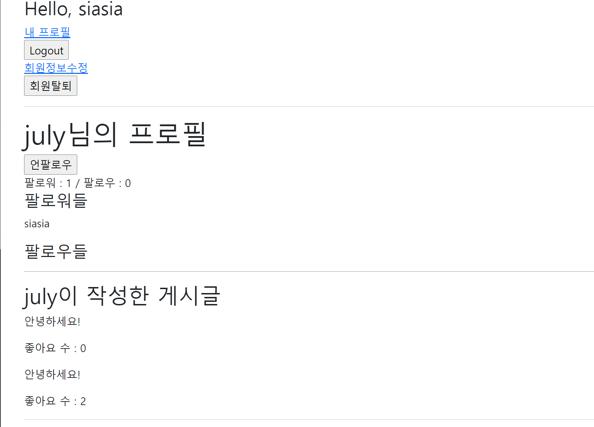

# 결과사진




# accounts/views.py

```python
from django.shortcuts import render, redirect, get_object_or_404
from django.contrib.auth import get_user_model

def profile(request, username):
    User = get_user_model()
    person = get_object_or_404(User, username=username)
    context = {
        'person': person,
    }
    return render(request, 'accounts/profile.html', context)


@require_POST
def follow(request, user_pk):
    if request.user.is_authenticated:
        person = get_object_or_404(get_user_model(), pk=user_pk)
       
        if request.user != person:
            if person.followers.filter(pk=request.user.pk).exists():
                person.followers.remove(request.user)
            else:
                person.followers.add(request.user)
        return redirect('accounts:profile', person.username)
    return redirect('accounts:login')

```


# accounts/models.py

```python
from django.db import models
from django.contrib.auth.models import AbstractUser

# Create your models here.
class User(AbstractUser):
    followings = models.ManyToManyField('self', symmetrical=False, related_name='followers')
```


# profile.html

```html



<h1>{{ person.username }}님의 프로필</h1>


  <div>
    팔로워 : {{ followers|length }} / 팔로우 : {{ followings|length }}
  </div>

  <div>
    
      <form action="" method="POST">
        
        
          <input type="submit" value="언팔로우">
        
          <input type="submit" value="팔로우">
        
      </form>
    
  </div>


<hr>

 이 사람이 작성한 게시글 목록 
<h2>{{ person.username }}이 작성한 게시글</h2>

  <p>{{ article.title }}</p>


<hr>

 이 사람이 작성한 댓글 목록 
<h2>{{ person.username }}이 작성한 댓글</h2>

  <p>{{ comment.content }}</p>


<hr>

 이 사람이 좋아요를 누른 게시글 목록 
<h2>{{ person.username }}이 좋아요를 누른 게시글</h2>

  <p>{{ article.title }}</p>


<a href="">[back]</a>



```

