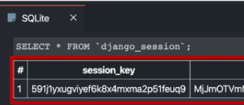
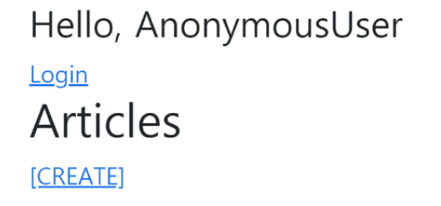

쿠키(데이터의 조각) - 세션아이디가 있나? : 내가 가지고있는 세션 아이디가 잇으면 value를 보고 어떤 유저구나~

# Django Authentication System

Django 인증 시스템은 django.contrib.auth에 Django contrib module로 제공

필수 구성은 settings.py에 이미 포함되어 있고 INSTALLED_APPS 설정에 나열된 django.contrib.auth와 django.contrib.contenttypes로 구성되어있다.

1. django.contrib.auth : 인증 프레임워크의 핵심과 기본 모델을 포함한다.
2. django.contrib.contenttypes : 사용자가 생성한 모델과 권한을 연결 할 수 있다.

Django 인증 시스템은 인증과 권한 부여를 함께 제공하며, 이러한 기능이 어느정도 결합되어서 인증 시스템이라고 한다.


- accounts 앱 생성 : auth와 관련해 Django 내부적으로 accounts라는 이름으로 사용되고 있기 때문에 되도록 accounts로 app이름을 지정하는 것을 권장한다.


## 쿠키와 세션

### HTTP

웹에서 이루어지는 모든 데이터 교환의 기초, 클라이언트-서버 프로토콜

비연결지향 : 서버는 요청에 대한 응답을 보낸 후 연결을 끊음

무상태 : 연결을 끊는 순간 클라이언트와 서버 간의 통신이 끝나며 상태 정보 유지X / 클라이언트와 서버가 주고 받는 메세지들은 서로 완전히 독립적이다

__=> 클라이언트와 서버의 지속적인 관계를 유지하기 위해 쿠키와 세션이 있다__


### 쿠키

서버가 사용자의 웹 브라우저에 전송하는 작은 _데이터 조각_

사용자가 웹사이트를 방문할 경우 해당 웹사이트의 서버를 통해 사용자의 컴퓨터에 설치되는 작은 기록 정보 파일

- 브라우저(클라이언트)는 쿠키를 로컬에 KEY-VALUE의 데이터 형식으로 저장해놓았다가 동일한 서버에서 재 요청시에 저장된 쿠키를 함께 전송한다.

__HPPT 쿠키는 상태가 있는 세션을 만들어 준다__

쿠키는 두 요청이 동일한 브라우저에서 들어왔는지 판단할 때 주로 사용

__=> 웹페이지에 접속하면 요청한 웹 페이지를 받으며 쿠키를 저장하고. 클라이언트가 같은 서버에 재 요청시 요청과 함께 쿠키도 함께 전송__


#### 쿠키 사용 목적

1. 세션 관리 : 로그인, 아이디 자동 완성, 공지 하루 안보기, 장바구니 등 정보관리
2. 개인화 : 사용자 선호, 테마 등의 설정
3. 트래킹 : 사용자 행동을 기록 및 분석


### 세션

사이트와 특정 브라우저 사이의 _상태_를 유지시키는 것

클라이언트가 서버에 접속하면 서버가 특정 __session id__를 발급하고, 클라이언트는 발급 받은 session id를 쿠키에 저장한다.

_ID는 세션을 구별하기 위해 필요하며, 쿠키에는 ID만 저장한다_


### 쿠키 수명

1. Session cookies : 현재 세션이 종료되면 삭제됨
2. Persistent cookies: `Expires`속성에 지정된 날짜 또는 `Max-Age`속성에 지정된 기간이 지나면 삭제


### Session in Django

Django 세션은 미들웨어를 통해 구현된다.

Django는 database-backed sessions 저장 방식을 기본 값으로 사용한다

Django는 특정 session id를 포함하는 쿠키를 사용해서 각각의 브라우저와 사이트가 연결된 세션을 알아낸다 : `django_session`테이블에 저장된다

모든 것을 세션으로 사용하려고 하면 사용자가 많을 때 서버에 부하가 걸릴 수 있다!


### Authentication System in MIDDLEWARE

- SessionMiddleware : 요청 전반에 걸쳐 세션을 관리
- AuthenticationMiddleware : 세션을 사용하여 사용자를 요청과 연결


# 로그인

session을 create 로직과 같다 / Django의 session framework를 사용해 세션에 user의 ID를 저장한다(==login)

`login(request, user, backend=None)`

## Login Code

```python
# accounts/urls.py

from django.urls import path
from . import views

app_name = 'accounts'
urlpatterns = [
    path('login/', views.login, name='login')
]
```

```python
# accounts/views.py

from django.shortcuts import render, redirect
from django.contrib.auth import login as auth_login
from django.contrib.auth.forms import AuthenticationForm
from django.views.decorators.http import require_http_methods

@require_http_method(['GET','POST'])
def login(request):
    if request.method == 'POST':
        form = AuthenticationForm(request, request.POST)
        if form.is_valid():
            auth_login(request,form.get_user())
            return redirect('articles:index')
    else:
        form = AuthenticationForm()
    context = { 'form' : form }
    return render(request, 'accounts/login.html', context)
```

```html
<--! accounts/login.html -->


<h1>로그인</h1>
<form action="" method="POST">
  
  {{form.as_p}}
  <input type="submit">
</form>

```

=> Django DB에서 session_id 확인




## get_user()

- AuthenticationForm의 인스턴스 메서드
- uesr_cache는 인스턴스 생성시에 None으로 할당되며, 유효성 검사를 통과했을 경우에 로그인 한 사용자 객체로 할당된다.
- 인스턴스의 유효성을 먼저 확인하고, 인스턴스가 유효할 때만 user를 제공하려는 구조이다.


# Authentication data in templates



## context processors

템플릿이 렌더링 될 때 자동으로 호출 가능한 컨텍스트 데이터 목록

작성된 프로세서는 RequestContext에서 사용 가능한 변수로 포함된다

## Users

템플릿 RequestContext를 렌더링할 때, 현재 로그인한 사용자를 나타내는 auth.User 인스턴스(클라이언트가 로그인 안했을 때는 AnonymousUser)는 템플릿 변수 `{{ user }}`에 저장된다.


# Logout

session을 Delete하는 로직과 같다

`logout(request)` :  현재 요청에 대한 session data를 DB에서 완전히 삭제하고, 클라이언트의 쿠키에서도 sessionid가 삭제된다. => 다른 사람이 동일한 웹 브라우저를 사용하여 로그인하고, 이전 사용자의 세션 데이터 엑세스하는 것을 방지하기 위한 것이다

## Logout Code

```python
# accounts/urls.py
path('logout/', views.logout, name='logout'),
```

```python
# accounts/views.py
from django.contrib.auth import logout as auth_logout
from django.views.decorators.http import require_http_methods, require_POST

@require_POST
def logout(request):
    auth_logout(request)
    return redirect('articles:index')
```


# 로그인 사용자에 대한 접근 제한(Limiting access to logged-in users)

두가지 방법

1. The raw way : `is_authenticated` attribute

User model의 속성 중 하나

모든 User 인스턴스에 대해 항상 True인 읽기 전용 속성이다

_사용자가 인증 되었는지 여부를 알 수 있는 방법_

일반적으로 request.user에서 이 속성을 사용해서 미들웨어의 'django.contrib.auth.middleware.AuthenticationMiddleware'를 통과 했는지 확인

__권한과는 관련X, 사용자가 active이거나 valid session 가지고 있는지도 확인X__

```html
<!--base.html-->

...

...

```

```python
# views.py
if request.user.is_authenticated:
    auth_logout(request)
```


__=> 로그인과 비로그인 상태에서 출력되는 링크를 다르게 설정한다__


2. The `login_required` decorator

사용자가 로그인되어 있지 않으면, settings.LOGIN_URL에 설정된 문자열 기반 절대 경로로 redirect 한다. (LOGIN_URL 기본 값은 '/accounts/login') __app 이름 account로 한 이유!!__

사용자가 로그인 되어있으면 정상적으로 view 함수를 실행한다.

인증 성공시에 사용자가 redirect 되어야하는 경로는 "next"라는 쿼리 문자열 매개 변수에 저장된다  ex)/accounts/login/?next=/articles/create/

```python
# /accounts/views.py
from django.contrib.auth.decorators import login_required

@login_required
def my_view(request):
    pass
```

#### "next" query string parameter

로그인이 정상적으로 진행되면 기존에 요청했던 주소로 redirect하기 위해 주소를 keep해주는 것! 별도 처리 안해주면 우리가 view에 설정한 redirect 경로로 이동
