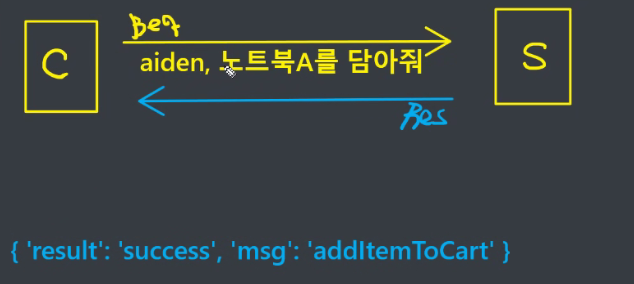

# Server - web server / API server

Web server : request가 왔을 때 __web page__를 response의 body에 담아서 넘김

API server : request가 왔을 때 __요청한 것의 처리결과__를 reponse의 Body에 담아서 넘김 (Key-Value로 이루어진 json 형식으로 담아서 돌려줌)

=> 2개를 다른 컴퓨터로 돌리는게 일반적이지만 같이 돌릴 수도 있다.

&nbsp;

ex) 장바구니 : API Server

# HTTP

클라이언트와 서버가 서로 어떤 형식으로 데이터를 보내줄건지를 약속한 것

프로토콜 : FTP(토렌트). SSH, TELNET, SMTP, HTTP, HTTPS(S=secure)

_클라이언트와 서버가 서로 데이터를 주고 받으려면 '프로토콜'이 필요하다. 웹 개발에서는 HTTP, HTTPS가 중요하다!_

&nbsp;

## HTTP의 기본 특성

### 비연결성(Connetless) : 서술형 느낌 ~

클라이언트와 서버가 한 번 응답을 주고 받으면 연결을 끊는다.

### 무상태(Stateless)

Connetless 때문에 발생한 것, 서버가 클라이언트를 기억하지 못한다. 식별 불가능 => 매번 요청할 때마다 내가 누군지를 서버에게 알려줘야한다.

=> 불편해! : __쿠키와 세션 등장!__

- 쿠키 : 클라이언트가 기억해서 나한테(서버) 들고와 : 쿠키가 굉장히 쉽게 뺏김 __보안에 취약__
- 세션 : 민감한 정보, 서버가 기억해줄게~~

&nbsp;

## HTTP Method

클라이언트가 서버에게 request를 보내면 어떤 request인지 서버에게 쉽게 알려주기 위해서 CRUD(POST, GET, PUT, DELETE)

Request, Response : head와 body로 나뉨!

- head ; 요청에 대한 부가정보, Method가 있음 / 상태코드, 상태메세지
- body : 실제 데이터
- head는 항상 채워져있지만 body는 비워져있을 수도 있다.

개발자 창의 Network : 한번에 모두 안보여주는 이유 : UI에 안좋다! 느려서!

headers의 Response Headers / Request Headers

Request 또는 Response 안에 있는 Head 안에 key와 values를 묶어서 Header : 여러개가 와서 Headers!

- 100번대 : 서버가 클라이언트한테 정보성 응답
  - 100 : Continue : 나 계속 해도되니 서버야...?
- 200번대 : 일반적인, 정상적인 상황 
  - 200 : OK 
  - 201 : Created
- 300번대 : 잠깐만! 그거 처리하려면 뭘 좀더 해야 된당 
  - 301 : Moved Permanently : 요청한 리소스 그 위치에 없어 옮겨졌어 : 보통 이후에 Redirection함
  -  304 : Not Modified 브라우저 캐싱 : 너 이미 가지고있어!
- 400번대 : 클라이언트 잘못 
  - 400 : Bad Request : URL은 있는데 형식이 안맞는 느낌, 오타가 있거나
  - 401 : Unauthorized 인증하고와~ 
  - 403 :  Forbidden 권한이 읍서
  - 404 : Not Found URL이 틀린거 같은데...
  - 429 : Too Many Request 너 디도스 공격하니...?
- 500번대 : 서버 잘못
  - 500 : Internal Server Error : 야근 에러
  - 503 : Service Unavailable : 서버가 점검중이거나 트래픽 초과가 일어나면 일시적으로 서비스를 제공하지 못할 때

&nbsp;

## URL, URN

URN 거의 안쓰임

URL : 네트워크 상 자원(리소스)이 어디 있는지 알려주기 위한 약속, 통합 자원 위치

__url 구조 중요~시험__

# REST API : 약속

어떻게 설계해도 기능적으로 문제가 없지만! 약속했다.

REST(표현적인 상태 이전) API => RESTful Service

6가지 중 2개

1. URL은 리소스를 나타내기 위해서만 사용하고, 리소스에 대한 처리는 메서드로 표현
2. Document는 단수명사로, Collection은 복수 명사로 표현