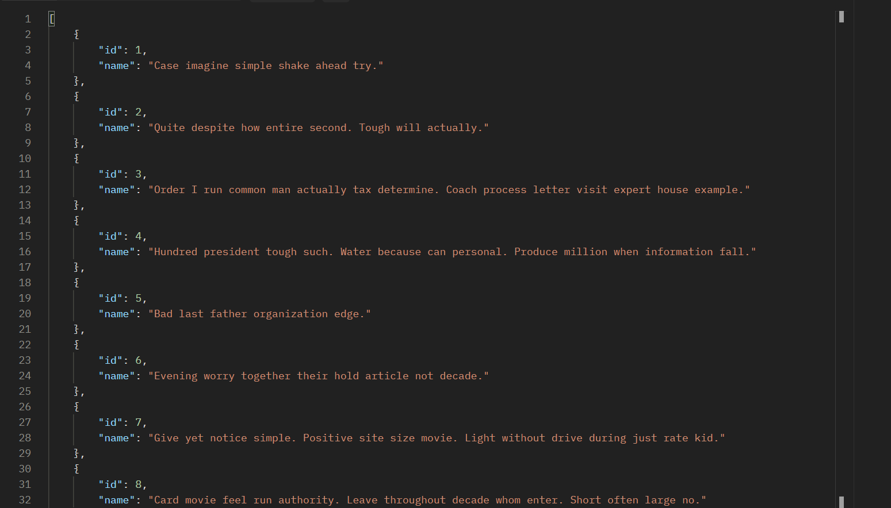
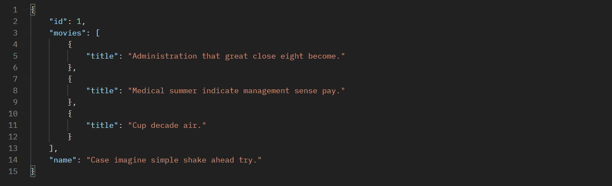
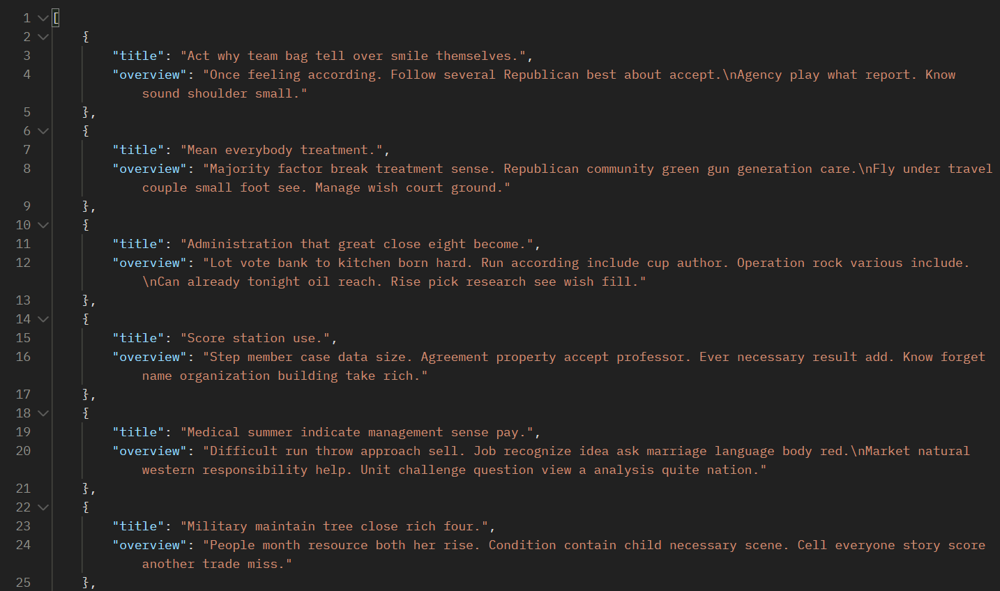
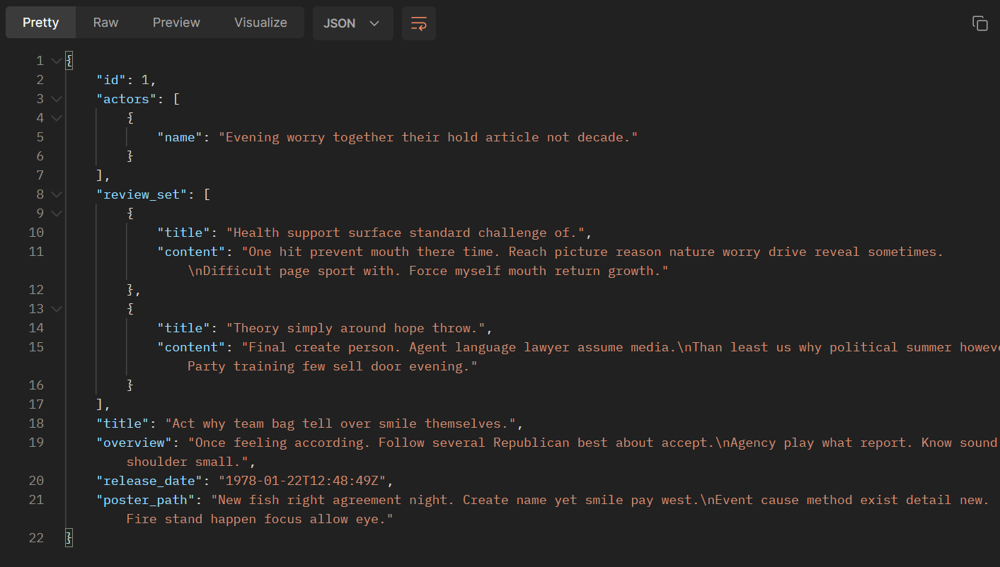
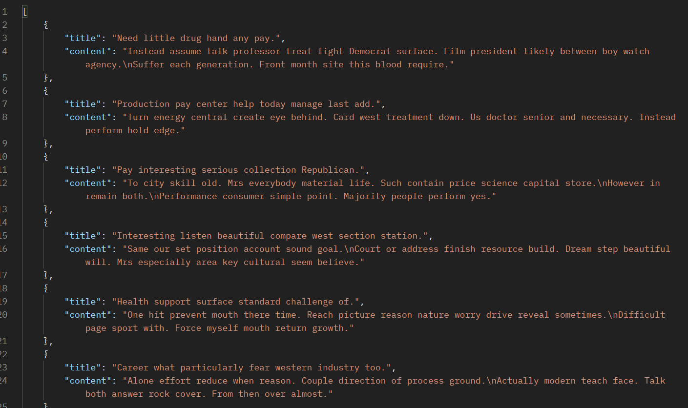
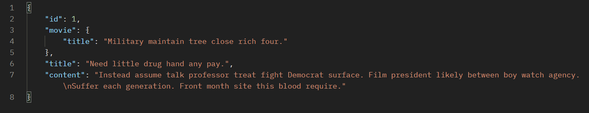
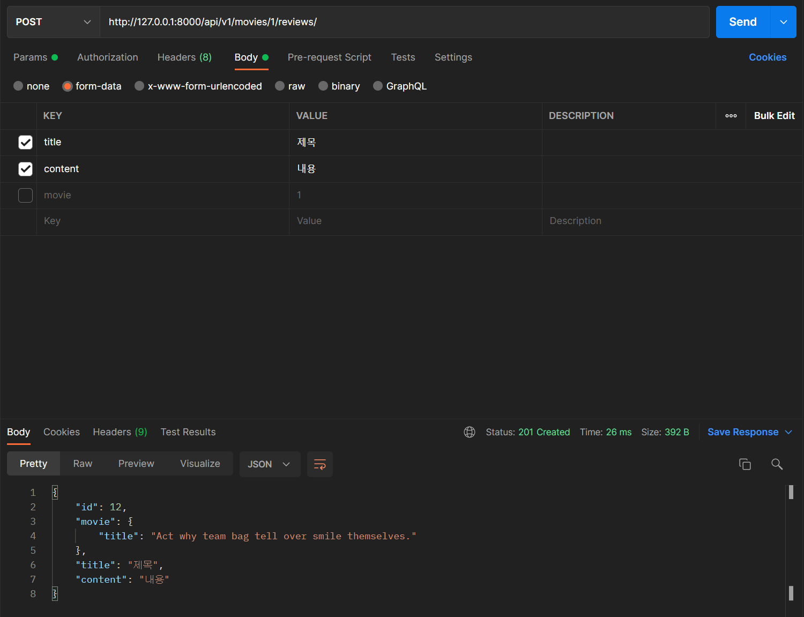
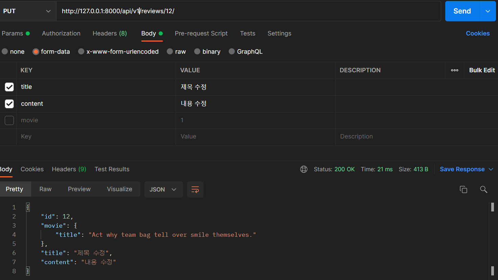
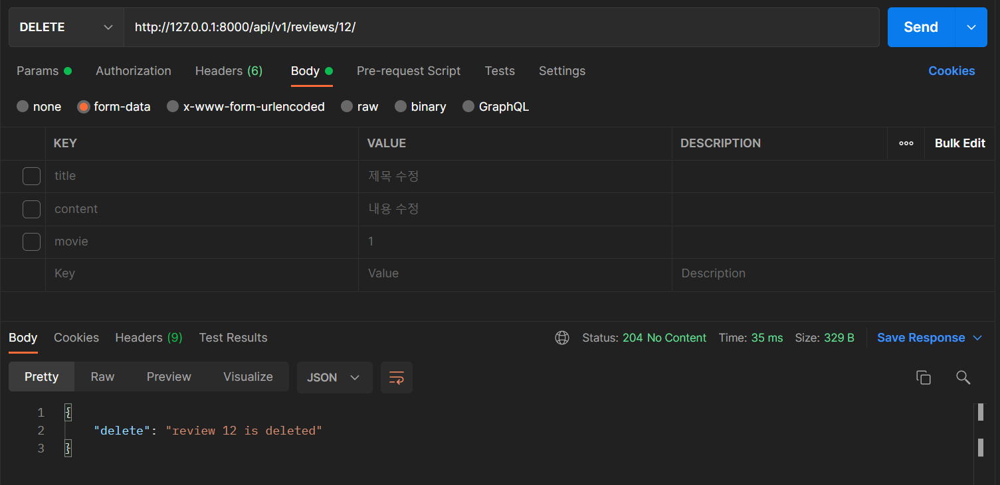

# 이성진

# PJT 08


### 이번 프로젝트의 주제

지금까지 해오던 것 과는 다른 패러다임으로, DRF를 사용하여 RESTful한 API server를 제작하는 것이 프로젝트의 목표였다. 배우 데이터, 영화 데이터를 조회할 수 있도록 하였고 리뷰 데이터의 CRUD를 구현하였으며 이 과정에서 M:N relation과 1:N relation이 사용되었다.


### 페어 프로그래밍 후기

1. 놓치는 부분을 페어가 잡아줘서 코드를 잘 고칠 수 있었던 것도 있고, 애매하게 알고 있는 부분을 확인받아서 확실하게 알 수 있게 되어서 좋았다.
2. 상대방이 하던 작업을 넘겨서 이어받고, 내가 하던 작업을 넘길때마다 서로 페어가 어디까지 진행했는지, 어디를 진행할 차례인지를 확인하기 위해 적응하는 시간이 필요했고 그 시간이 아깝다는 생각이 들었다.
3. Github 환경에서 진행했는데 git이 익숙하지 않아서 서로 사고가 나지 않게 하는 데에 주의를 많이 기울여야 했고, 그게 꽤 피곤하다는 생각이 들었다.
4. 그치만 도움받은 부분이 많아서 저번 프로젝트보다 훨씬 높은 생산성으로 진행할 수 있었다. 직접 코드를 짤 때 보이는 것과 한 발짝 떨어져서 볼 때 보이는 것이 다르다는 점을 알게 되었다.


### 가장 중요한 부분

아무래도 다양한 출력 형식을 구현하기 위한 다양한 serializer와, 이를 이용하여 CRUD를 구현하는 views 부분이 중요하다고 생각된다. M:N relation에 대한 이해가 부족하여 초반엔 다소 헤맸으나 어렵지 않게 구현해낼 수 있었다. DRF를 이용하면 CRUD의 구현 문법이 유사해서 매우 편하게 할 수 있다는 생각이 들었다.

#### movies/serializers.py

```python
from rest_framework import serializers
from .models import Movie, Actor,Review

class ActorListSerializer(serializers.ModelSerializer):
    class Meta:
        model = Actor
        fields = '__all__'

class MovieTitleSerializer(serializers.ModelSerializer):

    class Meta:
        model = Movie
        fields = ('title',)

class ActorDetailSerializer(serializers.ModelSerializer):
    movies = MovieTitleSerializer(many=True, read_only=True)
    
    class Meta:
        model = Actor
        fields = ('id', 'movies', 'name',)

class MovieListSerializer(serializers.ModelSerializer):

    class Meta:
        model = Movie
        fields = ('title', 'overview',)

class ActorNameSerializer(serializers.ModelSerializer):
    class Meta:
        model = Actor
        fields = ('name',)

class ReviewListSerializer(serializers.ModelSerializer):
    class Meta:
        model = Review
        fields = ('title', 'content', )

class MovieDetailSerializer(serializers.ModelSerializer):
    actors = ActorNameSerializer(many=True, read_only=True)
    review_set = ReviewListSerializer(many=True, read_only=True)
    
    class Meta:
        model = Movie
        fields = '__all__'

class ReviewDetailSerializer(serializers.ModelSerializer):
    movie = MovieTitleSerializer(read_only=True)
    class Meta:
        model = Review
        fields = '__all__'
        read_only_fields = ('movie',)
```


#### movies/views.py

```python
from movies import serializers
from .models import Actor,Movie,Review
from rest_framework.decorators import api_view
from rest_framework.response import Response
from rest_framework import status
# Create your views here.

@api_view(['GET'])
def actor_list(request):
    actors = Actor.objects.all()
    serializer = serializers.ActorListSerializer(actors, many=True)
    return Response(serializer.data)

@api_view(['GET'])
def actor_detail(request, actor_pk):
    actor = Actor.objects.get(pk=actor_pk)
    serializer = serializers.ActorDetailSerializer(actor)
    return Response(serializer.data)

@api_view(['GET'])
def movie_list(request):
    movies = Movie.objects.all()
    serializer = serializers.MovieListSerializer(movies, many=True)
    return Response(serializer.data)

@api_view(['GET'])
def movie_detail(request,movie_pk):
    movie = Movie.objects.get(pk=movie_pk)
    serializer = serializers.MovieDetailSerializer(movie)
    return Response(serializer.data)

@api_view(['GET'])
def review_list(request):
    reviews = Review.objects.all()
    serializer = serializers.ReviewListSerializer(reviews, many=True)
    return Response(serializer.data)

@api_view(['GET','PUT','DELETE'])
def review_detail(request, review_pk):
    review = Review.objects.get(pk=review_pk)
    
    if request.method == 'GET':
        serializer = serializers.ReviewDetailSerializer(review)
        return Response(serializer.data)
    
    elif request.method == 'PUT':
        serializer = serializers.ReviewDetailSerializer(review, request.data, partial=True)
        if serializer.is_valid(raise_exception=True):
            serializer.save()
            return Response(serializer.data, status=status.HTTP_200_OK)
        
    elif request.method == 'DELETE':
        review.delete()
        data = {
            "delete": f"review {review_pk} is deleted"
        }
        return Response(data, status=status.HTTP_204_NO_CONTENT)


@api_view(['POST'])
def create_review(request,movie_pk):
    movie = Movie.objects.get(pk=movie_pk)
    serializer = serializers.ReviewDetailSerializer(data=request.data)
    if serializer.is_valid(raise_exception=True):
        serializer.save(movie=movie)
        return Response(serializer.data, status=status.HTTP_201_CREATED)
```


### 후기

새로운 패러다임인 DRF를 사용하여 프로젝트를 진행하였는데, 실무에서 DRF를 많이 사용하기 때문에 저번보다 더욱 동기부여가 되었고, 실제로 써보니 매우 편리해서 왜 그런지도 알게 되었다. 또한 백엔드 부분만 구현하고 프론트 부분에는 관심을 안 가져도 되어서 매우 편했다.

페어 프로그래밍으로 진행한 점도 도움이 되었는데, 다소 잘못 알고 있거나 잠깐 막히는 부분을 페어가 도와주어서 수월하게 문제를 해결할 수 있었다. 이렇게 도와주는 데에는 시간이 얼마 걸리지 않지만, 만약 직접 문제를 찾아서 해결했어야 한다면 오랜 시간이 걸렸을 수도 있는 일이다. 경우에 따라 페어프로그래밍이 괜찮은 방법이 될 수 있겠다는 생각이 들었다.


***

# 박나경

# PJT 08

### 이번 pjt 를 통해 배운 내용

- serializers
-  N:M 관계
- read_only_fields


## Z. 준비사항

### models.py

- Actor
  - name(char)
- Movie
  - actors(MTM, Actor/ movies라고 부름)
  - title(Char)
  - overview(text)
  - release_date(Datetime)
  - poster_path(text)
- Review
  - movie(FK, Movie)
  - title(char)
  - content(text)

### serializers.py

- Actor%Serializer 
- Movie%Serializer
- Review%Serializer
  - read_only_fields = ('movie',) : url에 있는 movie_pk에 저장하기 위함


## A.  GET api/v1/actors/



* 요구 사항 : movies_actor 테이블의 모든 정보 출력 


#### 문제를 풀어간 과정

1. urls.py 등록 / views에서 actor_list 정의
2. Actor 테이블의 모든 정보를 불러와 Serialize해서 JSON방식으로 return 한다.

***

## B. GET api/v1/actors/1/

*  요구 사항 : movies_actor 테이블의 id가 1인 actor의 모든 정보 / 출현한 영화 출력 

#### 문제를 풀어간 과정

1. urls.py 등록 / views에서 actor_detail 정의
2. ActorDetailSerializer에 movies 변수에 MovietitleSerializer data들을 넣어 넘겨준다.
3. Actor 테이블의 actor_pk가 같은 정보를 불러와 Serialize해서 JSON방식으로 return 한다.

***

## C. GET api/v1/movies/

*  요구 사항 : movies_movie 테이블의 모든 정보 출력 

#### 문제를 풀어간 과정

1. urls.py 등록 / views에서 movie_list정의
2. movies_movie 테이블의 모든 정보를 불러와 Serialize(title, overview)해서 JSON방식으로 return 한다.

***

## D. GET api/v1/movies/1/

*  요구 사항 : movies_movie 테이블의 pk가 movie_pk와 같은 영화의 모든 정보 출력 / 등장  actor와 review들 출력

#### 문제를 풀어간 과정

1. urls.py 등록 / views에서 movie_detail 정의
2. MovieDetailSerializer에 actors와 review_set을 불러와 데이터를 넘겨준다.
3. movies_movie 테이블의 모든 정보 & 가져온 정보를 불러와 Serialize해서 JSON방식으로 return 한다.

***

## E. GET api/v1/reviews/

*  요구 사항 :  movies_review 테이블의 모든 정보 출력 

#### 문제를 풀어간 과정

1. urls.py 등록 / views에서 review_list정의
2. movies_review 테이블의 정보를 불러와 Serialize(title, content)해서 JSON방식으로 return 한다.

***

## F. GET api/v1/reviews/1/

*  요구 사항 :  movies_review 테이블의 pk가 review_pk와 같은 리뷰의 모든 정보 출력 / movie title 출력

#### 문제를 풀어간 과정

1. urls.py 등록 / views에서 actor_list 정의
2. class ReviewDetailSerializer에 movie을 불러와 데이터를 넘겨준다.
3. Actor 테이블의 모든 정보를 불러와 Serialize해서 JSON방식으로 return 한다.

***

## G. POST api/v1/movies/1/reviews/

*  요구 사항 : 영화에 새로운 리뷰 생성

#### 문제를 풀어간 과정

1. url 등록, views의 *create_review*에 POST방식
2. ReviewDetailSerializer데이터에 request data를 받아와 유효성을 검증하고, 유효하다면 저장하고 저장한 데이터를 보여준다. / 아니면 400 에러

***

## H. PUT api/v1/reviews/1/

*  요구 사항 : 이미 있는 리뷰 수정

#### 문제를 풀어간 과정

1. views의 review_detail에 PUT방식으로 추가
2. `serializer = serializers.ReviewDetailSerializer(data=request.data)`로 받아와 유효하다면 저장하고 201, 저장 데이터 보여주고 유효하지 않다면 400

***

## I. DELETE api/v1/reviews/1/



*  요구 사항 : 리뷰 삭제

#### 문제를 풀어간 과정

1. views의 review_detail에 DELETE방식으로 추가
2. DELETE 방식이 맞다면 저장했던 review를 지워주고 지워준 pk와 문구를 넘겨준다. 

***

# 후기

* 페어랑 같이하니까 어려운 오류도 서로 힘을 합쳐 잘 헤쳐갈 수 있었다.
* 계속해서 복습을 하다보니까 에러가 나와도 점점 어떤 에러인지 분석 할 수 있었다.
* serializers가 익숙해졌다.