출처 : [도커 한방에 정리 🐳 (모든 개발자들이 배워보고 싶어 하는 툴!) + 실습](https://www.youtube.com/watch?v=LXJhA3VWXFA)

추천 : [가장 쉽게 배우는 도커](https://www.youtube.com/watch?v=hWPv9LMlme8)

# What is Docker?

Application을 패키징 할 수 있는 Tool

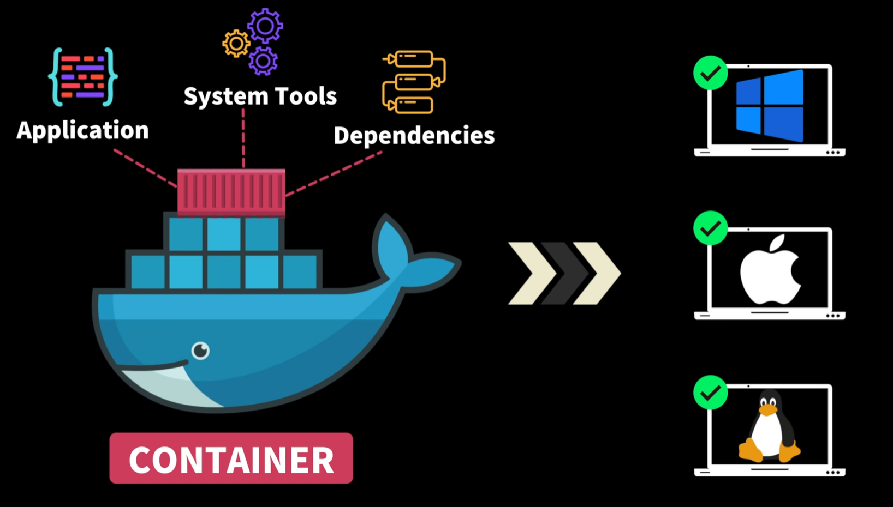

Container(하나의 작은 소프트웨어 유닛)에 Application, 환경 설정, Dependencies를 하나로 묶어 다른 서버, 다른 PC로 쉽게 배포하고 안정적으로 구동할 수 있게 하는 Tool


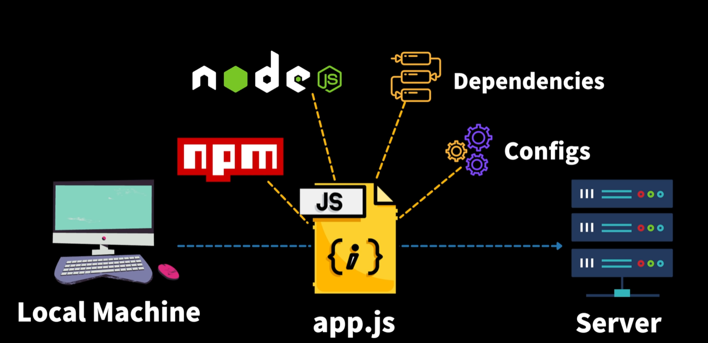

Local에 node가 있고, Server에 node가 있다고 다 작동하는 것이 아님. 버전이 달라서 작동을 안 할 수도 있다.

node.js를 예시로 app.js를 배포한다고 잘 작동하는게 아니다! npm, node.js, dependencies 등이 없거나 다르기 때문 ㅠㅠ

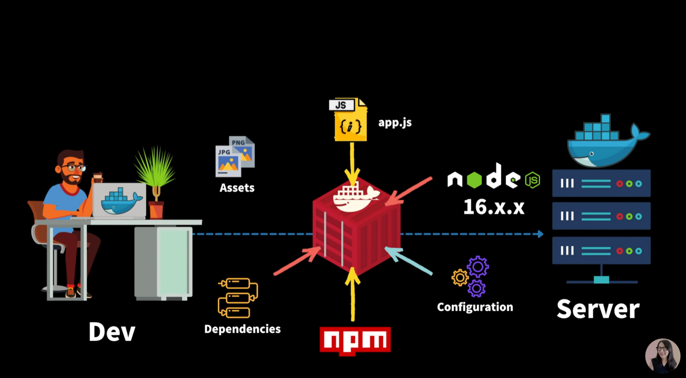

Docker의 container에는 app.js, node.js, configuration, dependencies, Assets를 포함 할 수 있다!

그니까 App을 구동하기 위한 모든 것들을 하나의 컨테이너에 넣어놨다고 볼 수 있다!


# Container VS VM(가상 머신)

VM : Hardware Infrastructure 위에 vmware나 virtualBox같은 Hypervisor(VM을 생성하고 구동하는 소프트웨어)을 이용해 각각의 가상의 머신을 만들 수 있다.

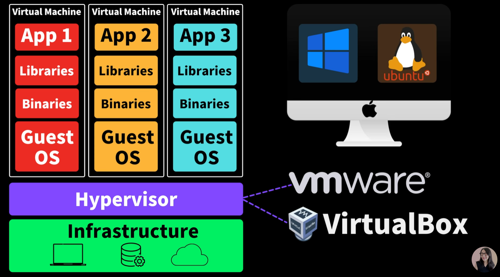

예를 들어 mac os에서도 각각의 가상머신을 만들어 window나 linux를 사용 가능하다!

=> 무거운 운영체제를 포함하기 때문에 시작하는데도 오래걸리고, 컴퓨터 운영체제, infrastructure의 resource를 많이 잡아먹을 수도 있음

=> 경량화 된 컨셉이 container

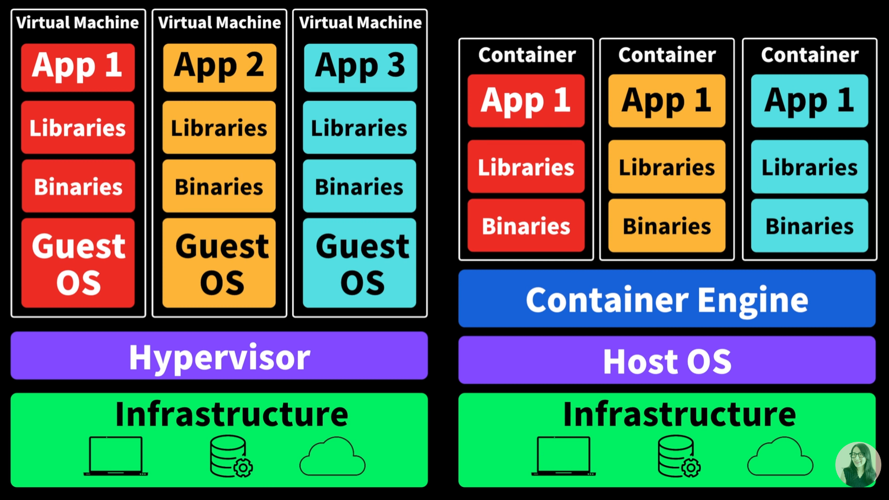

container은 지금 하드웨어에 설치된 운영체제, 즉 Host OS에서 Container Engine이라는 소프트웨어를 설치하면 각각의Container를 만들어 각 App을 고립된 환경에서 구동 가능

__Container은 운영체제를 설치 X Container Engine을 통해 Host OS를 공유__ => 운영체제와 커널 이해시 깊게 이해 가능

Container Engine중에 가장 많이 사용되는 것이 Docker이다!


# Docker의 3대 요소

Docker는 컨테이너를 만들고 > 배포하고 > 구동한다.


Container를 만드는데는 3가지가 필요하다. : Dockerfile, 

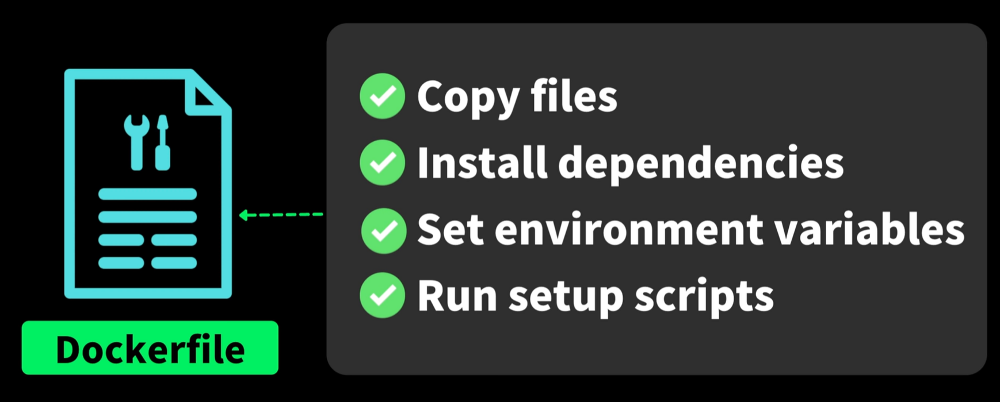

## Dockerfile(컨테이너 설명서)

- Application을 구동시키기 위해서 꼭 필요한 파일들은 무엇이 있는지(Copy files)
- 어떤 framework나 library를 설치해야 하는지 명시(Install dependencies)
- 환경설정을 어떻게 해야하는지 (Set environment variavles)
- 어떻게 구동해야되는지 스크립트!(Run setup scripts)

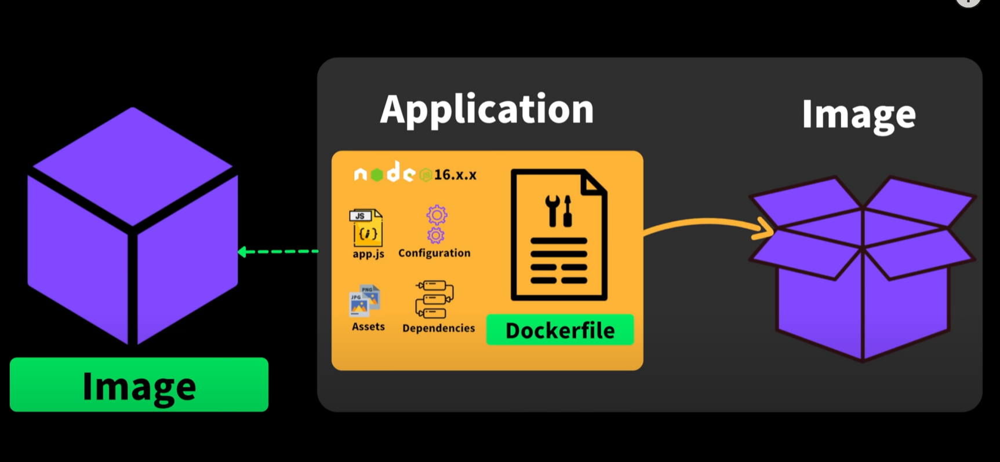

## Image

Dockerfile로 Image로 만든다.

code, runtime 환경 등등 모든 Setting들이 포함되어 있다.

비유를 하자면, 실행되고 있는 App의 상태를 찰칵해서 이미지를 만든다고 생각해보는 것이다. : __불변의 상태__

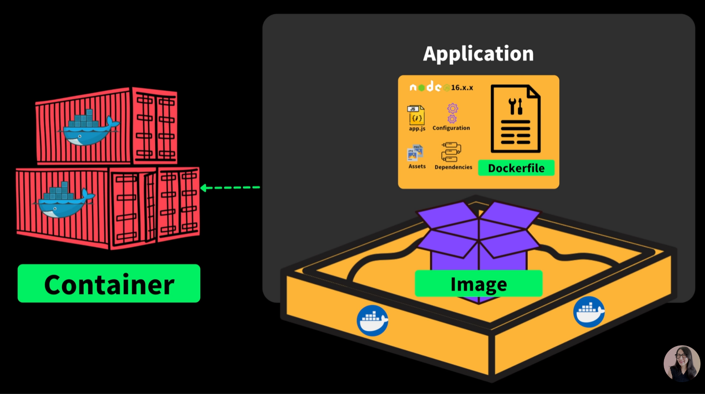

## Container

Image를 고립된 환경에서 실행할 수 있는 것

컨테이너 안에서 Application이 동작한다.

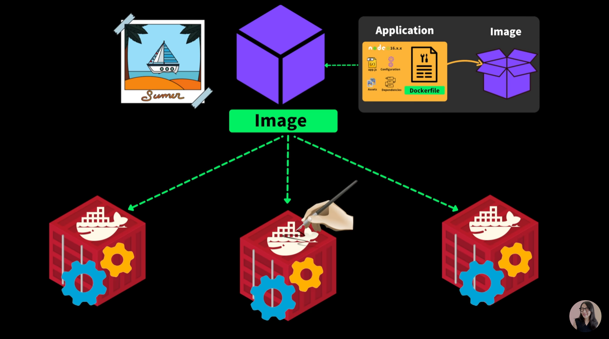

우리가 Image를 만들었을 때 상태를 가지고 있기 때문에 각각의 Container에서 개별적으로 수정이 가능!

각각 container에서 수정 된 부분은 Image에는 영향을 끼치지 않는다.

객체지향에서 바라보자면 Image는 class, Container은 instance로 볼 수 있을 것이다.


# Docker Image 배포하는 방법


Image를 Container Registry(Github, ...)에 push하면 Server에서 Pull 받아 구동

물론 server에 docker가 깔려 있어야 한다.


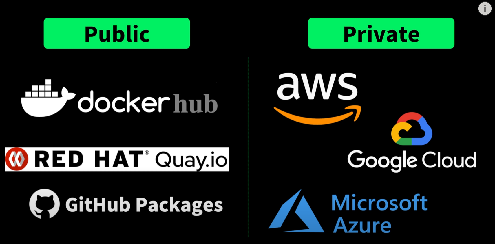

Container Registry는 Public과 Private가 있다.


## 정리하자면..

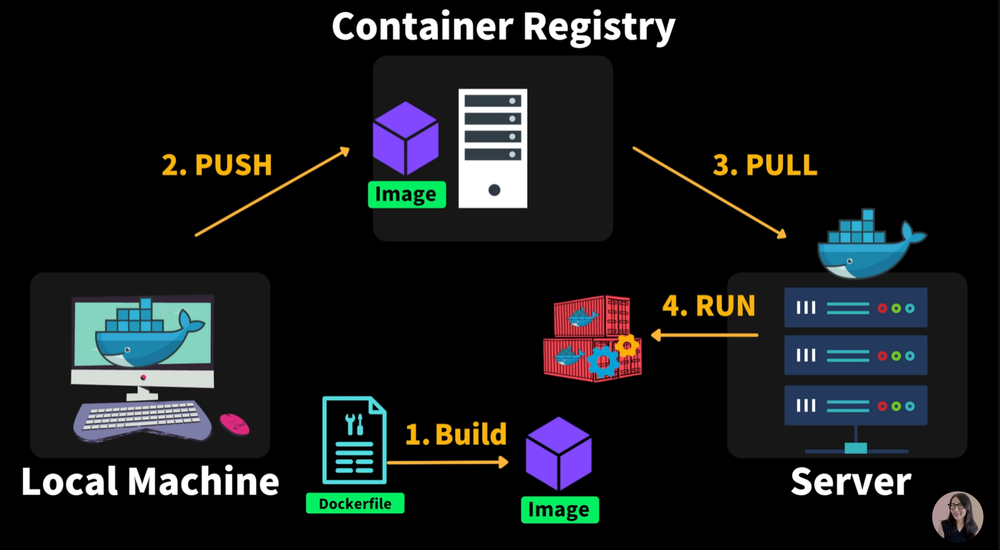

1. Dockerfile를 만들어 Image를 Build하고
2. Local Machine에서 Container Registry에 Push하고
3. Docker가 있는 Server에서 Pull 받아
4. Server에서 Run!


# 실습

## 기본 준비

- Docker 설치
- VS Code Extensions : Docker 다운 받으면 문법에 도움을 받을 수 있다.
- 배포할 프로젝트

## 1. Dockerfile 작성

```dockerfile
FROM node:17-alpine # 어떤 Image를 이용할 것인지 명시
#기본 리눅스의 경우에는 baseImage, node는 버전 별로, alpine 작은 단위의 리눅스 버전
WORKDIR /app # Image 안에서 어떤 폴더에 우리 APP을 카피해올건지?
COPY package.json package-lock.json ./ # layout 시스템이기 때문에 빈번히 변경되는 파일은 맨 마지막에 작성하는 것이 좋다.
RUN npm ci #package.json에 있는 모든 라이브러리 설치한다.
COPY index.js .
ENTRYPOINT ["node","index.js"] # node를 실행할 것이고, index.js를 실행해!
```

RUN

`npm install`은 package.json에 3버전이 명시되어 있더라도 설치 중 5버전을 설치 할 가능성이 있어 `npm ci`를 사용하는 것이 좋다

### Rayout system?

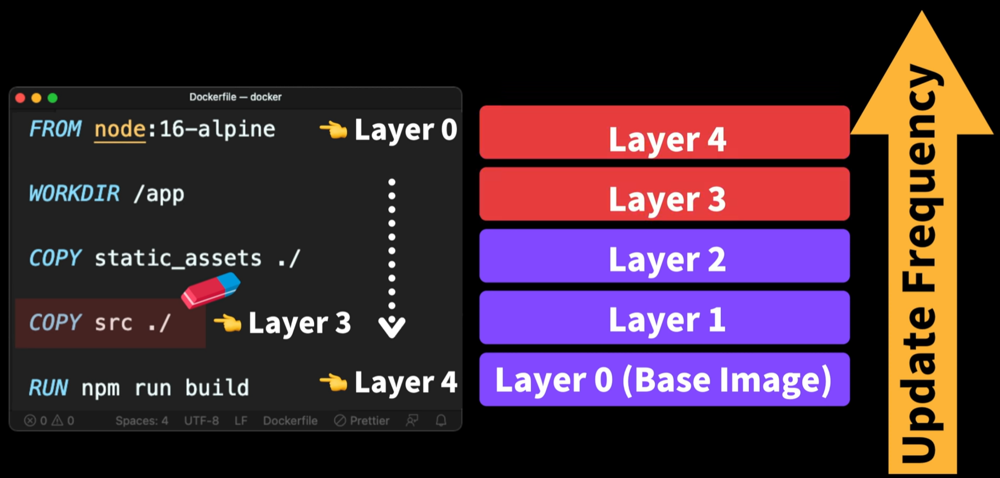

Layer 3이 수정된다면 Layer 0~2까지는 cash 된 것을 사용하고, 3,4는 bulid된다.


## Image 만들기

```bash
docker build -f Dockerfile -t fun-docker .
```

`-f` : 어떤 docker 파일을 사용할 것인지?

`-t` : docker Image에 이름을 부여

## Docker Container 실행

```bash
docker run -d -p 8080:8080 fun-docker
```

`-d` : detached, bacground에서 수행하고 이 명령어가 끝나면 너가 하던 일 해~ detach해라

`-p` : Host Machine에 있는 포트와 Local에 있는 port를 연결해주는 작업

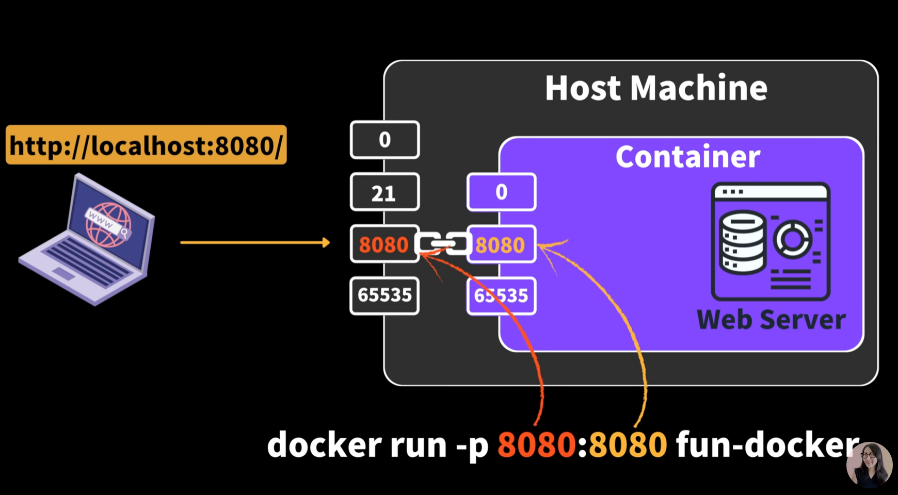

`docker ps`를 입력하면 현재 동작중인 것을 확인

`docker logs [CONTAINER ID]` : log를 확인 할 수 있다.


## Image 배포

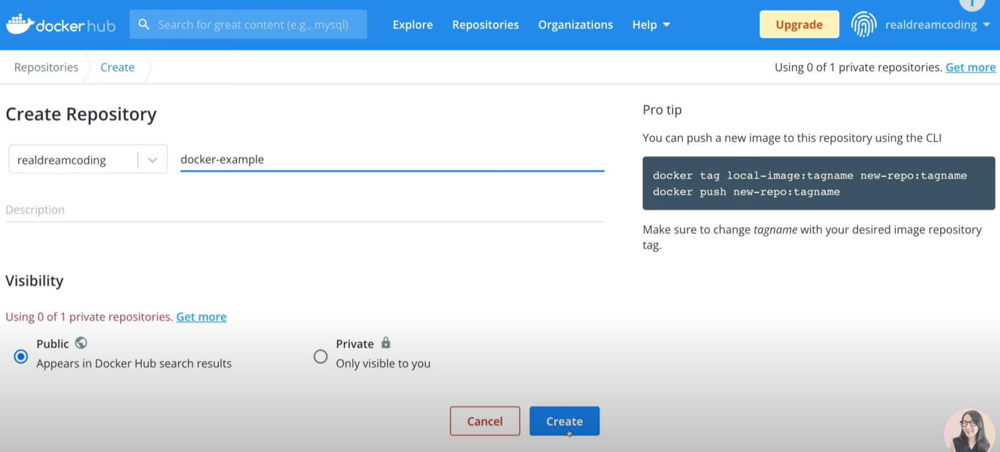

image를 push 하기 위해서는 image 이름과 repository 이름이 같아야 한다!

`docker tag fun-docker:latest realderamcoding/docker-example:latest` : tag 명령어를 이용해 image 이름을 바꿔준다


push하기 위해서 로그인이 필요하다

`docker login`

`docker push realdreamcoding/docker-example:latest` 를 입력하면 push가 된다.

