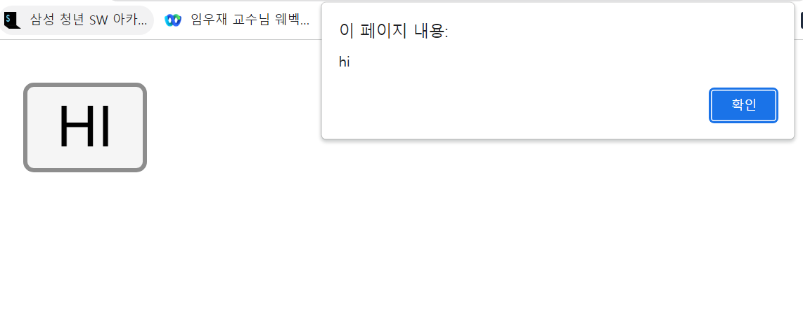

# JavaScript 

- 사용자와 상호작용  ex)  사용자가 night 버전을 클릭했을 때 바꿔줌
- web 페이지는 한 번 표현되면 자기 자신을 바꿀 수 있는 방법이 없는데 JS가 바꿔줌!
- JS는 HTML을 제어하는 언어 : 이런 특성이 웹페이지를 더 __동적__이게, 다이나믹하게 만드는 것!

&nbsp;&nbsp;

&nbsp;

# HTML과 JS의 만남

&nbsp;

## script 태그

```html
<!DOCTYPE html>
<html lang="en">
<head>
  <meta charset="UTF-8">
  <meta http-equiv="X-UA-Compatible" content="IE=edge">
  <meta name="viewport" content="width=device-width, initial-scale=1.0">
  <title>Document</title>
</head>
<body>
  <h1>hello</h1>
  <script>
    <!--출력 : 2-->
    document.write(1+1);
  </script>
  <!--출력 : 1+1-->
  1+1
  </script>
</body>
</html>
```


HTML은 정적이기 때문에 1+1은 그대로 1+1이 나오고,

JS는 동적이기 때문에 2가 나온다.

HTML에서 JS임을 알려주기 위해서는 `script` tag를 쓴다

&nbsp;

## 이벤트

```html
<input type="button" value="HI" onclick="alert('hi')">
<input type="text" onchange="alert('changed')">
<input type="text" onkeydown="alert('key down!')">
```



웹브라우저가 _onclick 이벤트_가 일어났을 때, JS가 alert('hi')를 한다

이벤트(onclick, onchange, ...)를 12~20개 정도 기억하고 있다.

&nbsp;

## Consol

콘솔창을 이용하면 파일을 이용하지 않더라도 JS를 실행시켜 데이터를 처리할 수 있다.

```consol
alert('nagyeong').length
=> 경고창에 8이 뜬다!
```

JS를 공부한다는 건 이미 있는 웹페이지에서 내가 원하는 것을 얻을 수 있다!

=> 내 현실의 문제를 가볍게 해결할 수도 있다.