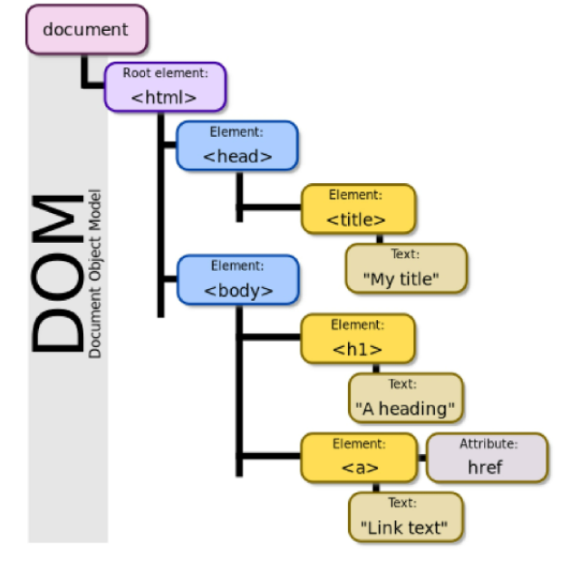
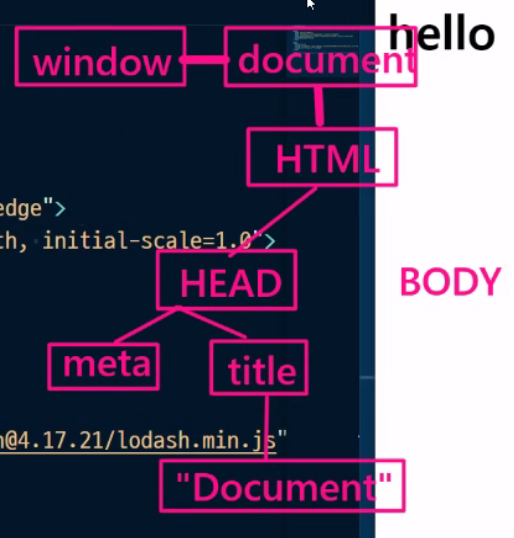
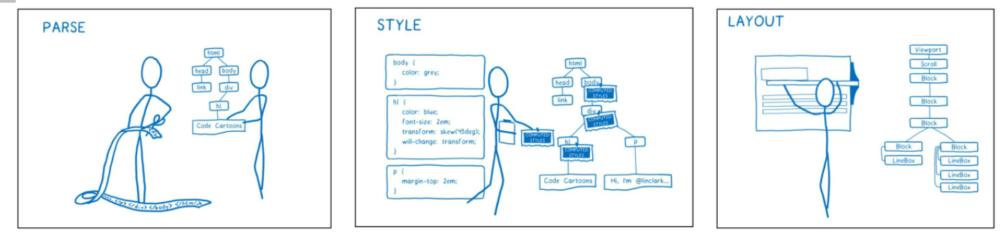
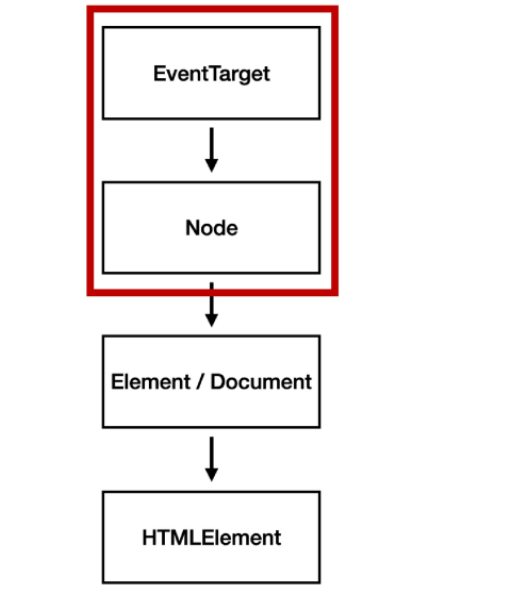

# DOM Document Object Model

브라우저에서 할 수 있는 일

- DOM조작
  - 문서(HTML) 조작
- BOM(Browser Object Model) 조작 : navigator, screen, location ...
- JavaScript Core (ECMAScript) : Data Structure, Conditional


DOM이란?





HTML, XML과 같은 문서를 다루기 위한 문서 프로그래밍 인터페이스

문서를 구조화하고 구조화된 구성요소를 하나의 객체 취급해 다루는 논리적 트리 모델

문서가 구조화, 각 요소는 객체 취급

단순한 속성 접근, 메서드 활용뿐만 아니라 프로그래밍 언어적 특성을 활용한 조작 가능

주요객체

- window : DOM을 표현하는 창, 가장 최상위 객체 : JS 어디서든 바로 접근 가능 => 전역객체
- document : 페이지 컨텐츠의 Entry Point 역할을 하며, <body> 등과 같은 수많은 다른 요소들 포함
- navigator, location, history, screen


## DOM - 해석

### 파싱(Parsing) : 구문 분석, 해석, 브라우저가 문자열 해석해 DOM Tree로 만드는 과정




## BOM(Browser Object Model)

JS가 브라우저와 소통하기 위한 모델

브라우저 창이나 프레임을 추상화해 프로그래밍적으로 제어할 수 있도록 제공하는 수단

window 객체는 모든 브라우저로부터 지원받으며 브라우저의 창 지칭


# DOM 조작 - 개념

Document는 문서 한장(HTML)에 해당하고, 이를 조작

순서 : 1. 선택 > 2. 변경

### DOM 관련 객체의 상속 구조



EventTarget : Event Listener를 가질 수 있는 객체가 구현하는 DOM 인터페이스

Node : 여러 가지 DOM 타입들이 상속하는 인터페이스

Element ; Document 안의 모든 객체가 상속하는 가장 범용적인 인터페이스 / 부모인 Node와 그 부모인 EventTarget의 속성을 상속

Document : 브라우저가 불러온 웹 페이지 / DOM 트리 진입점 역할 수행

HTMLElement : 모든 종류의 HTML 요소 / 부모 element의 속성 상속


```html
<!--이 HTML 문서를 이용해 실습-->

<!DOCTYPE html>
<html lang="en">
<head>
  <meta charset="UTF-8">
  <meta http-equiv="X-UA-Compatible" content="IE=edge">
  <meta name="viewport" content="width=device-width, initial-scale=1.0">
  <title>Seoul04 JS</title>
</head>
<body>
  <h1>Hi:)</h1>
  <!--div#content + tab-->
  <div id="content">
    <h2 id="title-1">내가 좋아하는 기기목록</h2>
    <ul id="list-1">
      <!--li*5 + tab-->
      <li>IPad</li>
      <li>MacBook</li>
      <li>Gram</li>
      <li>IPhone</li>
      <li>Headphone</li>
    </ul>
  </div>
  <script src="02_JS.js"></script>
</body>
</html>
```


## 선택 관련 메서드

- `document.querySelector`(selector)
  - 제공한 선택자와 일치하는 element 하나 선택
  - 제공한 CSS selector를 만족하는 첫 번째 element 객체를 반환 (없으면 null)
  
- `document.querySelectorAll`(selector)
  - 제공한 선택자와 일치하는 여러 element를 선택
  
  - 매칭할 하나 이상의 셀렉터를 포함하는 유효한 CSS selector를 인자로 받음
  
  - 지정된 셀렉터에 일치하는 __NodeList__로 반환
  
    => NodeList : JS 배열과 유사!하다.

```js
const elem1 = document.querySelector('#title-1')
console.log(elem1)

const elem2 = document.querySelector('#list-1')
console.log(elem2)

const elemlist = document.querySelectorAll('li')
console.log(elemlist)
```

## HTMLCollection & NodeList 

둘 다 배열과 같이 각 항목에 접근하기 위한 index 제공(유사 배열)

Live Collection으로 DOM 변경사항 실시간으로 반영하지만 `querySelectorAll()`에 의해 반환되는 NodeList는 Static Collection(실시간 반영X)

- HTMLCollection : name, id, idx 속성으로 각 항목에 접근 가능
- NodeList : idx로만 각 항목 접근 가능, HTMLCollection과 달리 배열에서 다양한 메서드 사용 가능

## Collection

- Live Collection : 문서가 바뀔 때 실시간 업데이트 ,  DOM 변경사항 실시간으로 collection에 반영
- Static Collection(non-live):  DOM 변경되어도 collection에 영향X


## 변경 관련 메서드(Creation)

- `document.createElement()` : 작성한 태그 명의 HTML 요소를 생성하여 반환
- `Element.append()` 
  - 특정 부모 Node의 자식 NodeList 중 마지막 자식 다음에 Node 객체나 DOMString을 삽입
  - 여러 개의 Node 객체, DomString 추가 가능 / 반환값 X
- `Node.appendChild()`
  - 한 Node를 특정 부모 Node의 자식 NodeList 중 마지막 자식으로 삽입(Node만 추가 가능)
  - 한번에 오직 하나의 Node만 추가 가능
  - 만약 주어진 Node가 이미 문서에 존재하는 다른 Node 참조시 새로운 위치로 이동

```js
// 헤드폰을 맥북과 그램 사이로 이동시키기
const elem1 = document.querySelector('#list-1')
const targetElem = elem1.lastElementChild // 헤드폰 선택

// const targetElem = elem1.children[4]
const sourceElem = elem1.children[1] // 맥북 선택

sourceElem.append(targetElem) // 잘 옮겨짐!

// append, prepend, before, after

// append
// 새로운 노드 생성
const newNode = document.createElement('li') // li tag 만들기 => '<li></li>'상태
// 노드 꾸미기
newNode.textContent = '세로 모니터'
// 추가시키기
elem1.append(newNode) // 기본값이 맨 밑을 보고있다.
console.log(elem1);
```

### ParetNode.append() VS Node.appendChild()

append() 사용하면 DOMString 객체를 추가할 수도 있지만 appendChild()는 Node 객체만 허용

append()는 반환값X / appendChild()는 추가된 Node 객체 반환

append()는 여러 Node 객체와 문자열 추가 / appendChild()는 하나의 Node 객체만 추가


## 변경 관련 속성(property)

- `Node.innerText`
  -  Node 객체와 그 자손의 텍스트 컨텐츠를 표현(사람이 읽을 수 있는 요소만 남김)
  - 줄 바꿈을 인식하고 숨겨진 내용을 무시하는 등 최종적으로 스타일링이 적용된 모습으로 표현
- `Element.innerHTML`
  - 요소(element) 내에 포함된 HTML 마크업을 반환
  - XSS 공격에 취약하므로 사용 시 주의

XSS(Cross-site Scripting) : 공격자가 입력요소를 사용해 웹 사이트 클라이언트 측 코드에 악성 스크립트를 삽입해 공격하는 방법

```js
// innerHTML
const elem1 = document.querySelector('#list-1')
const myHtml = elem1.innerHTML
// const myHtml = elem1.innerHTML : 나를 포함함
console.log(myHtml); 
elem1.innerHTML += '<li>AirpotPro</li>'

// 텍스트 가져오기
const myText1 = elem1.textContent
const myText2 = elem1.innerHTML
console.log(myText1); // IPad; MacBook; ...
console.log(myText2); // <!--li*5 + tab--> ; <li>IPad</li>; <li>MacBook</li>; ...

// outerHTML은 값이 바뀌었을 때 다시 찾아줘야된다. 
let myElem = elem1.outerHTML
console.log(myElem); //<ul id="list-1">; <!--li*5 + tab--> ; <li>IPad</li>; ...
elem1.outerHTML = '<h3>test</h3>'
console.log(myElem); // HTML은 바뀌었지만 이전에 있던 애를 출력함
```


## 삭제 관련 메서드

- `ChildNode.remove()` : Node가 속한 트리에서 해당 Node 제거
- `Node.removeChild() `: DOM에서 자식 Node를 제거하고 제거된 Node 반환, Node는 인자로 들어가는 자식 Node의 부모 Node

```js
elem1.remove()
```


## 속성 관련 메서드

- HTML Tag = 요소 노드 => `요소노드.method` 이 가능!
  - HTML 표준 요소만 가능 : h2X formO
- `Element.setAttribute(name, value)` : 지정된 요소의 값 설정, __속성이 이미 존재하면 값 갱신 __ / name은 대소문자를 구분하지 않음
- `Element.getAttribute(attributeName)` : 해당 요소의 지정된 값 반환, 인자(attributeName)는 값을 얻고자 하는 속성의 이름

```js
// HTML 속성 다루기
elem1.style.backgroundColor = '#dd151d'
// 이렇게 쓰면 인라인으로 들어가서 우선순위가 높아짐
// 똑같은 속성을 다른 곳에 적용하려면 코드를 더 써야됨 (중복)
// 의도적이지 않으면 JS로 이렇게 바꾸지마라!
// stylesheet에 적어놓고 id와 class로 접근해야한다.

//classList
// add, remove, toggle 지원
elem1.classList.add('WhiteFont')
elem1.classList.toggle('WhiteFont')
elem1.classList.toggle('WhiteFont')
```

```css
/*   HTML에 <link rel="stylesheet" href="style2.css"> 넣어주고 */
.RedBG {
  background-color: red;
}
.GreenBG{
  background-color: green;
}
```


## 자식노드

```js
const elem1 = document.querySelector('#list-1')

// 1. firstElementChild
const firstElem = elem1.firstElementChild
console.log(firstElem);

// 2. children
const children = elem1.children
console.log(children[0]);

// 3. lastElementChild
const lastElem = elem1.lastElementChild
console.log(lastElem);
```

## 부모노드

```js
const elem1 = document.querySelector('#list-1')

// 내가 선택한 노드의 부모노드
const parent = elem1.parentElement
console.log(parent);
```

## 형제 노드

```js
const elem1 = document.querySelector('#list-1')

// 내가 선택한 노드의 형제노드 (앞에있는)
const previous = elem1.previousElementSibling
console.log(previous); // h2#title-1

// 내가 선택한 노드의 형제노드 (뒤에있는)
const next = elem1.nextElementSibling
console.log(next); // ul#list-2
```


# Event : ~하면 ~한다.

네트워크 활동이나 사용자와의 상호작용 같은 사건의 발생을 알리기 위한 객체

Event 기반 인터페이스 : AnimationEvent, ClipboardEvent, DragEvent 등

UIEvent : 간단한 사용자 인터페이스 이벤트, Event의 상속 받음, Mouse, Keyboard,Input, FocusEvent 등의 부모 객체 역할


## Event 다루기

```js
// Event 다루기 
function myClick() {
  console.log('HI');
}

elem1.onclick = function() {
  myClick()
} // 머릿 속에서 지우자 이렇게 안쓴다

// node.addEventListener(event type - 이벤트 트리거, handler - 이벤트 핸들러)
// remove는 익명함수가 아니여야지 가능하다!
elem1.addEventListener('click',myClick())
elem1.removeEventListener('click', myClick())

// return값 이용해서 어떤 요소가 있는지 확인 가능
// target : 어떤 요소를 클릭했는지(li = node), type : 이벤트(click)
function myClick(e) {
  console.log(e.target);
}
elem1.addEventListener('click',myClick)
```

## Event bubbling

```js
// Event Bubbling
const contentElem = document.querySelector('#content')
const listElem = document.querySelector('#list-1')

function myClick(e) {
  console.log('Hello');
  console.log(e.target);
  console.log(e.currentTarget);
}
contentElem.addEventListener('click',myClick)
listElem.addEventListener('click',myClick)
// list-1 클릭하면 Hello가 2번씩 출력됨 / 나머지 content 요소들은 1번씩 출력
// 맨 아래에서 거품을 만들었는데 계속해서 버블이 올라가는 것
// 같은 이벤트를 가지고 있는 애들만 버블링이 일어남
// 언제까지 버블링? document를 만날 때까지!

// Propagation : 버블링이 더이상 전파되지않게 막아준다.
contentElem.addEventListener('click',myClick)
listElem.addEventListener('click',function(e){
  e.stopPropagation()
  myClick(e)
})
```


## Event handler

`EventTarget.addEventListener()`

- 지정한 이벤트가 대상에 전달될 때마다 호출할 함수를 설정
- 이벤트를 지원하는 모든 객체를 대상으로 지정 가능

`target.addEventListener(type, listtener[, options])`

- type : 반응 할 이벤트 유형(대소문자 구분 문자열)
- listener : 지정된 타입의 이벤트가 발생했을 때 알림을 받는 객체, EventListener 인터페이스 혹은 JS function 객체(콜백함수)여야 함

`EventTarget.addEventListener(type, listener)`

_"대상에 특정이벤트가 발생하면, 할 일을 등록하자"_


## Event 취소

`event.preventDefault()`

현재 이벤트의 기본 동작 중단

HTML 요소의 기본 동작을 작동하지 않게 막음

이벤트 취소 가능하면 이벤트 전파 막지않고 그 이벤트를 취소


### 참고

time 변수를 설정하지 않았는데 결과가 Node 형태로 잘 나왔던 경우 (id에 time이 있었음)

: id가 time인 객체를 돌려줌 (window 아래에 id 객체를 다 저장한다. 그래서! id가 time인 객체를 불러와서 웹에 나타내줬던 것이다) 
