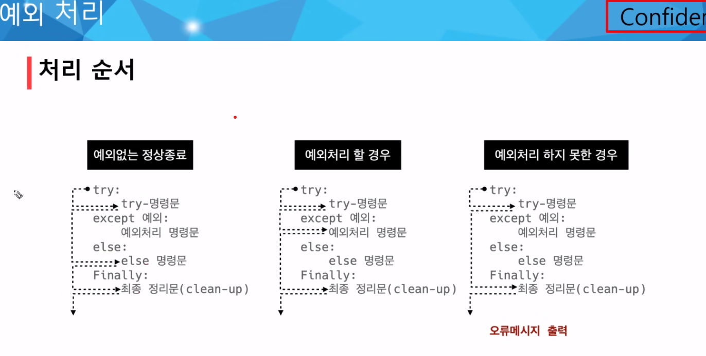

# 데이터 구조 2022-01-24

## 순서가 있는 데이터 구조

__*메소드? 함수? : 함수>메소드 : 객체(class) 안에있는 함수 = 메소드__

### 문자열구조

- s.find(d) : x 첫번째 위치 반환, 없으면 -1 반환
- s.index () :  x 첫번째 위치 반환, 없으면 오류
- s.isalpha() : 알파벳 문자 여부(단순 알파벳 아닌 유니코드 상 Letter(한국어 포함))
- s.isupper() : 대문자 여부
- s.islower() :  소문자 여부
- s.istitle : 타이틀 형식 여부(단어간에 공백 시 앞 글자가 대문자)

### 문자열 변경 메소드

- 아니 immutable인데 가능? : 변경된 문자열로 된다

- s. replace(old, new[,count]) : 바꿀 대상 글자들 새로운 글자로 바꿔서 반환

- s.strip([chars]) : 공백이나 특정 문자 제거 (lstrip : 왼쪽 / rstrip : 오른쪽)

- s.split(sep = None, maxplit = -1 ): 공백이나 특정 문자 기준 분리 : 문자열 특정한 단위로 나눠 __리스트__로 반환

- 'separator'.join([iterable]) : 구분자로 iterable을 합쳐 문자열로 반환  __join은 string 메서드__

  - iterable에 문자열이 아닌 것을 집어넣으면 Type error

  - ex) `' '.join(['3', '5'])` => `'3 5'`

- s. capitalize() : '나 공백 이후를 대문자로 
- s.upper() :모두 대문자로  / s.lower() : 모두 소문자로 / s.swapcase() : 대 <-> 소


### 리스트

- 순서를 가지는 0개 이상의 객체 참조하는 자료형

  

### 리스트 메소드

- ___L.append(x)___
- ___L.insert(i, x)___ : 리스트 인덱스 i에 x 삽입
- L.remove(x) : 리스트 가장 왼쪽에 있는 항목(첫 번째) x를 제거, 항목 존재하지 않으면 ValueError
- L.pop() : 리스트 가장 오른쪽에 있는 항목(마지막) 반환 후 제거
- L.pop(i) : 인덱스 i 항목 반환 후 제거
- ___L.extend(m)___ : 순회형 m의 모든 항목들의 리스트 끝에 추가(+=와 같음) _두 리스트를 합치는 너낌_
- L.index(x, start, end) : 리스트 있는 항목 중 가장 왼쪽 있는 항목 x의 인덱스 반환
- L.reverse() : 거꾸로 정렬
- L.sort(...) : 리스트 정렬 (매개변수 이용가능)
  - sorted와 구분!! : __sort는 원본 변경 / sorted는 원본변경X 정렬된 리스트 반환__
  - key도 있다. lamda나 함수 정의해서 key로 사용가능
  
- L.count(x) : x 몇 개 존재하는지 갯수 반환
- L.clear() : 모든 항목 삭제

 ### 튜플

- 변경 불가능(immutable)
- 튜플 관련 메소드 : 값에 영향 미치지 않는 메소드만 지원
- 리스트 메소드 중 항목을 변경하는 메소드들 제외하고 대부분 동일


## 순서가 없는 데이터 구조

### 셋(set)

- 순서 X,  mutable

### 셋 메소드

- s.add(x) : 항목에 x가 없으면 x추가
- s.pop() : 셋에서 랜덤하게 항목을 반환하고, 해당 항목 제거 /  set 비어있으면 KeyError
- s.remove(x)  : x를 s에서 삭제 / 존재하지않으면 KeyError
  - s.discard(elem) : 셋에서 삭제하고, 없어도 에러 안남!

- s.update : 여러 값 추가

### 딕셔너리

- 순서 없다, 키는 해시가능한 불변 자료형만 가능, 키의 값은 어떠한 형태든 관계 없다
- keys, values, items, get
- pop : 리스트(마지막or인덱스), 셋(랜덤), 딕셔너리(key)
- .update() : 값을 제공하는 key, value로 덮어씀 
  - ex) `{'apple' : '사'} /  .update(apple='사과')` => `'apple' : '사과'`


## 얕은 복사와 깊은 복사

- 얕은 복사 : 대입연산자 (=) 
  - 리스트 복사 확인하기 (예제 확인) => __대입연산자를 통한 복사는 해당 객체에 대한 객체 참조를 복사__
  - 해당 주소의 일부 값 변경시 참조하는 모든 변수에 영향
- 깊은 복사 : slice 이용해 같은 원소 가진 리스트지만 연산된 결과를 복사(다른주소)


# 에러/예외 처리

## 디버깅

### 문법 에러(Syntax Error)

- 파일이름, 줄번호, ^를 통해 파이썬이 문자를 읽어나갈 때 문제가 발생된 위치를 표현

### 예외

- 실행 중에 감지되는 에러들
- 예외는 여러 타입으로 나타나고, 타입이 메세지의 일부로 출력됨
  -  NameError, TypeError 등은 발생한 예외 타입의 종류
- 사용자 정의 예외 만들어 관리 가능

## 예외처리

## 예외 발생시키기



- except : 예외 발생하지않으면
- finally : 언제나 

## 예외 발생 시키기

- raise : `raise <표현식>(메시지)`
  - 예외 타입 지정하지않으면 현재 스코프에서 활성화된 마지막 예외 다시 일으킴
- assert : `assert <표현식>, <메세지>`
  - 표현식이 False일 경우 Assertion Error
  - 일반적으로 디버깅 용도로 사용

# 객제지향 프로그래밍 (2022.01.26)

## 객체

- 객체 : 속성(value, attribute)+동작, 기능(Method)
- 객체(object, 개념)는 특정 타입의 __인스턴스(instance)__이다.
  - 인스턴스 : 클래스로 만들어진 객체(객체가 실제로 만들어짐)

- ___주니어 개발자 뽑을 때 클래스(설계도)와 인스턴스(만들어진것)의 차이가 뭔가요? : 단골___
- 타입 = 어떤 클래스로 만들어졌냐~? 데이터의 타입이 클래스 : 어떤 연산자와 조작이 가능한가?
  - 클래스를 만드는 것 : 새로운 데이터의 타입을 만드는 것
- 속성(attribute) : 어떤 상태(데이터)를 가지는가?
- 조작법(method) : 어떤 행위(함수)를 할 수 있는가?

## 객체지향프로그래밍이란?

- 왜 ? : 그 전에 _절차지향_ : 뭐가 불편해? : 절차를 중심으로 쭉~실행 : 느린 실행속도, 높은 난이도, 모든 객체의 역할과 기능을 이해해야 하기 때문에 프로그래밍 시간 다소요 :속성과 기능이 떨어져있어서 유지보수가 힘들었다
- 객체지향프로그래밍 : 속성과 기능이 합쳐진 객체는 유지보수가 편함
- 클래스 이름은 _파스칼_케이스로 쓰는게 좋다

## OOP 기초

### 기본 문법

- 클래스 정의 `class MyClass:`
- 인스턴스 생성 : `my_instance = MyClass()`
- 메소드 호출 : `my_instance.my_method()`
- 속성 : `my_instance.my_attribute`

- dir() : 객체의 속성과 메소드를 보여준다
  - . 하나 조차도...dot 연산자
  - 파이썬 내부적으로는 int랑 bool이랑 거의 같다
- 리터럴 : 객체의 클래스를 호출하지않고 그냥 객체를 만들어준다.
- __클래스 변수와 인스턴스 변수의 차이점__ : 모든 인스턴스 변수가 클래스변수를 공유하고있다. : 인스턴스 변수는 각각 가지고 있음
- '_ _init_ _'
- 같은 이름으로 된 함수를 두개 만들면 마지막의 함수가 적용된다
- is : 메모리 주소 비교하는 연산자
- __클래스간 비교는 우리가 구현해줘야한다...! _ _ eq_ _ __

## 인스턴스

### 인스턴스 변수

- 인스턴스가 개인적으로 가지고 있는 속성 : attribute
- 각 인스턴스들의 고유한 변수

### 인스턴스 메소드

- 인스턴스 변수를 사용하거나, 인스턴스 변수에 값을 설정하는 메소드
- 클래스 내부에 정의되는 메소드의 기본
- 호출 시, 첫번째 인자로 인스턴스 자기자신이 전달

___self? : 인스턴스 자기자신 : 파이썬에서 인스턴스 메소드는 호출 시 첫인자로 인스턴스 자신이 전달되게 설계!___

### 메소드

- __ init __ : 생성자 메소드 : 인스턴스 객체 생성시 자동 호출되는 메소드 : 인스턴스 변수들의 초깃값 설정
- __ del __ : 소멸자 메소드 : 인스턴스 객체가 소멸되기 직전 호출되는 메소드

#### 매직 메소드

- 더블 언더스코어가 있는 메소드는 특수 동작을 위해 만들어진 메소드
- 특정 상황에 자동으로 불리는 메소드
- 예시) __ str __(self), len, repr, lt, le, eq, gt, ge, ne
- __ str __ : 해당 객체 출력 형태 지정 : 프린트 함수 호출 시 자동으로 호출 : 어떤 인스턴스 출력시 __ str __ 의 return 값 출력

```python
class Person:
    cnt = 0 # 클래스 변수
    
    def __init__(self): # 생성자, 클래스가 생성될 때 무조건 불리는 함수!
        self.name = name # 인스턴스 변수
        Person.cnt += 1
        
        
person_1 = Person('July')
print(person_1.cnt) # cnt = 0
July.cnt = 3 # July안에 새로운 인스턴스 변수를 만들어버렸다...! !주의!
```

#### 클래스 메소드

- 클래스가 사용할 메소드
- @classmethod 데코레이터를 사용하여 정의
  - 데코레이터 : 함수를 어떤 함수로 꾸며 새로운 기능 부여
- 호출시 첫번째 인자로 클래스가 전달 됨
- 데코레이터는 1급 객체와 연관되어있다.

```python
def time_display_deco(origin_func):
    def deco():
        print(dt.now())
        print('----')
    return deco

@time_display_deco
def test_a():
    print('test_a')

test_a() # time_display_deco(test_a)()
```

#### 스태틱 메소드

- 인스턴스 변수, 클래스 변수를 전혀 다루지않는 메소드
- 속성을 다루지않고 기능만 하는 메소드

# 객체지향의 핵심 4가지(문제 당근 나옴)

## 객체지향의 핵심 4가지 : 추상화, 상속, 다형성, 캡슐화

### 상속

- 코드의 재사용성이 높아진다
- 메소드 재사용

### 다형성( polymorphism)

- 동일한 메소드가 클래스에 따라 다르게 행동할 수 있음을 의미
- 서로 다른 클래스에 속해있는 객체들이 동일한 메세지에 대해 다른 방식으로 응답될 수 있다
- 메소드 오버라이딩 : 

### 캡슐화

1. 속성, 메서드를 묶는 작업

2. '은닉성' => 접근에 대한 권한

   - 응집도 : 모듈이 하나의 기능을 중심으로 책임이 잘 뭉쳐있는지 : 높을수록 좋다 

   - 결합도 : 각 메소드가 서로 얼마나 의존하고있는가 : 낮을수록 좋다

- 접근제어자 종류
  - public Access Modifier : 다
    - 언더바 없이 시작하는 메소드나 속성
  - Protected Access Modifier : 나랑 내 자식 Class 안에서만
    - 언더바 1개로 시작하는 메소드나 속성
    - 암묵적 규칙으로 의해 부모 클래스 내부와 자식 클래스에서만 호출
  - Private Access Modifier : 나만
    - 언더바 2개로 시작하는 메소드나 속성
    - 본 클래스 내부에서만 사용 가능
    - 하위 클래스 상속 및 호출 불가능 : 오류 / 외부 호출 불가능 : 오류
    - => __메소드를 통해서 접근하자!__
  - 코드에 __은닉성__을 띄고싶다 : __protected__
- getter / setter
  - getter : 
