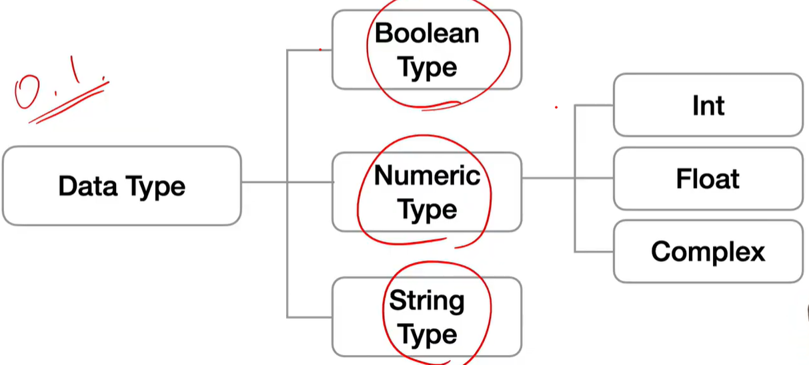
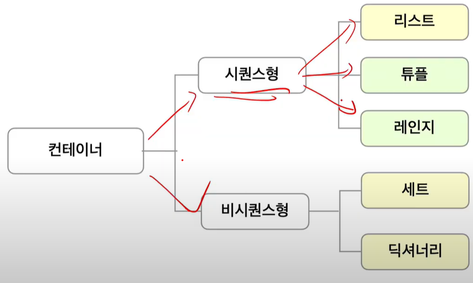

# Python 

## Confidential

프로그래밍 : 일종의 명령어 모음

컴퓨터 프로그래밍 : 컴퓨터에게 명령시키기 위한 약속

선언적 지식 : 사실에 대한 내용 / 명령적 지식 : How-to

### python의 특징

- 인터프리터 언어
- 객체 지향 프로그래밍

### python 개발환경

- 대화형 환경
  - 파이썬 기본 Interpreter
  - Jupyter Notebook, IDE(통합개발환경, Pycharm)
- 스크립트 실행
  - .py 파일을 작성하고, IDE 혹은 Text Editor(VSC) 활용

## 기초문법

### 코드 스타일 가이드

- PEP8 스타일 사용
- 들여쓰기 4칸

### 변수

- assignment : = : 할당한다
- 메모리 어딘가 저장되어 있는 객체를 참조하기 위해 사용되는 이름
  - 객체(object) : 숫자, 문자, 클래스 등 값을 가지고 있는 모든 것 : 파이썬은 객체지향 언어, 모든 것이 객체로 구현되어 있음
- 동일 변수에 다른 객체 언제든 할당 가능해서, 참조하는 객체가 바뀔 수 있어 __변수__
- 변수는 할당 연산자 __=__ 를 통해 값을 할당
  - `type()`: 변수에 할당된 값의 타입
  - `id()` : 변수에 할당된 객체의 고유한 아이덴티티 값, 주소
- 실습문제 : 각각 값 바꿔서 저장하는 코드 : ___임시 변수 활용___

### 식별자(Identifiers)

- 변수의 이름을 어떻게 지을 수 있을까?
- 규칙
  - 식별자 이름 영문 알파벳, _, 숫자로 구성
  - 첫 글자에 숫자 x, 길이제한 X, 대소문자 구별
  - False, None, True, and , as ... 는 예약어로 사용 X
  - 우리는 보통 Snake Case 사용 : red_apple / Camel Case : RedApple
  - 내장함수나 모듈 등의 이름으로도 만들면 안됨

### 사용자 입력

- input([prompt]) : 입력 받는 함수

### 주석

- 코드에 대한 설명
- 한 줄 주석 : #  /  여러 줄 주석 : 한 줄씩 # or """ or ''' : 뒤에 두개는 doscstring 위해 사용 or VS code 에서 (ctrl + / )

## 파이썬 자료형

### None Type

### Boolean Type

- 비어있으면(0이 아닌 모든 것은 T) F, -1도 T

### 수치형(Numeric Type)

#### 정수(int)

- 모든 정수의 타입은 int
- 매우 큰 수를 나타낼 때 오버플로우 발생 X
- 진수
  - 2진수 : 0b
  - 8진수 : 0o
  - 16진수 : 0x

#### 실수(float)

- 정수가 아닌 모든 실수는 float
- 부동소수점 : -2진수(비트)로 숫자 표현 : 이 과정에서 floating point rounding error 발생해 예상치 못한 결과 발생 
- Rounding error : 매우 작은 수보다 작은지 확인하거나 math모듈 활용(epsilon, isclose)

#### 복소수(complex)

#### 문자열(String Type)

- Immutable : 문자열의 특정한 값 하나만 바꿀 수 없다 
- Iterable
- ''' : 여러줄 나눠 입력시 편리
- Escape sequence : 문자열 내에서 특정 문자나 조작 위해서 \ 활용해 구분
- __String Interpolation__ : 문자열을 변수를 활용해 만드는 법
  - %-formatting : 거의 대부분 타 프로그래밍 언어
  - str.format()
  - f-strings : python 3.6+

## 컨테이너(Container)

- 컨테이너 : 여러 개 값을 담을 수 있는 것, 서로 다른 자료형 저장 가능
  - ex) list, tuple
- 분류 : 순서 O / X (노란색 : 가변형 / 초록색 : 불변형)

### 리스트

- [] or list() 통해 생성
- 인덱스 통해 접근 가능
- 길이 함수 : `len()`

### 튜플(Tuple)

- 불변 자료형
- 항상 소괄호 형태 출력
- 수정 불가능한 시퀀스로 인덱스로 접근 가능
- 일반적으로 파이썬 내부에서 활용
- 튜플 대입 : 우변의 값을 좌변의 변수에 한번에 할당하는 과정

### 레인지(Range)

- 숫자 시퀀스를 나타내기 위해 사용
- range(n) / range(n,m) / range(n,m,s)

### 패킹/언패킹(Packing/Unpacking)

## 비시퀸스형 데이터

### 셋(Set)

- 가변자료형, 수학의 집합 형태같음
- __중복없이 순서가 없는__ 자료구조
- {} or set()으로 생성
- 순서가 없어서 _인덱스 접근 등_ 특정 값 접근 할 수 없음

### 딕셔너리(dictionary)

- __순서 없이 키-값으로 쌍으로 이뤄진 객체를 참조__
- 키 : 해시가능한 불변 자료형만 가능
- {} or dic() / key : value

## 형 변환(Typecasting)

### 자료형 변환 

- 암시적 형 변환 : 사용자 의도 X, 파이썬 내부적으로 자료형 변환 (implicit)
- 명시적 형 변환 : 사용자가 함수를 이용해 자료형 변환(explicit)

## 연산자

산술 / 비교 / 논리 / 식별 / 멤버십(포함여부 확인 : in, not in) / 시퀸스형 

- 인덱싱 : 해당 인덱스 없는 경우 IndexError
- 슬라이싱 : 시퀸스 특정 단위로 슬라이싱 ex) s [ : : ] / s [ : : -1] (뒤집어짐)

## 파이썬 프로그램 구성 단위

### 프로그램 구성 단위

- 표현식
- 문장
- 함수
- 모듈
- 패키지 : 프로그램  + 모듈
- 라이브러리

# Jupyter notebook 쓰는 이유

- 복습할 때 기록을 보려고 : 코드 - 결과 
-  md 가능(vs cord + notion 같당)