staging area의 파일 다시 working directory로 내리기 : `git restore --staged {file}`

working Directory 변경사항 취소하기 :  `git reset --hard {c_id}` 실제 내 파일 변경사항 취소하는 거이다. : 이전 커밋의 상태로 __모든__ 변경사항을 돌려버린다 => ___주의 : 내 시간도 취소될 수 있다___

.gitignore 

!profile.png : 모든 png는 빼되 profile.png만 넣어줘!

브랜치 Branch : 특정 커밋을 가리키는 __포인터__

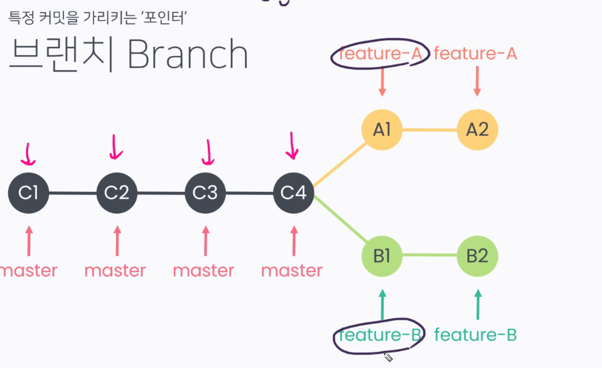

브랜치를 '딴다'

맨처음에 따면 C4 <- feature-A <- feature-B 

이 상태에서 A1 커밋을 따면 분기된다

=> 이 때까지도 feature-B는 C4를 가르키고있다

이제 b1커밋하면 b1을 가르키고 잇느거임

마스터 c4 fA A2에. fB는 B2에

__커밋은 그대로있고 포인터만 달라지는거임__

팀장님! 저 fA 다 개발했습니다. master branch에 올려주세요 : merge해주세요

fB 브랜치를 master branch에 merge해주세요

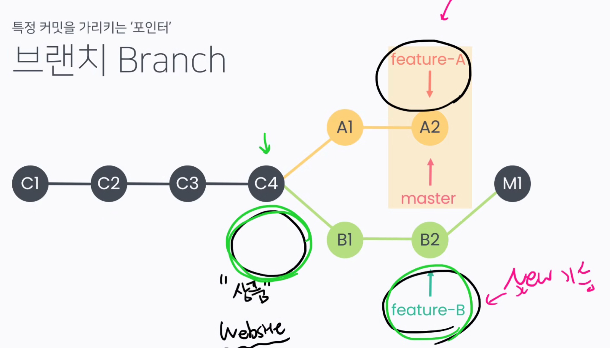

master와 fB 모두 M!이라는 커밋의 버전을 가르키고 있음 : website에서 운영되고잇음

fA도 반영해주세요!

M1이랑 A2이랑 merge해서 M2 커밋 fAfBmaster 다 가르키고 있다.

새 브랜치 만드는법

`git branch {branch name}`

브랜치 목록보기

`git branch` : *은 내가있는 브랜치 가르켜줌

$ git branch
  ice

* master

git checkout ice

July@DESKTOP-MP2PI6T MINGW64 ~/Desktop/git_test (ice)

Switched to branch 'ice'

txt 수정후 add commit

$ git checkout master
Switched to branch 'master' = > 민트초코 사라짐

$ git branch cream

$ git branch
  cream
  ice
* master

또 만들고 add commit 

브런치 왓다갓다하면 커밋 바뀜

`git checkout -b {branch name}` : 한번에 브랜치 생성 및 이동

`git branch -d {branch name}` : 브런치 삭제

여기서 cream 브랜치를 지우면 : 커밋은 남아있고 브랜치만 없어진다!


## branch merge 

각 브랜치에서 작업 한 후 이력을 합치기 위해선 일반적으로 merge 명령어를 사용한다. 병합 진행할 때, 서로 다른 이력(커밋)에서 동일한 작업을 했을 때 confilct 발생 가능

머지방법 크게 두가지

- fast-forward
- merge commit case

머지를 할 때는 머지를 가져올 커밋으로 가야한다 : 마스터로 가야한다


## merge commit case : confilc가 나는 상황이면 무족권 ~

$ git merge ice
Updating 7727254..03fb31c
Fast-forward
 A.txt | 3 ++-
 1 file changed, 2 insertions(+), 1 deletion(-)

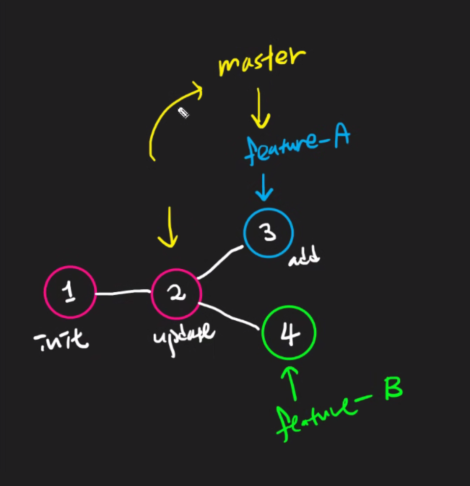

마스터 손가락이 3을 가르키고 있다

4번 합치면 충돌 나겟지!

```bash
July@DESKTOP-MP2PI6T MINGW64 ~/Desktop/git_test (master)
$ git merge cream
Auto-merging A.txt
CONFLICT (content): Merge conflict in A.txt
Automatic merge failed; fix conflicts and then commit the result.

July@DESKTOP-MP2PI6T MINGW64 ~/Desktop/git_test (master|MERGING)
```


(파란색)냠냠 다좋아가 (초록색)head로 머지가 되려구해 ~~

초록색 위에가 버튼임 : 깃은 이런 기능 없는데 vscode가 제공해주는 기능

원래는 우리가 직접 지우고 잘 해줘야되는데 

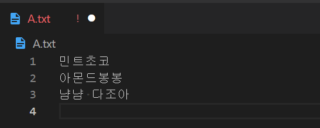

Accept Both change

저장하구

add commit => merging 사라짐


$ git branch -d ice
Deleted branch ice (was 03fb31c).

July@DESKTOP-MP2PI6T MINGW64 ~/Desktop/git_test (master)
$ git branch
  cream
* master
```

cream도 지워준다.

- branch들을 지우는 회사도 있고, 아닌 곳도 있다. 
- feature-{name} ex)feature-login, feature-logout 

 Merge Day~


## 협업의 시작 with PR

- PR을 날린다

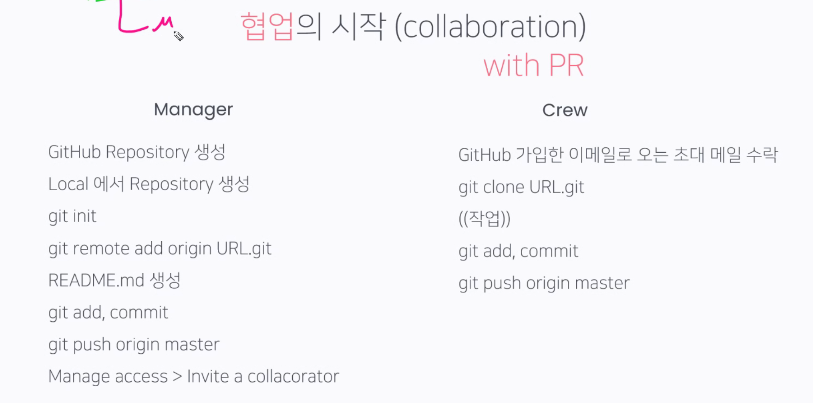


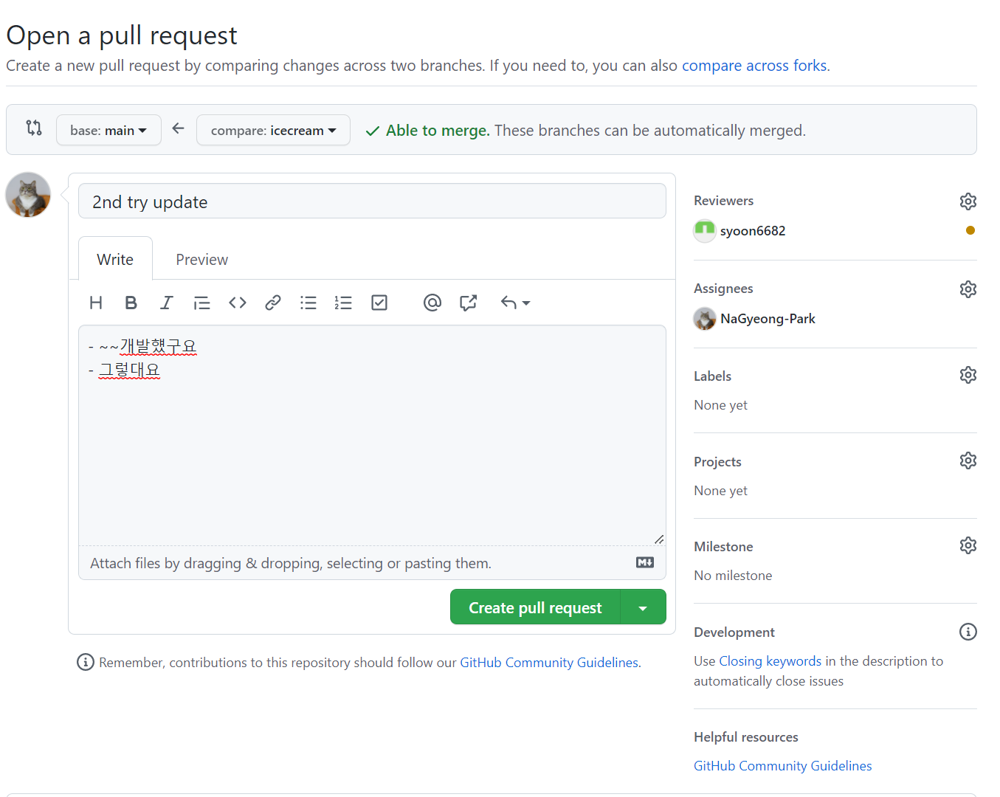

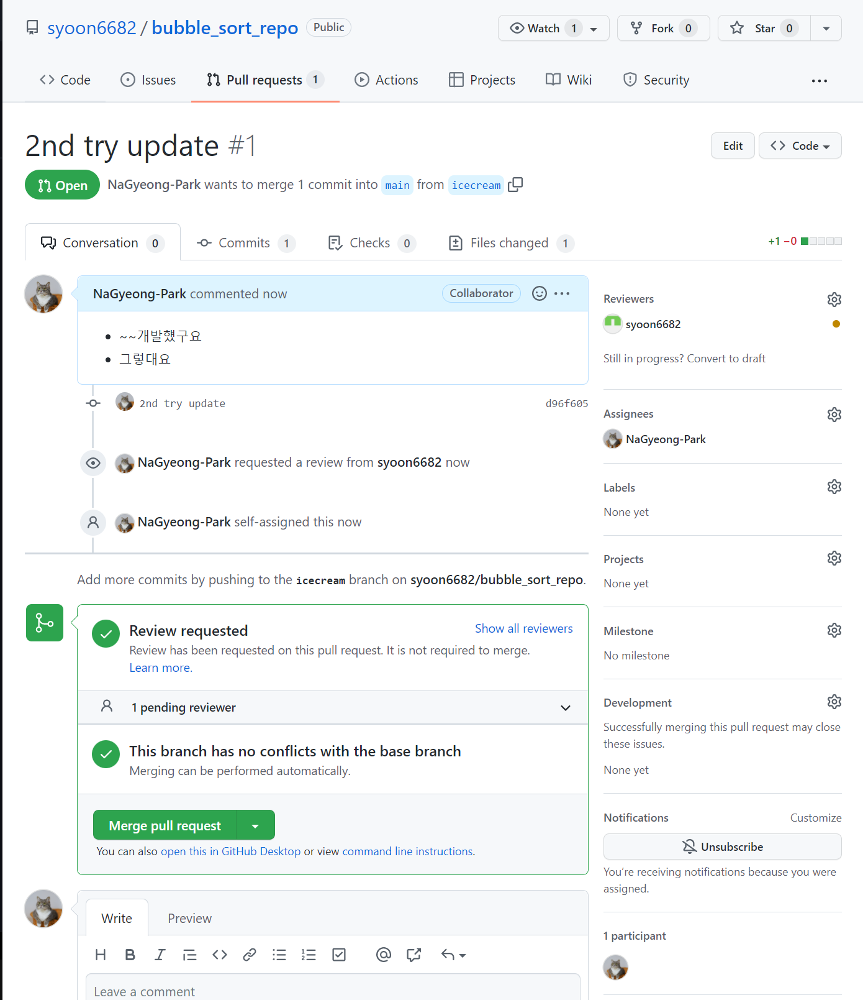

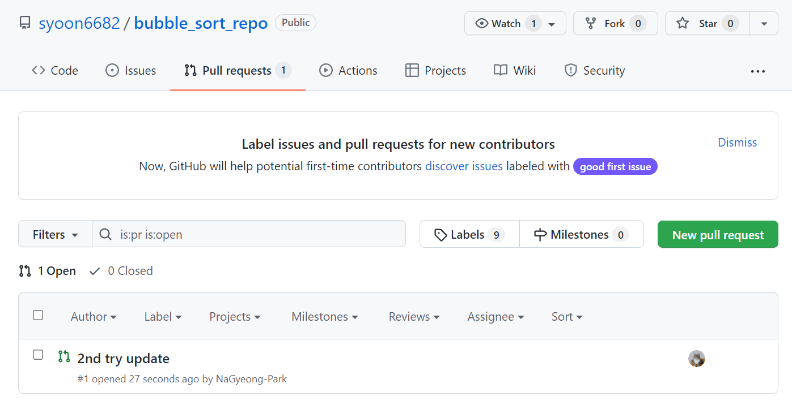

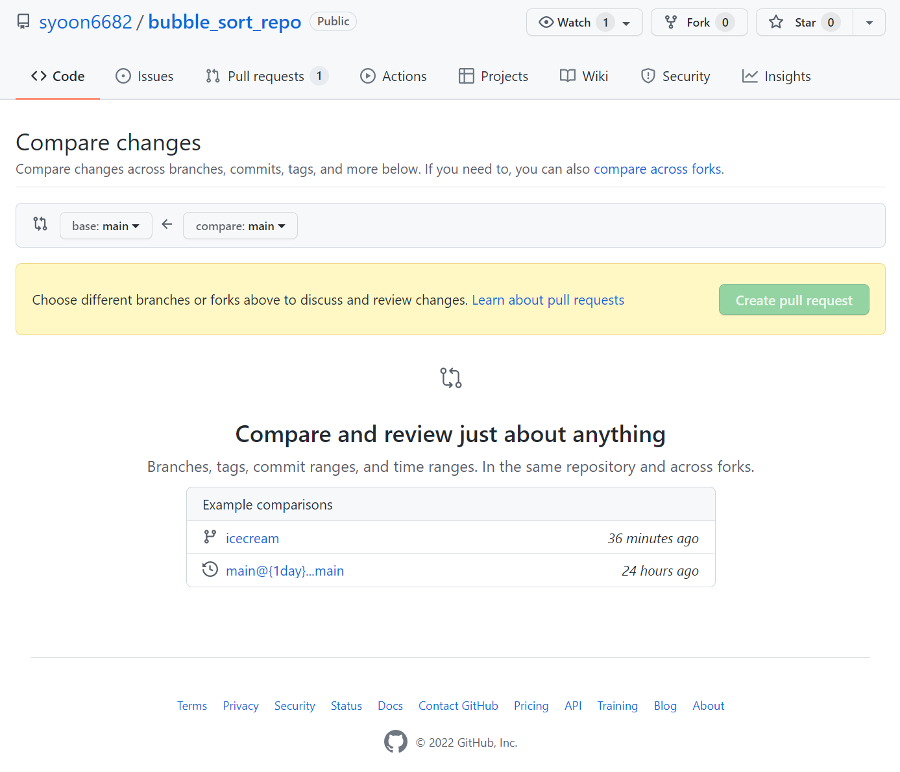

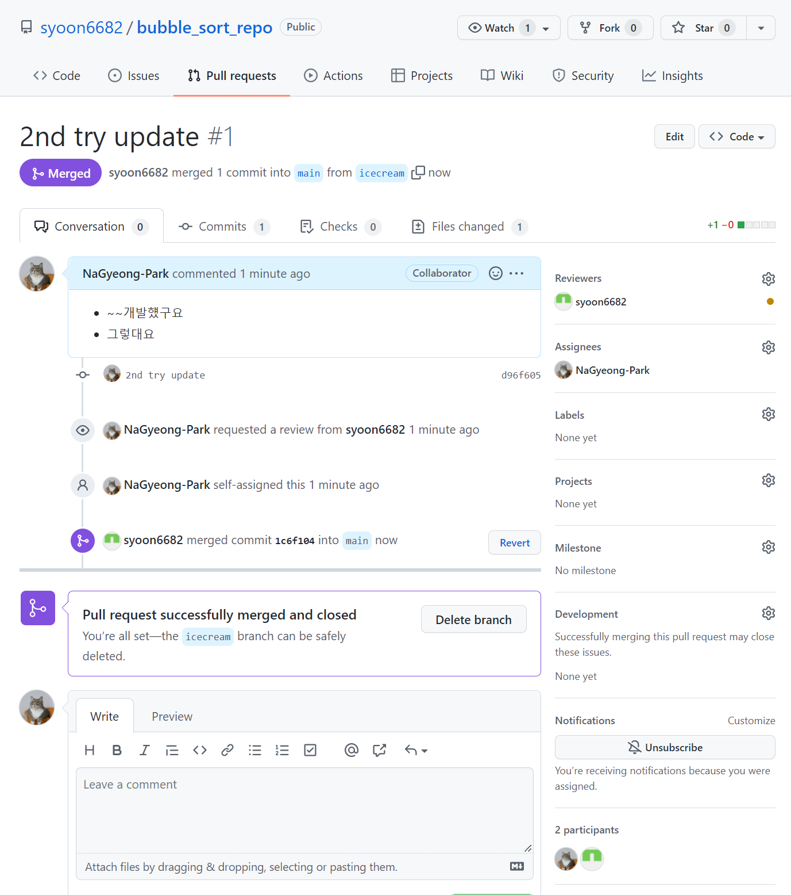

delete branch를 누르면 브랜치도 지워진다!

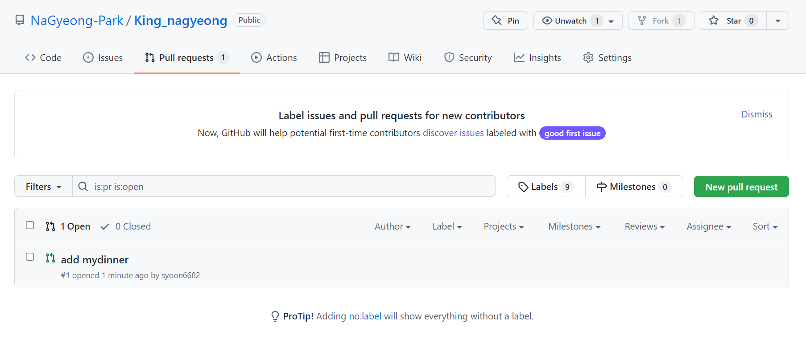

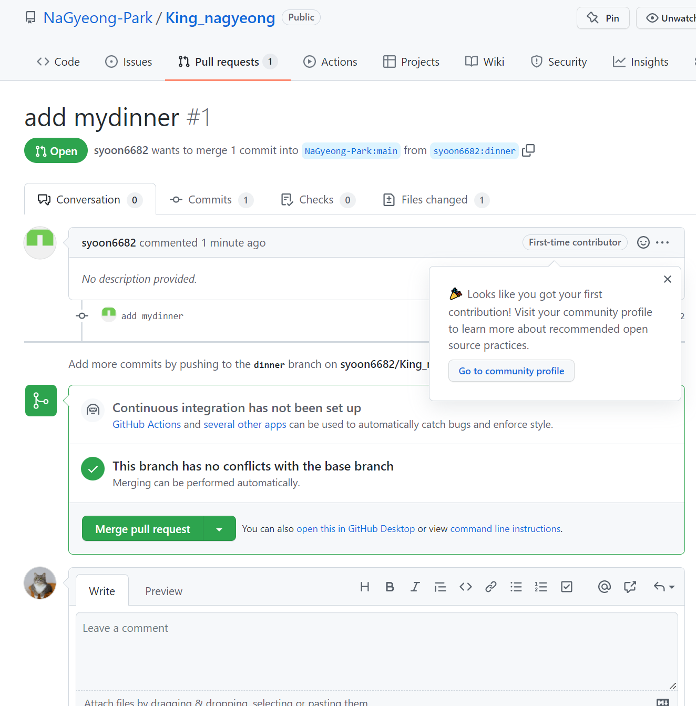

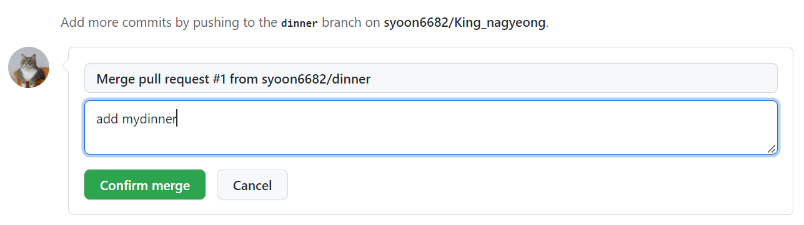

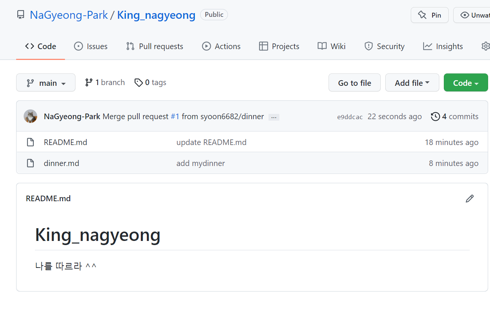

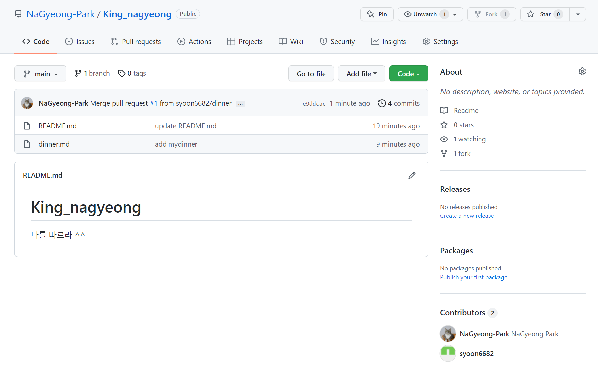